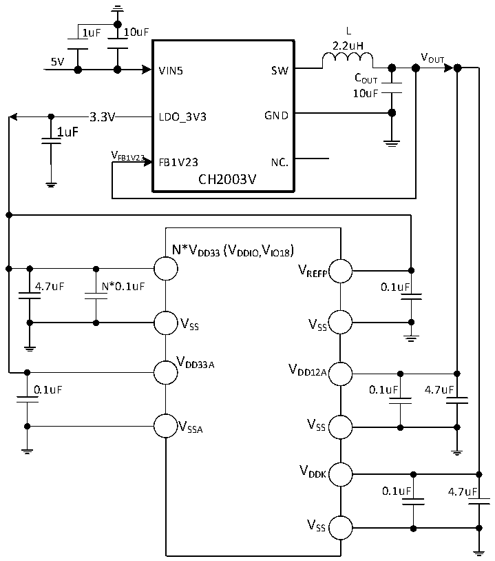
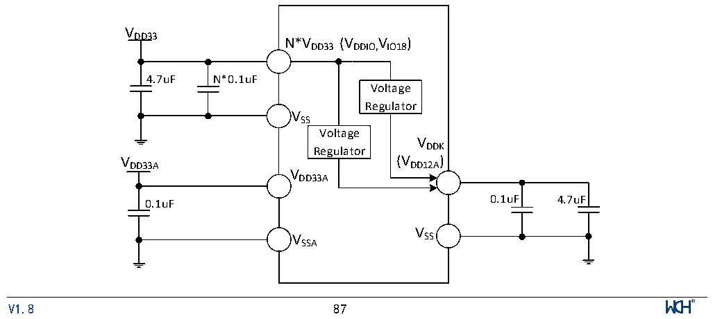

<!-- source-page: 91 -->

[← p.90](0090.md) · [index](../README.md) · [PDF p.91](https://ch32-riscv-ug.github.io/CH32H417/datasheet_en/CH32H417DS0.PDF#page=91) · [p.92 →](0092.md)

<!-- header: CH32H417/H416/H415 Datasheet https://wch-ic.com -->

Figure 3-1-5 CH32H416 DCDC single 5V supply circuit  
 <!-- rendered from the PDF; verify at https://ch32-riscv-ug.github.io/CH32H417/datasheet_en/CH32H417DS0.PDF#page=91 -->

🖼 Text parsed from the figure above

1uF 10uF L  
2.2uH  
V  
5V OUT  
VIN5 SW  
COUT  
10uF  
3.3V  3.3V  
3.3V LDO_3V3 GND  
1uF  
V  
FB1V23 FB1V23 NC.  
CH2003V  
N*VDD33(VDDIO,IO18 V )  
VREFP  
4.7uF N*0.1uF 0.1uF  
VSS VSS  
V  
DD33A V  
DD12A  
0.1uF 0.1uF 4.7uF  
V SSA V SS  
VDDK  
0.1uF 4.7uF  
VSS  

<em>Note: For the CH32H416RDU6 chip, VDD33 has 2 pins, and the power supply pin of the same name must be</em>  
<em>shorted.</em>  
<em>Connect a 0.1uF decoupling capacitor in parallel with a capacitor of at least 10uF to the main VDD33 pin</em>  
<em>(adjacent to VDDK); the remaining VDD33 pins only require a 0.1uF decoupling capacitor.</em>  

Figure 3-1-6 CH32H416 Conventional power supply typical circuit  
 <!-- rendered from the PDF; verify at https://ch32-riscv-ug.github.io/CH32H417/datasheet_en/CH32H417DS0.PDF#page=91 -->

🖼 Text parsed from the figure above

VDD33  
N*VDD33(VDDIO,IO18 V )  
4.7uF N*0.1uF  
Voltage  
Regulator  
VSS  
Voltage  
VDDK  
Regulator  
VDD33A(VDD12A)  
VDD33A  
0.1uF 0.1uF 4.7uF  
V  
V SS  
SSA  
<!-- image: p91-draw-image-00001 inside the figure -->
<!-- footer: V1.8 87 -->

