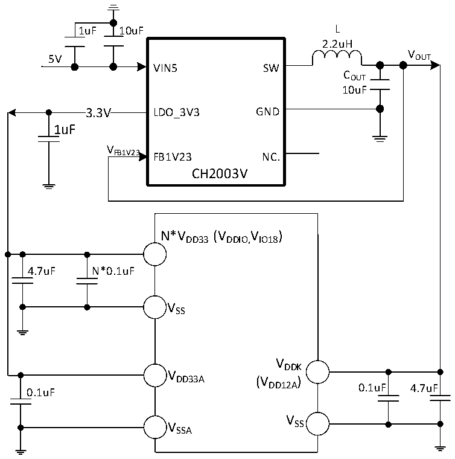

<!-- source-page: 92 -->

[← p.91](0091.md) · [index](../README.md) · [PDF p.92](https://ch32-riscv-ug.github.io/CH32H417/datasheet_en/CH32H417DS0.PDF#page=92) · [p.93 →](0093.md)

<!-- header: CH32H417/H416/H415 Datasheet https://wch-ic.com -->

Figure 3-1-7 CH32H415 DCDC single 5V supply circuit  
 <!-- rendered from the PDF; verify at https://ch32-riscv-ug.github.io/CH32H417/datasheet_en/CH32H417DS0.PDF#page=92 -->

🖼 Text parsed from the figure above

1uF 10uF L  
2.2uH  
V  
5V OUT  
VIN5 SW  
COUT  
10uF  
3.3V  3.3V  
3.3V LDO_3V3 GND  
1uF  
V  
FB1V23 FB1V23 NC.  
CH2003V  
N*VDD33(VDDIO,IO18 V )  
4.7uF N*0.1uF  
VSS  
VDDK  
V  
DD33A (V )  
0.1uF DD12A 0.1uF 4.7uF  
V  
V SS  
SSA  

<em>Note: For the CH32H415REU6 chip, VDD33 has several pins, and the power supply pin of the same name must be</em>  
<em>shorted.</em>  
<em>Connect a 0.1uF decoupling capacitor in parallel with at least 4.7uF decoupling capacitor to the main VDD33 pin</em>  
<em>(adjacent to the VDDK pin); the remaining VDD33 pins only require a 0.1uF decoupling capacitor.</em>  
<!-- image: p92-draw-image-00001 bbox=[511.32, 783.6, 530.76, 793.8] -->
<!-- footer: V1.8 88 -->
