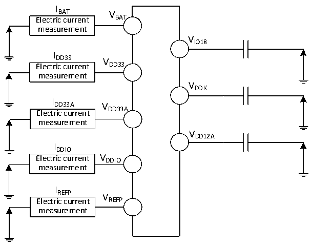
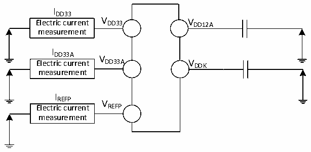

<!-- source-page: 96 -->

[← p.95](0095.md) · [index](../README.md) · [PDF p.96](https://ch32-riscv-ug.github.io/CH32H417/datasheet_en/CH32H417DS0.PDF#page=96) · [p.97 →](0097.md)

<!-- header: CH32H417/H416/H415 Datasheet https://wch-ic.com -->

### 3.3.3 Embedded Reference Voltage

<!-- p96-table-001 (table-3-5@1) -->
<table><caption>Table 3-5 Embedded reference voltage</caption><tr><th>Symbol</th><th>Parameter</th><th>Condition</th><th>Min.</th><th>Typ.</th><th>Max.</th><th>Unit</th></tr><tr><td style="text-align:left">VREFINT</td><td>Built-in reference voltage</td><td style="text-align:left">T = -40℃ ~ A85℃</td><td>1.17</td><td>1.21</td><td>1.24</td><td>V</td></tr></table>

### 3.3.4 Supply Current Characteristics

Current consumption is a comprehensive index of a variety of parameters and factors. These parameters and factors  
include operating voltage, ambient temperature, I/O pin load, software configuration of the product, the operating  
frequency, flip rate of the I/O pin, the location of the program in memory and the executed code, etc. The current  
consumption measurement method is as follows:  

Figure 3-2-1 CH32H417 Current consumption measurement  
 <!-- rendered from the PDF; verify at https://ch32-riscv-ug.github.io/CH32H417/datasheet_en/CH32H417DS0.PDF#page=96 -->

🖼 Text parsed from the figure above

I  
BAT V  
Electric current BAT  
measurement  
VIO18  
I  
DD33 V  
Electric current DD33  
measurement  
VDDK  
I  
DD33A V  
DD33A  
Electric current  
measurement  
VDD12A  
IDDIO  
Electric current V DDIO  
measurement  
IREFP  
V  
Electric current REFP  
measurement  

Figure 3-2-2 CH32H416 Current consumption measurement  
 <!-- rendered from the PDF; verify at https://ch32-riscv-ug.github.io/CH32H417/datasheet_en/CH32H417DS0.PDF#page=96 -->

🖼 Text parsed from the figure above

IDD33  
Electric current V DD33 V DD12A  
measurement  
IDD33A  
V  
Electric current DD33A VDDK  
measurement  
IREFP  
V  
Electric current REFP  
measurement  

<!-- image: p96-draw-image-00001 bbox=[511.32, 783.6, 530.76, 793.8] -->
<!-- footer: V1.8 92 -->
