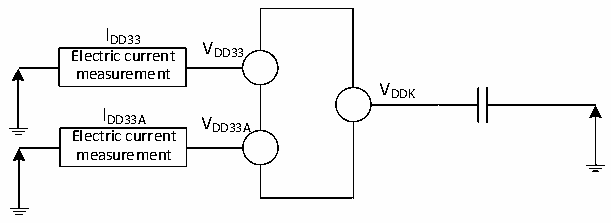

<!-- source-page: 97 -->

[← p.96](0096.md) · [index](../README.md) · [PDF p.97](https://ch32-riscv-ug.github.io/CH32H417/datasheet_en/CH32H417DS0.PDF#page=97) · [p.98 →](0098.md)

<!-- header: CH32H417/H416/H415 Datasheet https://wch-ic.com -->

Figure 3-2-3 CH32H415 Current consumption measurement  
 <!-- rendered from the PDF; verify at https://ch32-riscv-ug.github.io/CH32H417/datasheet_en/CH32H417DS0.PDF#page=97 -->

🖼 Text parsed from the figure above

I  
DD33 V  
Electric current DD33  
measurement  
VDDK  
I  
DD33A V  
DD33A  
Electric current  
measurement  

CH32H417 is under one of the following conditions:  
1. At room temperature, power supply: VDD33= 3.3V, VDD33A= 3.3V, VDDIO= 3.3V, VREFP= 3.3V, generating VIO18  
= 1.8V, VDD12A= 1.2V, VDDK= 1.2V.  
2. At room temperature, an external DC-DC converter (CH2003V or CH2003K) supplies rated 5V, generating  
rated 3.3V and 1.2V to power the CH32H417 chip.  
3. At room temperature, the external DCDC chip (CH2003K) supplies a rated 5V, generating rated 3.3V and  
0.875V voltages to power the CH32H417 chip.  
During simultaneous testing: All I/O ports configured as pull-down inputs, HSI = 25MHz (calibrated), FHCLK=  
FV3F. Power consumption when enabling or disabling all peripheral clocks.  
CH32H416 is under one of the following conditions:  
1. At room temperature, power supply: VDD33= 3.3V, VDD33A= 3.3V, VREFP= 3.3V, generating VDD12A= 1.2V,  
VDDK= 1.2V.  
2. At room temperature, an external DC-DC converter (CH2003V) supplies rated 5V, generating rated 3.3V and  
1.2V to power the CH32H416 chip.  
During simultaneous testing: All I/O ports configured as pull-down inputs, HSI = 25MHz (calibrated), FHCLK=  
FV3F. Power consumption when enabling or disabling all peripheral clocks.  
CH32H415 is under one of the following conditions:  
1. At room temperature, power supply: VDD33= 3.3V, VDD33A= 3.3V, generating VDDK= 1.2V.  
2. At room temperature, an external DC-DC converter (CH2003V) supplies rated 5V, generating rated 3.3V and  
1.2V to power the CH32H415 chip.  
During simultaneous testing: All I/O ports configured as pull-down inputs, HSI = 25MHz (calibrated), FHCLK=  
FV3F. Power consumption when enabling or disabling all peripheral clocks.  
<em>Note: The pins that are not encapsulated out of the small package model or the pins that have been encapsulated</em>  
<em>out but not used, it is recommended to configure them as pull-up inputs or pull-down inputs, or else the current</em>  
<em>index may be affected, please refer to the EVT low-power routines for specific operations.</em>  
(RISC-V5F)  

<!-- p97-table-001 (table-3-6-1@1) pages 97-98 -->
<table><caption>Table 3-6-1 Typical current consumption in run mode with data processing code running from SRAM</caption><tr><th rowspan="3">Symbol</th><th rowspan="3">Parameter</th><th colspan="3">Condition</th><th colspan="2">Typ.</th><th rowspan="3">Unit</th></tr><tr><td rowspan="2">Clock</td><td rowspan="2" style="text-align:left">FV5F</td><td rowspan="2" style="text-align:left">FHCLK</td><td rowspan="2" style="text-align:left">Enable all peripherals</td><td>Disable all</td></tr><tr><td>peripherals</td></tr><tr><td style="text-align:left">I (1) DD</td><td>Total supply</td><td>Run in high-speed</td><td>480MHz</td><td>120MHz</td><td>135.5</td><td>101.1</td><td>mA</td></tr><tr><td rowspan="11"></td><td rowspan="11" style="text-align:left">current of the chip in operating mode</td><td rowspan="5" style="text-align:left">internal RC oscillator (HSI), HB prescaler is used to reduce the frequency.</td><td>400MHz</td><td>100MHz</td><td>101.6</td><td>73.6</td><td rowspan="11"></td></tr><tr><td>384MHz</td><td>96MHz</td><td>96.6</td><td>68.7</td></tr><tr><td>288MHz</td><td>144MHz</td><td>95.4</td><td>57.4</td></tr><tr><td>25MHz</td><td>25MHz</td><td>14.0</td><td>8.3</td></tr><tr><td>500kHz</td><td>500kHz</td><td>10.0</td><td>8.2</td></tr><tr><td rowspan="6">External clock</td><td>480MHz</td><td>120MHz</td><td>136.7</td><td>101.9</td></tr><tr><td>400MHz</td><td>100MHz</td><td>102.2</td><td>74.2</td></tr><tr><td>384MHz</td><td>96MHz</td><td>97.4</td><td>69.6</td></tr><tr><td>288MHz</td><td>144MHz</td><td>96.0</td><td>58.0</td></tr><tr><td>25MHz</td><td>25MHz</td><td>14.7</td><td>8.9</td></tr><tr><td>500kHz</td><td>500kHz</td><td>10.7</td><td>8.8</td></tr></table>

<!-- image: p97-draw-image-00001 bbox=[511.32, 783.6, 530.76, 793.8] -->
<!-- footer: V1.8 93 -->
