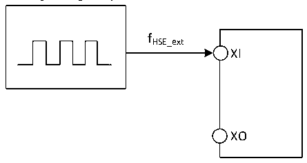
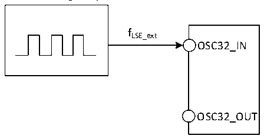

<!-- source-page: 101 -->

[← p.100](0100.md) · [index](../README.md) · [PDF p.101](https://ch32-riscv-ug.github.io/CH32H417/datasheet_en/CH32H417DS0.PDF#page=101) · [p.102 →](0102.md)

<!-- header: CH32H417/H416/H415 Datasheet https://wch-ic.com -->

### 3.3.5 External Clock Source Characteristics

<!-- p101-table-001 (table-3-9@1) -->
<table><caption>Table 3-9 From external high-speed clock</caption><tr><th>Symbol</th><th>Parameter</th><th>Condition</th><th>Min.</th><th>Typ.</th><th>Max.</th><th>Unit</th></tr><tr><td style="text-align:left">FHSE_ext</td><td>External clock frequency</td><td></td><td>5</td><td>25</td><td>32</td><td>MHz</td></tr><tr><td style="text-align:left">V (1) HSEH</td><td>XI input pin high voltage</td><td></td><td style="text-align:left">0.8*VDDIO</td><td></td><td style="text-align:left">VDDIO</td><td>V</td></tr><tr><td style="text-align:left">V (1) HSEL</td><td>XI input pin low voltage</td><td></td><td>0</td><td></td><td style="text-align:left">0.2*VDDIO</td><td>V</td></tr><tr><td style="text-align:left">C in(HSE)</td><td>XI input capacitance</td><td></td><td></td><td>5</td><td></td><td>pF</td></tr><tr><td style="text-align:left">DuCy (HSE)</td><td>Duty cycle</td><td></td><td></td><td>50</td><td></td><td>%</td></tr><tr><td style="text-align:left">IL</td><td>XI input leakage current</td><td></td><td></td><td></td><td>±1</td><td>uA</td></tr></table>

<em>Note 1: Failure to meet this condition may cause a level recognition error.</em>  

Figure 3-3 High frequency clock circuit for external clock source  
 <!-- rendered from the PDF; verify at https://ch32-riscv-ug.github.io/CH32H417/datasheet_en/CH32H417DS0.PDF#page=101 -->

🖼 Text parsed from the figure above

fHSE_ext  
XI  
XO  

<!-- p101-table-002 (table-3-10@1) -->
<table><caption>Table 3-10 From external low-speed clock</caption><tr><th>Symbol</th><th>Parameter</th><th>Condition</th><th>Min.</th><th>Typ.</th><th>Max.</th><th>Unit</th></tr><tr><td style="text-align:left">FLSE_ext</td><td>User external clock frequency</td><td></td><td></td><td>32.768</td><td></td><td>kHz</td></tr><tr><td style="text-align:left">VLSEH</td><td style="text-align:left">OSC32_IN input pin high level voltage</td><td></td><td style="text-align:left">0.8*VDD33</td><td></td><td style="text-align:left">VDD33</td><td>V</td></tr><tr><td style="text-align:left">VLSEL</td><td>OSC32_IN input pin low voltage</td><td></td><td>0</td><td></td><td style="text-align:left">0.2*VDD33</td><td>V</td></tr><tr><td style="text-align:left">C in（LSE）</td><td>OSC32_IN input capacitance</td><td></td><td></td><td>5</td><td></td><td>pF</td></tr><tr><td style="text-align:left">DuCy LSE</td><td>Duty Cycle</td><td></td><td></td><td>50</td><td></td><td>%</td></tr><tr><td style="text-align:left">IL</td><td>OSC32_IN input leakage current</td><td></td><td></td><td></td><td>±1</td><td>uA</td></tr></table>

<em>Note 1: Failure to meet this condition may cause a level recognition error.</em>  

Figure 3-4 Low frequency clock circuit for external clock source  
 <!-- rendered from the PDF; verify at https://ch32-riscv-ug.github.io/CH32H417/datasheet_en/CH32H417DS0.PDF#page=101 -->

🖼 Text parsed from the figure above

fLSE_ext  
OSC32_IN  
OSC32_OUT  

<!-- image: p101-draw-image-00001 bbox=[511.32, 783.6, 530.76, 793.8] -->
<!-- footer: V1.8 97 -->
