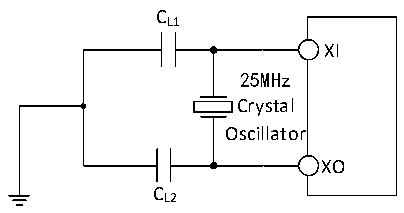

<!-- source-page: 102 -->

[← p.101](0101.md) · [index](../README.md) · [PDF p.102](https://ch32-riscv-ug.github.io/CH32H417/datasheet_en/CH32H417DS0.PDF#page=102) · [p.103 →](0103.md)

<!-- header: CH32H417/H416/H415 Datasheet https://wch-ic.com -->

<!-- p102-table-001 (table-3-11@1) -->
<table><caption>Table 3-11 High-Speed external clocks generated using one crystal/ceramic resonator</caption><tr><th>Symbol</th><th>Parameter</th><th>Condition</th><th>Min.</th><th>Typ.</th><th>Max.</th><th>Unit</th></tr><tr><td style="text-align:left">FXI</td><td>Resonator frequency</td><td></td><td>5</td><td>25</td><td>32</td><td>MHz</td></tr><tr><td style="text-align:left">RF</td><td style="text-align:left">Feedback resistance (No need for external)</td><td></td><td></td><td>250</td><td></td><td>kΩ</td></tr><tr><td style="text-align:left">CLOAD</td><td style="text-align:left">Suggested load capacitance with corresponding crystal serial impedance RS</td><td style="text-align:left">R = 60Ω(1) S</td><td></td><td>20</td><td></td><td>pF</td></tr><tr><td style="text-align:left">IHSE</td><td>HSE drive current</td><td></td><td></td><td>0.8</td><td></td><td>mA</td></tr><tr><td style="text-align:left">g m</td><td>Oscillator transconductance</td><td>Startup</td><td></td><td>26</td><td></td><td>mA/V</td></tr><tr><td style="text-align:left">t SU(HSE)</td><td>Startup time</td><td style="text-align:left">V stabilization, 25MDD33 crystal</td><td></td><td>1.5(2)</td><td></td><td>ms</td></tr></table>

<em>Note: 1. The crystal ESR should not exceed 80 ohms. Prioritize crystals with lower ESR values. Refer to the</em>  
<em>crystal manual for load capacitance requirements.</em>  
<em>2. The startup time refers to the time difference between HSEON being enabled and HSERDY being set.</em>  
<em>3. Ethernet applications typically require HSE. A 25MHz crystal is recommended, with a tolerance not</em>  
<em>exceeding 30ppm.</em>  
Circuit reference design and requirements:  
The load capacitance of the crystal is based on the crystal manufacturer&#x27;s recommendation, usually CL1=CL2.  

Figure 3-5 Typical circuit for external 25M crystal  
 <!-- rendered from the PDF; verify at https://ch32-riscv-ug.github.io/CH32H417/datasheet_en/CH32H417DS0.PDF#page=102 -->

🖼 Text parsed from the figure above

CL1  
XI  
25MHz  
Crystal  
Oscillator  
XO  
CL2  

<!-- p102-table-002 (table-3-12@1) -->
<table><caption>Table 3-12 Low-speed external clocks generated using a crystal/ceramic resonator (fLSE=32.768KHz)</caption><tr><th>Symbol</th><th>Parameter</th><th>Condition</th><th>Min.</th><th>Typ.</th><th>Max.</th><th>Unit</th></tr><tr><td style="text-align:left">FLSE</td><td>Resonator frequency</td><td></td><td></td><td>32.768</td><td></td><td>kHz</td></tr><tr><td style="text-align:left">RF</td><td>Feedback resistance</td><td></td><td></td><td>5</td><td></td><td>MΩ</td></tr><tr><td>C</td><td style="text-align:left">Suggested load capacitance with corresponding crystal serial impedance RS</td><td style="text-align:left">R &lt; 70kΩS</td><td></td><td></td><td>15</td><td>pF</td></tr><tr><td style="text-align:left">i 2</td><td>LSE drive current</td><td></td><td></td><td>0.35</td><td></td><td>uA</td></tr><tr><td style="text-align:left">g m</td><td>Oscillator transconductance</td><td>Startup</td><td></td><td>30</td><td></td><td>uA/V</td></tr><tr><td style="text-align:left">t SU（LSE）</td><td>Startup time</td><td style="text-align:left">V stabilization DD33</td><td></td><td>800</td><td></td><td>mS</td></tr></table>

Circuit reference design and requirements:  
The load capacitance of the crystal is based on the crystal manufacturer&#x27;s recommendation, usually CL1=CL2,  
optional about 12pF.  
<!-- image: p102-draw-image-00001 bbox=[511.32, 783.6, 530.76, 793.8] -->
<!-- footer: V1.8 98 -->
