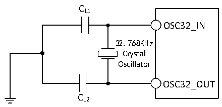

<!-- source-page: 103 -->

[← p.102](0102.md) · [index](../README.md) · [PDF p.103](https://ch32-riscv-ug.github.io/CH32H417/datasheet_en/CH32H417DS0.PDF#page=103) · [p.104 →](0104.md)

<!-- header: CH32H417/H416/H415 Datasheet https://wch-ic.com -->

Figure 3-6 Typical Circuit for External 32.768K Crystal  
 <!-- rendered from the PDF; verify at https://ch32-riscv-ug.github.io/CH32H417/datasheet_en/CH32H417DS0.PDF#page=103 -->

🖼 Text parsed from the figure above

CL1  
OSC32_IN  
32.768KHz  
Crystal  
Oscillator  
OSC32_OUT  
CL2  

<em>Note: The load capacitance CL is calculated by the following formula: CL= CL1× CL2/ (CL1+ CL2) + Cstray,</em>  
<em>where Cstray is the capacitance of the pins and the capacitance associated with the PCB board or PCB, and its</em>  
<em>typical value is between 2pF and 7pF.</em>  

### 3.3.6 Internal Clock Source Characteristics

<!-- p103-table-001 (table-3-13@1) -->
<table><caption>Table 3-13 Internal High-Speed (HSI) RC Oscillator Characteristics</caption><tr><th>Symbol</th><th>Parameter</th><th>Condition</th><th>Min.</th><th>Typ.</th><th>Max.</th><th>Unit</th></tr><tr><td style="text-align:left">FHSI</td><td>Frequency (after calibration)</td><td></td><td></td><td>25</td><td></td><td>MHz</td></tr><tr><td style="text-align:left">DuCy HSI</td><td>Duty cycle</td><td></td><td>45</td><td>50</td><td>55</td><td>%</td></tr><tr><td rowspan="2" style="text-align:left">ACCHSI</td><td rowspan="2" style="text-align:left">Accuracy of HSI oscillator (after calibration)</td><td style="text-align:left">T = 0℃~70℃ A</td><td>-1.6</td><td></td><td>1.6</td><td>%</td></tr><tr><td style="text-align:left">T = -40℃~85℃ A</td><td>-2.2</td><td></td><td>2.2</td><td>%</td></tr><tr><td style="text-align:left">t SU(HSI)</td><td style="text-align:left">HSI oscillator startup stabilization time</td><td></td><td></td><td>10</td><td></td><td>us</td></tr></table>

<!-- p103-table-002 (table-3-14@1) -->
<table><caption>Table 3-14 Internal Low-Speed (LSI) RC Oscillator Characteristics</caption><tr><th>Symbol</th><th>Parameter</th><th>Condition</th><th>Min.</th><th>Typ.</th><th>Max.</th><th>Unit</th></tr><tr><td style="text-align:left">FLSI</td><td>Frequency</td><td></td><td>25</td><td>40</td><td>60</td><td>kHz</td></tr><tr><td style="text-align:left">DuCy LSI</td><td>Duty Cycle</td><td></td><td>45</td><td>50</td><td>55</td><td>%</td></tr><tr><td style="text-align:left">t (1) SU(LSI)</td><td style="text-align:left">LSI oscillator startup stabilization time</td><td></td><td></td><td>230</td><td></td><td>us</td></tr><tr><td style="text-align:left">IDD(LSI)</td><td>LSI oscillator power consumption</td><td></td><td></td><td>0.6</td><td></td><td>uA</td></tr></table>

<em>Note: 1. Register RCC_CTLR LSION is set to 1. Wait for LSIRDY to be set to 1.</em>  

### 3.3.7 PLL Characteristics

<!-- p103-table-003 (table-3-15@1) -->
<table><caption>Table 3-15 PLL Characteristics</caption><tr><th>Symbol</th><th>Parameter</th><th>Condition</th><th>Min.</th><th>Typ.</th><th>Max.</th><th>Unit</th></tr><tr><td rowspan="2" style="text-align:left">FPLL_IN</td><td>PLL input clock</td><td></td><td>5</td><td>25</td><td>32</td><td>MHz</td></tr><tr><td>PLL input clock duty cycle</td><td></td><td>40</td><td></td><td>60</td><td>%</td></tr><tr><td style="text-align:left">FPLL_OUT</td><td>PLL multiplier output clock</td><td></td><td>100</td><td></td><td>600</td><td>MHz</td></tr><tr><td style="text-align:left">t LOCK</td><td>PLL lock time</td><td></td><td></td><td>40</td><td>90</td><td>us</td></tr></table>

### 3.3.8 Wakeup Time from Low-power Mode

<!-- p103-table-004 (table-3-16@1) pages 103-104 -->
<table><caption>Table 3-16 Wakeup time from low-power mode</caption><tr><th>Symbol</th><th>Parameter</th><th>Condition</th><th>Typ.</th><th>Unit</th></tr><tr><td style="text-align:left">t wusleep</td><td>Wakeup from Sleep mode</td><td>Use HSI RC clock wakeup</td><td>0.3</td><td>us</td></tr><tr><td rowspan="2" style="text-align:left">t wustop</td><td style="text-align:left">Wakeup from Stop mode (Regulator in normal mode)</td><td>HSI RC clock wakeup</td><td>4</td><td>us</td></tr><tr><td style="text-align:left">Wakeup from Standby mode (Regulator in low-power mode)</td><td style="text-align:left">Regulator wake-up time from low-power mode + HSI RC clock wake-up</td><td>35</td><td>us</td></tr></table>

<!-- image: p103-draw-image-00001 bbox=[511.32, 783.6, 530.76, 793.8] -->
<!-- footer: V1.8 99 -->
