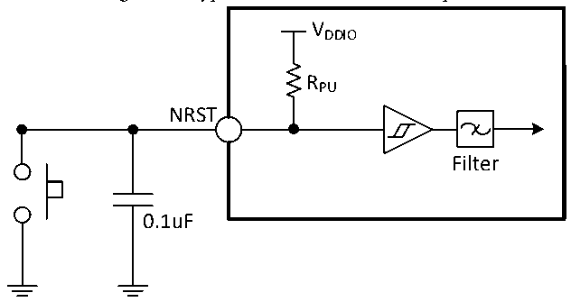

<!-- source-page: 112 -->

[← p.111](0111.md) · [index](../README.md) · [PDF p.112](https://ch32-riscv-ug.github.io/CH32H417/datasheet_en/CH32H417DS0.PDF#page=112) · [p.113 →](0113.md)

<!-- header: CH32H417/H416/H415 Datasheet https://wch-ic.com -->

Figure 3-7 Typical circuit of external reset pin  
 <!-- rendered from the PDF; verify at https://ch32-riscv-ug.github.io/CH32H417/datasheet_en/CH32H417DS0.PDF#page=112 -->

🖼 Text parsed from the figure above

VDDIO  
RPU  
NRST  
Filter  
0.1uF  

<em>Note: The capacitors shown are optional and can be used to filter out key jitter.</em>  

<!-- p112-table-002 (table-3-22@1) -->
<table><caption>Table 3-22 External reset pin characteristics</caption><tr><th>Symbol</th><th>Parameter</th><th>Condition</th><th>Min.</th><th>Typ.</th><th>Max.</th><th>Unit</th></tr><tr><td style="text-align:left">VIL(NRST)</td><td>NRST input low voltage</td><td></td><td>-0.3</td><td></td><td style="text-align:left">0.29*V -0.07DDIO</td><td>V</td></tr><tr><td style="text-align:left">VIH(NRST)</td><td>NRST input high voltage</td><td></td><td style="text-align:left">0.45*V +0.41DDIO</td><td></td><td style="text-align:left">V +0.3DDIO</td><td>V</td></tr><tr><td style="text-align:left">V hys(NRST)</td><td style="text-align:left">NRST Schmitt trigger voltage hysteresis</td><td></td><td>150</td><td></td><td></td><td>mV</td></tr><tr><td style="text-align:left">R (1) PU</td><td>Pull-up equivalent resistance</td><td></td><td>30</td><td>40</td><td>55</td><td>kΩ</td></tr><tr><td style="text-align:left">VF(NRST)</td><td style="text-align:left">NRST input can be filtered for pulse width</td><td></td><td></td><td></td><td>100</td><td>ns</td></tr><tr><td style="text-align:left">VNF(NRST)</td><td style="text-align:left">NRST input cannot be filtered pulse width</td><td></td><td>300</td><td></td><td></td><td>ns</td></tr></table>

<em>Note: The pull-up resistor is a real resistor in series with a switchable PMOS implementation. The resistance of</em>  
<em>this PMOS/NMOS switch is very small (about 10%).</em>  

### 3.3.12 TIM Characteristics

<!-- p112-table-003 (table-3-23-1@1) -->
<table><caption>Table 3-23-1 TIM1/8/2/3/4/5/6/7 and LPTIM1/2 characteristics</caption><tr><th>Symbol</th><th>Parameter</th><th>Condition</th><th>Min.</th><th>Max.</th><th>Unit</th></tr><tr><td rowspan="2" style="text-align:left">t res(TIM)</td><td rowspan="2">Timer reference clock</td><td></td><td>1</td><td></td><td style="text-align:left">t TIMxCLK</td></tr><tr><td style="text-align:left">f = 150MHz TIMxCLK</td><td>6.7</td><td></td><td>ns</td></tr><tr><td rowspan="2" style="text-align:left">FEXT</td><td rowspan="2" style="text-align:left">Timer external clock frequency on CH1 to CH4</td><td></td><td>0</td><td style="text-align:left">f / TIMxCLK2</td><td>MHz</td></tr><tr><td style="text-align:left">f = 150MHz TIMxCLK</td><td>0</td><td>75</td><td>MHz</td></tr><tr><td style="text-align:left">R esTIM</td><td>Timer resolution</td><td></td><td></td><td>16</td><td>Bit</td></tr><tr><td rowspan="2" style="text-align:left">t COUNTER</td><td rowspan="2" style="text-align:left">16-bit counter clock cycle when the internal clock is selected</td><td></td><td>1</td><td>65536</td><td style="text-align:left">t TIMxCLK</td></tr><tr><td style="text-align:left">f = 150MHz TIMxCLK</td><td>0.0067</td><td>437</td><td>us</td></tr><tr><td rowspan="2" style="text-align:left">t MAX_COUNT</td><td rowspan="2">Maximum possible count</td><td></td><td></td><td>65536</td><td style="text-align:left">t TIMxCLK</td></tr><tr><td style="text-align:left">f = 150MHz TIMxCLK</td><td></td><td>28.6</td><td>s</td></tr></table>

<!-- image: p112-draw-image-00001 bbox=[515.88, 783.6, 535.32, 793.8] -->
<!-- footer: V1.8 108 -->
