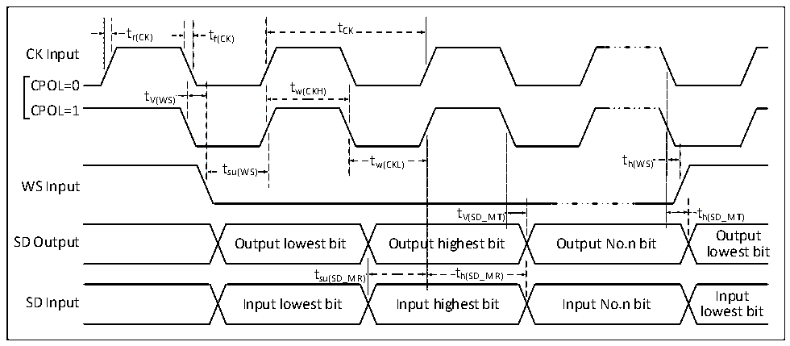

<!-- source-page: 116 -->

[← p.115](0115.md) · [index](../README.md) · [PDF p.116](https://ch32-riscv-ug.github.io/CH32H417/datasheet_en/CH32H417DS0.PDF#page=116) · [p.117 →](0117.md)

<!-- header: CH32H417/H416/H415 Datasheet https://wch-ic.com -->

> ⬆ **Table continued** — rendered in full at [page 115](0115.md). <!-- p116-table-001 -->

### 3.3.16 QSPI Interface Characteristics

<!-- p116-table-002 (table-3-27@1) -->
<table><caption>Table 3-27 QSPI interface I/O characteristics</caption><tr><th>Symbol</th><th>Parameter</th><th>Condition</th><th>Min.</th><th>Max.</th><th>Unit</th></tr><tr><td style="text-align:left">f /t SCK SCK</td><td>QSPI clock frequency</td><td></td><td></td><td>75</td><td>MHz</td></tr><tr><td style="text-align:left">t /t r（SCK） f（SCK）</td><td>QSPI clock rise and fall time</td><td>Load capacitance: C = 30pF</td><td></td><td>20</td><td>ns</td></tr><tr><td style="text-align:left">t /t w（SCKH） w （SCKL）</td><td style="text-align:left">SCK high-level and low-level time</td><td style="text-align:left">f = 36MHz, HCLK prescaler factor = 4</td><td>40</td><td>60</td><td>ns</td></tr><tr><td style="text-align:left">t SU（SIO*）</td><td>Data input setup time</td><td></td><td>5</td><td></td><td>ns</td></tr><tr><td style="text-align:left">t h（SIO*）</td><td>Data input hold time</td><td></td><td>5</td><td></td><td>ns</td></tr><tr><td style="text-align:left">t V（SIO*）</td><td>Data output valid time</td><td></td><td></td><td>5</td><td>ns</td></tr><tr><td style="text-align:left">t h（SIO*）</td><td>Data output hold time</td><td></td><td>0</td><td></td><td>ns</td></tr></table>

### 3.3.17 I2S Interface Characteristics

Figure 3-12 I2S Bus master mode timing diagram  
 <!-- rendered from the PDF; verify at https://ch32-riscv-ug.github.io/CH32H417/datasheet_en/CH32H417DS0.PDF#page=116 -->

🖼 Text parsed from the figure above

t  
t r(CK) t f(CK) CK  
CK Input  
CPOL=0t tw(CKH)  
V(WS)  
CPOL=1  
t t  
t w(CKL) h(WS)  
su(WS)  
WS Input  
t V(SD_MT)  
tV(SD_MT) th(SD_MT)  
Output  
SD Output Output lowest bit Output highest bit Output No.n bit  
lowest bit  
t  t h(SD_MR)  t  th(SD_MR)  
t su(SD_MR) t h(SD_MR)  
Input  
SD Input Input lowest bit Input highest bit Input No.n bit  
lowest bit  

<!-- image: p116-draw-image-00001 bbox=[515.88, 783.6, 535.32, 793.8] -->
<!-- footer: V1.8 112 -->
