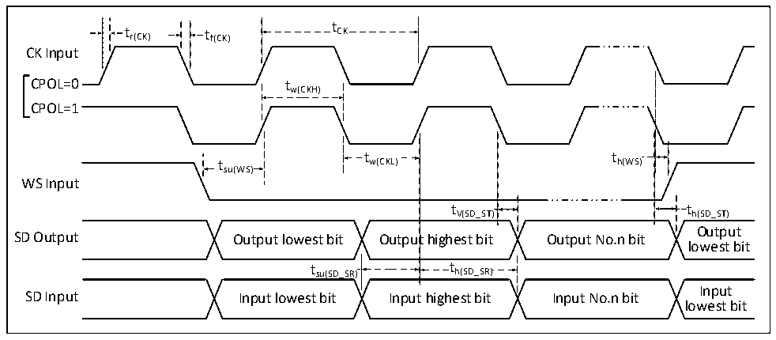

<!-- source-page: 117 -->

[← p.116](0116.md) · [index](../README.md) · [PDF p.117](https://ch32-riscv-ug.github.io/CH32H417/datasheet_en/CH32H417DS0.PDF#page=117) · [p.118 →](0118.md)

<!-- header: CH32H417/H416/H415 Datasheet https://wch-ic.com -->

Figure 3-13 I2S Bus slave mode timing diagram  
 <!-- rendered from the PDF; verify at https://ch32-riscv-ug.github.io/CH32H417/datasheet_en/CH32H417DS0.PDF#page=117 -->

🖼 Text parsed from the figure above

t  
t r(CK) t f(CK) CK  
CK Input  
CPOL=0 tw(CKH)  
CPOL=1  
t t  
t w(CKL) h(WS)  
su(WS)  
WS Input  
t V(SD_ST)  
tV(SD_ST) th(SD_ST)  
Output  
SD Output Output lowest bit Output highest bit Output No.n bit  
lowest bit  
t  t h(SD_SR)  t  th(SD_SR)  
t su(SD_SR) t h(SD_SR)  
Input  
SD Input Input lowest bit Input highest bit Input No.n bit  
lowest bit  

<!-- p117-table-003 (table-3-28@1) -->
<table><caption>Table 3-28 I2S interface characteristics</caption><tr><th>Symbol</th><th>Parameter</th><th>Condition</th><th>Min.</th><th>Max.</th><th>Unit</th></tr><tr><td rowspan="2" style="text-align:left">f /t CK CK</td><td rowspan="2">I2S clock frequency</td><td>Master mode</td><td></td><td>8</td><td>MHz</td></tr><tr><td>Slave mode</td><td></td><td>8</td><td>MHz</td></tr><tr><td style="text-align:left">t /t r(CK) f(CK)</td><td>I2S clock rise and fall time</td><td>Load capacitance: C = 30pF</td><td></td><td>20</td><td>ns</td></tr><tr><td style="text-align:left">t V(WS)</td><td>WS valid time</td><td>Master mode</td><td></td><td>5</td><td>ns</td></tr><tr><td style="text-align:left">t SU(WS)</td><td>WS setup time</td><td>Slave mode</td><td>10</td><td></td><td>ns</td></tr><tr><td rowspan="2" style="text-align:left">t h(WS)</td><td rowspan="2">WS hold time</td><td>Master mode</td><td>0</td><td></td><td>ns</td></tr><tr><td>Slave mode</td><td>0</td><td></td><td>ns</td></tr><tr><td style="text-align:left">t /t w(CKH) w(CKL)</td><td style="text-align:left">SCK high level and low level time</td><td style="text-align:left">Master mode, f = 36MHz HCLK prescaler factor = 4</td><td>40</td><td>60</td><td>%</td></tr><tr><td rowspan="2" style="text-align:left">t SU(SD_MR) t SU(SD_SR)</td><td rowspan="2">Data input setup time</td><td>Master mode</td><td>8</td><td></td><td>ns</td></tr><tr><td>Slave mode</td><td>8</td><td></td><td>ns</td></tr><tr><td rowspan="2" style="text-align:left">t h(SD_MR) t h(SD_SR)</td><td rowspan="2">Data input hold time</td><td>Master mode</td><td>5</td><td></td><td>ns</td></tr><tr><td>Slave mode</td><td>4</td><td></td><td>ns</td></tr><tr><td style="text-align:left">t h(SD_MT)</td><td rowspan="2">Data output hold time</td><td>Slave mode (After enabling edge)</td><td></td><td>5</td><td>ns</td></tr><tr><td style="text-align:left">t h(SD_ST)</td><td style="text-align:left">Master mode (After enabling edge)</td><td></td><td>5</td><td>ns</td></tr><tr><td style="text-align:left">t V(SD_MT)</td><td rowspan="2">Data output valid time</td><td>Slave mode (After enabling edge)</td><td></td><td>5</td><td>ns</td></tr><tr><td style="text-align:left">t v(SD_ST)</td><td style="text-align:left">Master mode (After enabling edge)</td><td></td><td>4</td><td>ns</td></tr></table>

### 3.3.18 USB PD Interface Characteristics

<!-- p117-table-004 (table-3-29-1@1) pages 117-118 -->
<table><caption>Table 3-29-1 PD interface I/O characteristics</caption><tr><th>Symbol</th><th>Parameter</th><th>Condition</th><th>Min.</th><th>Typ.</th><th>Max.</th><th>Unit</th></tr><tr><td style="text-align:left">t Rise</td><td>Rising time</td><td style="text-align:left">The amplitude is between 10% and 90%, and the minimum value is the time under no-load condition.</td><td>300</td><td>430</td><td></td><td>ns</td></tr><tr><td style="text-align:left">t Fall</td><td>Falling time</td><td style="text-align:left">The amplitude is between 10% and 90%, and the minimum value is the time under no-load condition.</td><td>300</td><td>430</td><td></td><td>ns</td></tr><tr><td style="text-align:left">VSwing</td><td style="text-align:left">Output voltage swing (peak-to-peak)</td><td></td><td>1.04</td><td>1.12</td><td>1.20</td><td>V</td></tr></table>

<!-- image: p117-draw-image-00001 bbox=[515.88, 783.6, 535.32, 793.8] -->
<!-- footer: V1.8 113 -->
