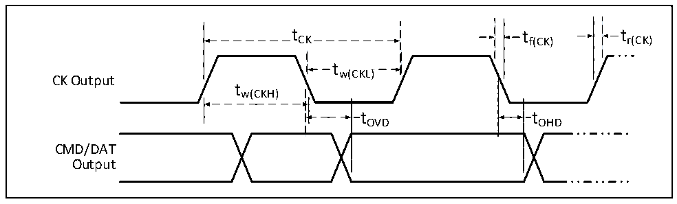

<!-- source-page: 121 -->

[← p.120](0120.md) · [index](../README.md) · [PDF p.121](https://ch32-riscv-ug.github.io/CH32H417/datasheet_en/CH32H417DS0.PDF#page=121) · [p.122 →](0122.md)

<!-- header: CH32H417/H416/H415 Datasheet https://wch-ic.com -->

Figure 3-15 SD default mode timing diagram  
 <!-- rendered from the PDF; verify at https://ch32-riscv-ug.github.io/CH32H417/datasheet_en/CH32H417DS0.PDF#page=121 -->

🖼 Text parsed from the figure above

t CK  tCK  
tCK tf(CK) tr(CK)  
tw(CKL)  
CK Output  
tw(CKH)  
t OVD  
t OHD  
tOVD tOHD  
CMD/DAT  
Output  

<!-- p121-table-004 (table-3-33@1) -->
<table><caption>Table 3-33 SDMMC interface characteristics</caption><tr><th>Symbol</th><th>Parameter</th><th colspan="2">Condition</th><th>Min.</th><th>Max.</th><th>Unit</th></tr><tr><td rowspan="5" style="text-align:left">f /t CK CK</td><td rowspan="5" style="text-align:left">Clock frequency in data transmission mode</td><td colspan="2">CL≤30pF</td><td></td><td>100</td><td>MHz</td></tr><tr><td colspan="2" style="text-align:left">CL≤10pF, V = 1.8VDD18 (Single-edge)</td><td></td><td>200</td><td>MHz</td></tr><tr><td colspan="2" style="text-align:left">CL≤10pF, V = 3.3VDD18 (Single-edge)</td><td></td><td>200</td><td>MHz</td></tr><tr><td colspan="2" style="text-align:left">CL≤10pF, V = 1.8VDD18 (Single-edge)</td><td></td><td>150(1)</td><td>MHz</td></tr><tr><td colspan="2" style="text-align:left">CL≤10pF, V = 3.3VDD18 (Dual-edge)</td><td></td><td>180(1)</td><td>MHz</td></tr><tr><td style="text-align:left">t W（CKL）</td><td>Clock low level time</td><td colspan="2">CL≤10pF</td><td>2.2</td><td></td><td rowspan="4">ns</td></tr><tr><td style="text-align:left">t W（CKH）</td><td>Clock high level time</td><td colspan="2">CL≤10pF</td><td>2.2</td><td></td></tr><tr><td style="text-align:left">t r（CK）</td><td>Rising time</td><td colspan="2">CL≤10pF</td><td></td><td>1.2</td></tr><tr><td style="text-align:left">t f（CK）</td><td>Falling time</td><td colspan="2">CL≤10pF</td><td></td><td>1.2</td></tr><tr><td colspan="7">CMD/DAT input (Refer to CK)</td></tr><tr><td style="text-align:left">t ISU</td><td>Input setup time</td><td colspan="2">CL≤10pF</td><td>0.5</td><td></td><td rowspan="2">ns</td></tr><tr><td style="text-align:left">t IH</td><td>Input holding time</td><td colspan="2">CL≤10pF</td><td>0.5</td><td></td></tr><tr><td colspan="7" style="text-align:left">In high-speed mode, CMD/DAT output (refer to CK)</td></tr><tr><td rowspan="2" style="text-align:left">t OV</td><td rowspan="2">Output valid time</td><td rowspan="2">CL≤10pF</td><td>Master mode</td><td></td><td>1.2</td><td rowspan="3">ns</td></tr><tr><td>Slave mode</td><td></td><td>6</td></tr><tr><td style="text-align:left">t OH</td><td>Output holding time</td><td colspan="2">CL≤10pF</td><td>4.5</td><td></td></tr><tr><td colspan="7" style="text-align:left">In default mode, CMD/DAT output (refer to CK).</td></tr><tr><td rowspan="2" style="text-align:left">t OVD</td><td rowspan="2">Output valid default time</td><td rowspan="2">CL≤10pF</td><td>Master mode</td><td></td><td>1.2</td><td rowspan="3">ns</td></tr><tr><td>Slave mode</td><td></td><td>6</td></tr><tr><td style="text-align:left">t OHD</td><td>Output holding default time</td><td colspan="2">CL≤10pF</td><td>4.5</td><td></td></tr></table>

<em>Note: 1. These maximum clock frequencies are significantly influenced by the performance of the opposite end and</em>  
<em>PCB design; when VDD18= 1.8V, bidirectional communication with an EMMC card has been measured to reach</em>  
<em>175MHz.</em>  
<em>2. At higher clock frequency, if the recommended timing adjustment register value can&#x27;t communicate stably,</em>  
<em>users need to initiate the bus sampling tuning sequence to find a better sampling point.</em>  
<!-- image: p121-draw-image-00001 bbox=[515.88, 783.6, 535.32, 793.8] -->
<!-- footer: V1.8 117 -->
