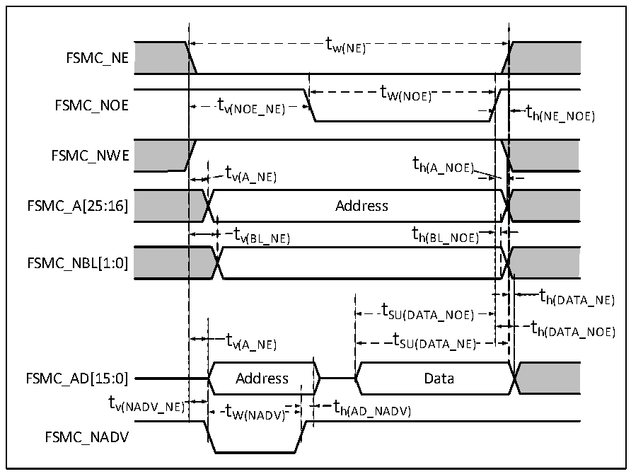

<!-- source-page: 122 -->

[← p.121](0121.md) · [index](../README.md) · [PDF p.122](https://ch32-riscv-ug.github.io/CH32H417/datasheet_en/CH32H417DS0.PDF#page=122) · [p.123 →](0123.md)

<!-- header: CH32H417/H416/H415 Datasheet https://wch-ic.com -->

### 3.3.24 UHSIF Interface Characteristics

<!-- p122-table-001 (table-3-34@1) -->
<table><caption>Table 3-34 UHSIF interface characteristics</caption><tr><th>Symbol</th><th>Parameter</th><th>Condition</th><th>Min.</th><th>Max.</th><th>Unit</th></tr><tr><td style="text-align:left">f /t CK CK</td><td style="text-align:left">Clock frequency in data transmission mode</td><td style="text-align:left">CL≤10pF, V = 1.8VDD18</td><td></td><td>125</td><td>MHz</td></tr><tr><td style="text-align:left">t C</td><td>Clock cycle</td><td></td><td>8</td><td></td><td>ns</td></tr><tr><td style="text-align:left">t IS</td><td>Input signal rise time to CLK</td><td></td><td>0.5</td><td></td><td>ns</td></tr><tr><td style="text-align:left">t IH</td><td>Input signal hold time to CLK</td><td></td><td>1.5</td><td></td><td>ns</td></tr><tr><td style="text-align:left">t OD</td><td>Output signal delay to CLK</td><td></td><td>6.2</td><td>8</td><td>ns</td></tr></table>

### 3.3.25 FSMC Characteristics

Figure 3-16-1 Asynchronous bus multiplexing PSRAM/NOR read operation waveform  
 <!-- rendered from the PDF; verify at https://ch32-riscv-ug.github.io/CH32H417/datasheet_en/CH32H417DS0.PDF#page=122 -->

🖼 Text parsed from the figure above

tw(NE)  
FSMC_NE  
t  
FSMC_NOE t v(NOE_NE) W(NOE) t  
h(NE_NOE)  
FSMC_NWE  
t  
t h(A_NOE)  
v(A_NE)  
FSMC_A[25:16] Address  
t v(BL_NE)  )  t h(BL_NOE)  )  
FSMC_NBL[1:0]  
th(DATA_NE)  
t SU(DATA_NOE)  t SU(DATA_NE)  
t  
v(A_NE) SU(DATA_NE)  
FSMC_AD[15:0] Address Data  
tv(NADV_NE)t th(AD_NADV)  
W(NADV)  
FSMC_NADV  

<!-- image: p122-draw-image-00001 bbox=[515.88, 783.6, 535.32, 793.8] -->
<!-- footer: V1.8 118 -->
