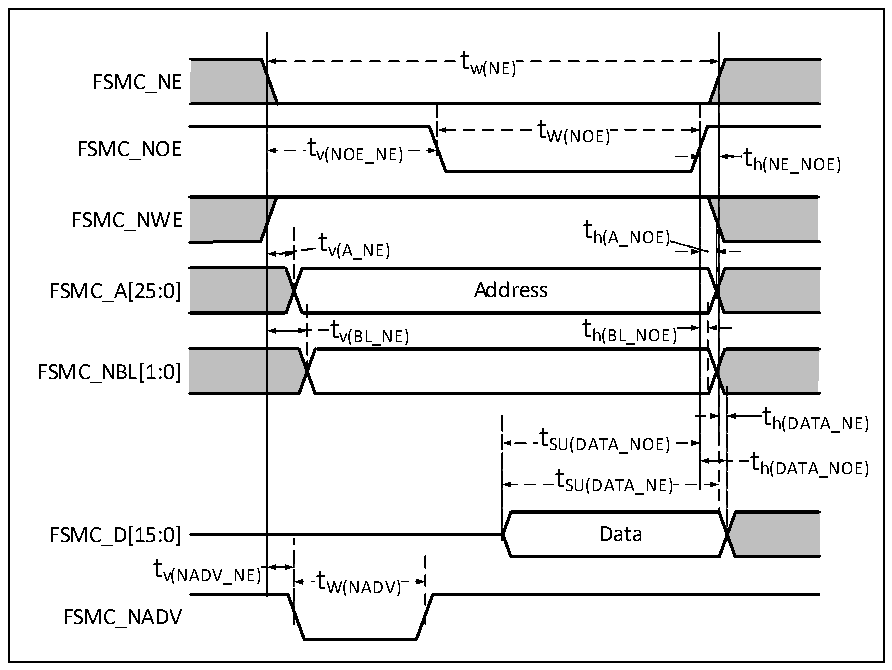

<!-- source-page: 123 -->

[← p.122](0122.md) · [index](../README.md) · [PDF p.123](https://ch32-riscv-ug.github.io/CH32H417/datasheet_en/CH32H417DS0.PDF#page=123) · [p.124 →](0124.md)

<!-- header: CH32H417/H416/H415 Datasheet https://wch-ic.com -->

Figure 3-16-2 Asynchronous bus non-multiplexing PSRAM/NOR read operation waveform  
 <!-- rendered from the PDF; verify at https://ch32-riscv-ug.github.io/CH32H417/datasheet_en/CH32H417DS0.PDF#page=123 -->

🖼 Text parsed from the figure above

tw(NE)  
FSMC_NE  
t  
FSMC_NOE t v(NOE_NE) W(NOE) t  
h(NE_NOE)  
FSMC_NWE  
t  
t h(A_NOE)  
v(A_NE)  
FSMC_A[25:0] Address  
t v(BL_NE)  )  t h(BL_NOE)  )  
FSMC_NBL[1:0]  
th(DATA_NE)  
t SU(DATA_NOE)  t SU(DATA_NE)  
t  
t h(DATA_NOE)  
FSMC_D[15:0] Data  
t  
v(NADV_NE) t  
W(NADV)  
FSMC_NADV  

<!-- p123-table-004 (table-3-35@1) -->
<table><caption>Table 3-35 Timing of PSRAM/NOR read operations for asynchronous bus multiplexing</caption><tr><th>Symbol</th><th>Parameter</th><th>Min.</th><th>Max.</th><th>Unit</th></tr><tr><td style="text-align:left">t W(NE)</td><td>FSMC_NE low level time</td><td style="text-align:left">7*t HCLK</td><td></td><td rowspan="15">ns</td></tr><tr><td style="text-align:left">t V(NOE_NE)</td><td>FSMC_NE low to FSMC_NOE low</td><td>0</td><td></td></tr><tr><td style="text-align:left">t W(NOE)</td><td>FSMC_NOE low time</td><td style="text-align:left">4*t HCLK</td><td></td></tr><tr><td style="text-align:left">t h(NE_NOE)</td><td>FSMC_NOE high to FSMC_NE high hold time</td><td>0</td><td></td></tr><tr><td style="text-align:left">t V(A_NE)</td><td>FSMC_NE low to FSMC_A valid</td><td>0</td><td>5</td></tr><tr><td style="text-align:left">t V(NADV_NE)</td><td>FSMC_NE low to FSMC_NADV low</td><td>0</td><td>5</td></tr><tr><td style="text-align:left">t W(NADV)</td><td>FSMC_NADV low time</td><td style="text-align:left">t HCLK</td><td></td></tr><tr><td style="text-align:left">t h(AD_NADV)</td><td style="text-align:left">FSMC_AD (address) valid hold time after FSMC_NADV high</td><td style="text-align:left">2*t HCLK</td><td></td></tr><tr><td style="text-align:left">t h(A_NOE)</td><td>Address hold time after FSMC_NOE high</td><td>0</td><td></td></tr><tr><td style="text-align:left">t h(BL_NOE)</td><td>FSMC_BL hold time after FSMC_NOE high</td><td>0</td><td></td></tr><tr><td style="text-align:left">t V(BL_NE)</td><td>FSMC_NE low to FSMC_BL valid</td><td>0</td><td>5</td></tr><tr><td style="text-align:left">t SU(DATA_NE)</td><td>Data to FSMC_NE high build time</td><td style="text-align:left">3*t HCLK</td><td></td></tr><tr><td style="text-align:left">t SU(DATA_NOE)</td><td>Data to FSMC_NOE high build time</td><td style="text-align:left">3*t HCLK</td><td></td></tr><tr><td style="text-align:left">t h(DATA_NE)</td><td>Data hold time after FSMC_NE high</td><td>0</td><td></td></tr><tr><td style="text-align:left">t h(DATA_NOE)</td><td>Data hold time after FSMC_NOE high</td><td>0</td><td></td></tr></table>

<!-- image: p123-draw-image-00001 bbox=[515.88, 783.6, 535.32, 793.8] -->
<!-- footer: V1.8 119 -->
