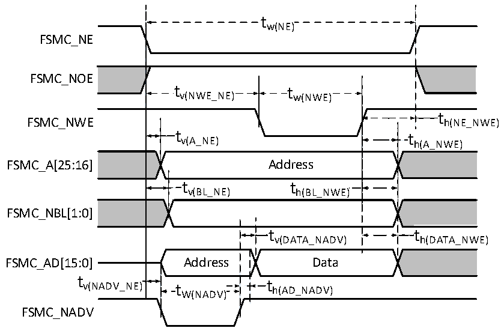
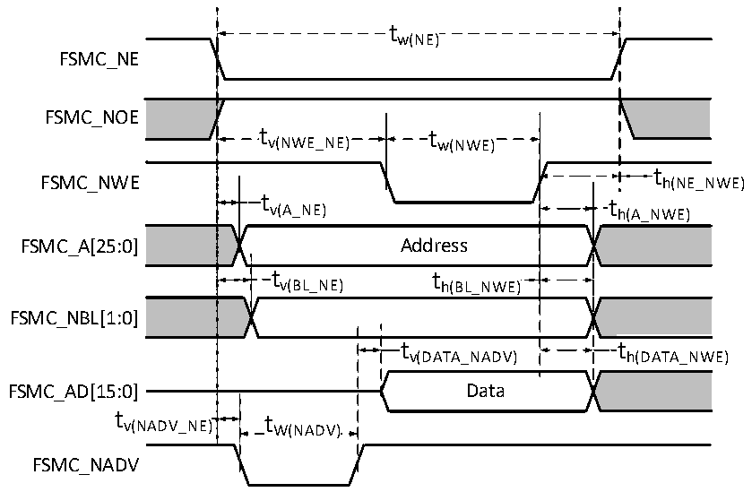

<!-- source-page: 124 -->

[← p.123](0123.md) · [index](../README.md) · [PDF p.124](https://ch32-riscv-ug.github.io/CH32H417/datasheet_en/CH32H417DS0.PDF#page=124) · [p.125 →](0125.md)

<!-- header: CH32H417/H416/H415 Datasheet https://wch-ic.com -->

Figure 3-17-1 Asynchronous bus multiplexing PSRAM/NOR write operation waveform  
 <!-- rendered from the PDF; verify at https://ch32-riscv-ug.github.io/CH32H417/datasheet_en/CH32H417DS0.PDF#page=124 -->

🖼 Text parsed from the figure above

tw(NE)  
FSMC_NE  
FSMC_NOE  
tv(NWE_NE) tw(NWE)  
t h(NE_NWE)  th(NE h(A_NWE)  
FSMC_NWE h(NE_NWE)  
t v(A_NE)  Address  t v(BL_NE)  )  t h(BL_NWE)  )  )  t v(DATA_NADV)  th(AD_NADV)  
FSMC_A[25:16] Address  
FSMC_NBL[1:0]  
t  
FSMC_NADV  

Figure 3-17-2 Asynchronous bus non-multiplexing PSRAM/NOR write operation waveform  
 <!-- rendered from the PDF; verify at https://ch32-riscv-ug.github.io/CH32H417/datasheet_en/CH32H417DS0.PDF#page=124 -->

🖼 Text parsed from the figure above

tw(NE)  
FSMC_NE  
FSMC_NOE  
tv(NWE_NE) tw(NWE)  
t h(NE_NWE)  th(NE h(A_NWE)  
FSMC_NWE h(NE_NWE)  
t v(A_NE)  Address  t v(BL_NE)  )  t h(BL_NWE)  )  )  t v(DATA_NADV)  
FSMC_NBL[1:0]  
FSMC_AD[15:0] Data  
tv(NADV_NE) tW(NADV)  
FSMC_NADV  

<!-- p124-table-007 (table-3-36@1) pages 124-125 -->
<table><caption>Table 3-36 Timing of PSRAM/NOR write operations for asynchronous bus multiplexing</caption><tr><th>Symbol</th><th>Parameter</th><th>Min.</th><th>Max.</th><th>Unit</th></tr><tr><td style="text-align:left">t W(NE)</td><td>FSMC_NE low level time</td><td style="text-align:left">5*t HCLK</td><td></td><td rowspan="13">ns</td></tr><tr><td style="text-align:left">t V(NEW_NE)</td><td>FSMC_NE low to FSMC_NWE low</td><td style="text-align:left">3*t HCLK</td><td></td></tr><tr><td style="text-align:left">t W(NWE)</td><td>FSMC_NWE low time</td><td style="text-align:left">2*t HCLK</td><td></td></tr><tr><td style="text-align:left">t h(NE_NWE)</td><td>FSMC_NWE high to FSMC_NE high hold time</td><td style="text-align:left">t HCLK</td><td></td></tr><tr><td style="text-align:left">t V(A_NE)</td><td>FSMC_NE low to FSMC_A valid</td><td>0</td><td>5</td></tr><tr><td style="text-align:left">t V(NADV_NE)</td><td>FSMC_NE low to FSMC_NADV low</td><td>0</td><td>5</td></tr><tr><td style="text-align:left">t W(NADV)</td><td>FSMC_NADV low time</td><td style="text-align:left">t HCLK</td><td></td></tr><tr><td style="text-align:left">t h(AD_NADV)</td><td style="text-align:left">FSMC_AD (address) valid hold time after FSMC_NADV high</td><td style="text-align:left">2*t HCLK</td><td></td></tr><tr><td style="text-align:left">t h(A_NWE)</td><td>Address hold time after FSMC_NWE high</td><td style="text-align:left">t HCLK</td><td></td></tr><tr><td style="text-align:left">t V(BL_NE)</td><td>FSMC_NE low to FSMC_BL valid</td><td>0</td><td>5</td></tr><tr><td style="text-align:left">t h(BL_NWE)</td><td>FSMC_BL hold time after FSMC_NWE high</td><td style="text-align:left">t HCLK</td><td></td></tr><tr><td style="text-align:left">t V(DATA_NADV)</td><td>FSMC_NADV high to data hold time</td><td style="text-align:left">2*t HCLK</td><td></td></tr><tr><td style="text-align:left">t h(DATA_NWE)</td><td>Data hold time after FSMC_NWE high</td><td style="text-align:left">t HCLK</td><td></td></tr></table>

<!-- image: p124-draw-image-00001 bbox=[515.88, 783.6, 535.32, 793.8] -->
<!-- footer: V1.8 120 -->
