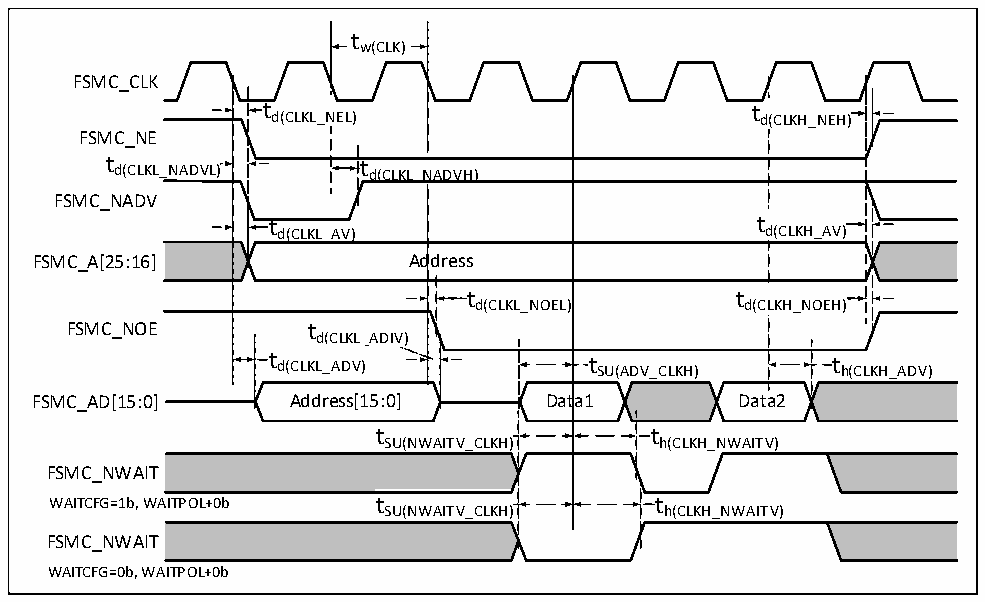

<!-- source-page: 125 -->

[← p.124](0124.md) · [index](../README.md) · [PDF p.125](https://ch32-riscv-ug.github.io/CH32H417/datasheet_en/CH32H417DS0.PDF#page=125) · [p.126 →](0126.md)

<!-- header: CH32H417/H416/H415 Datasheet https://wch-ic.com -->

> ⬆ **Table continued** — rendered in full at [page 124](0124.md). <!-- p125-table-001 -->

Figure 3-18 Synchronous bus multiplexing NOR/PSRAM read waveforms  
 <!-- rendered from the PDF; verify at https://ch32-riscv-ug.github.io/CH32H417/datasheet_en/CH32H417DS0.PDF#page=125 -->

🖼 Text parsed from the figure above

tw(CLK)  
FSMC_CLK  
t  t d(CLKL_N  NEL)  td(CLKL_N  d(CLKH_NEH)  t d(CLKL_AV)  td(CLKL_N  ADVH)  )  td(CLKL_N  NADVH)  t d  d(CLKH_AV)  t d(CLKL_AV)  d(CLKH_AV)  td(CLKL_AV) Ad  dress  t d(CLKL_NOEL)  t d(C  t d(C  LKH_NOEH)  t SU(ADV_CLKH)  ta1  
FSMC_NE  
FSMC_NADV  
FSMC_NOE t  
d(CLKL_ADIV)  
t h(CLKH_ADV)  
FSMC_AD[15:0] Address[15:0] Data1 Data2  
t SU(NWAITV_CLKH)  t SU(NWAITV_CLKH)  
t  t h(CLKH_NWAITV)  
FSMC_NWAIT  
SU(NWAITV_CLKH) h(CLKH_NWAITV)  
FSMC_NWAIT  
WAITCFG=0b, WAITPOL+0b  

<!-- p125-table-006 (table-3-37@1) pages 125-126 -->
<table><caption>Table 3-37 Synchronous bus multiplexing NOR/PSRAM read timing</caption><tr><th>Symbol</th><th>Parameter</th><th>Min.</th><th>Max.</th><th>Unit</th></tr><tr><td style="text-align:left">t W(CLK)</td><td>FSMC_CLK period</td><td style="text-align:left">2*t HCLK</td><td></td><td rowspan="6">ns</td></tr><tr><td style="text-align:left">t d(CLKL_NEL)</td><td>FSMC_CLK low to FSMC_NE low</td><td>0</td><td>5</td></tr><tr><td style="text-align:left">t d(CLKH_NEH)</td><td>FSMC_CLK high to FSMC_NE high</td><td style="text-align:left">0.5*t HCLK</td><td style="text-align:left">0.5*t HCLK</td></tr><tr><td style="text-align:left">t d(CLKL_NADVL)</td><td>FSMC_CLK low to FSMC_NADV low</td><td>0</td><td>5</td></tr><tr><td style="text-align:left">t d(CLKL_NADVH)</td><td>FSMC_CLK low to FSMC_NADV high</td><td>0</td><td>5</td></tr><tr><td style="text-align:left">t d(CLKL_AV)</td><td style="text-align:left">FSMC_CLK low to FSMC_Ax valid (x = 16…25)</td><td>0</td><td>5</td></tr><tr><td style="text-align:left">t d(CLKH_AIV)</td><td style="text-align:left">FSMC_CLK high to FSMC_Ax invalid (x = 16…25)</td><td>0</td><td>5</td><td rowspan="9"></td></tr><tr><td style="text-align:left">t d(CLKL_NOEL)</td><td>FSMC_CLK low to FSMC_NOE low</td><td style="text-align:left">2*t HCLK</td><td></td></tr><tr><td style="text-align:left">t d(CLKH_NOEH)</td><td>FSMC_CLK high to FSMC_NOE high</td><td style="text-align:left">t HCLK</td><td></td></tr><tr><td style="text-align:left">t d(CLKL_ADV)</td><td>FSMC_CLK low to FSMC_AD[15:0] valid</td><td>0</td><td>5</td></tr><tr><td style="text-align:left">t d(CLKL_ADIV)</td><td>FSMC_CLK low to FSMC_AD[15:0] invalid</td><td>0</td><td>5</td></tr><tr><td style="text-align:left">t SU(ADV_CLKH)</td><td style="text-align:left">FSMC_AD[15:0] valid data before FSMC_CLK high</td><td>8</td><td></td></tr><tr><td style="text-align:left">t h(CLKH_ADV)</td><td style="text-align:left">FSMC_AD[15:0] valid data after FSMC_CLK high</td><td>8</td><td></td></tr><tr><td style="text-align:left">t SU(NWAITV_CLKH)</td><td>FSMC_NWAIT valid before FSMC_CLK high</td><td>6</td><td></td></tr><tr><td style="text-align:left">t h(CLKH_NWAITV)</td><td>FSMC_NWAIT valid after FSMC_CLK high</td><td>2</td><td></td></tr></table>

<!-- image: p125-draw-image-00001 bbox=[515.88, 783.6, 535.32, 793.8] -->
<!-- footer: V1.8 121 -->
