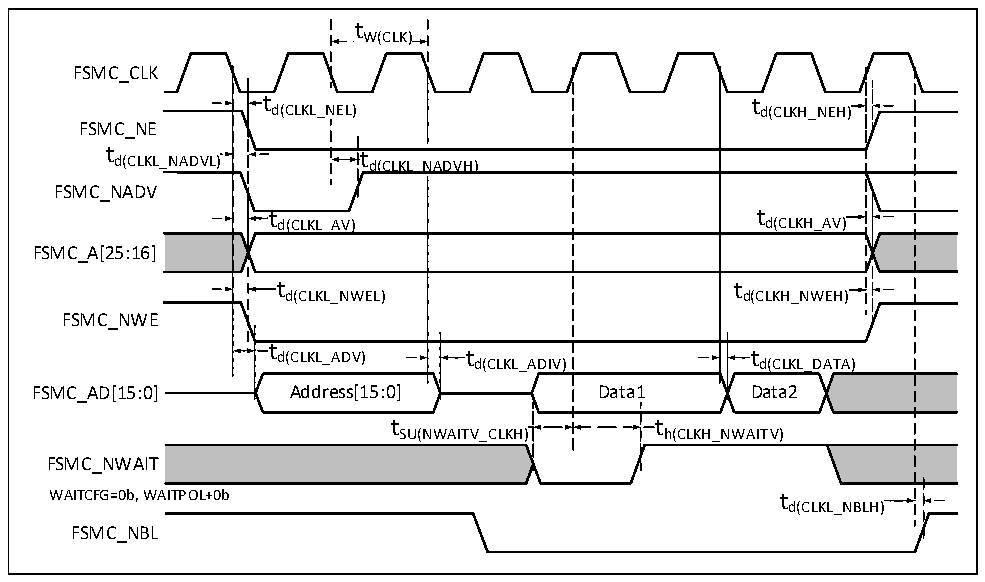

<!-- source-page: 126 -->

[← p.125](0125.md) · [index](../README.md) · [PDF p.126](https://ch32-riscv-ug.github.io/CH32H417/datasheet_en/CH32H417DS0.PDF#page=126) · [p.127 →](0127.md)

<!-- header: CH32H417/H416/H415 Datasheet https://wch-ic.com -->

> ⬆ **Table continued** — rendered in full at [page 125](0125.md). <!-- p126-table-001 -->

Figure 3-19 Synchronous bus multiplexing PSRAM write waveforms  
 <!-- rendered from the PDF; verify at https://ch32-riscv-ug.github.io/CH32H417/datasheet_en/CH32H417DS0.PDF#page=126 -->

🖼 Text parsed from the figure above

tW(CLK)  
FSMC_CLK  
t  t d(CLKL_N  EL)  
td(CLKL_NEL) td(CLKH_NEH)  
FSMC_NE  
td(CLKL_N  ADVH  H)  td(CLKL_N  NADVH)  t d(CLKH_AV)  t d(CLKL_AV)  t  td(CLKL_AV)  t d(CLKH_NWEH)  t d(CLKL_ADIV)  t d(CLKL_DATA)  Data1  
FSMC_NADV  
FSMC_A[25:16]  
FSMC_NWE  
t h(CLKH_NWAITV)  
tSU(NWAITV_CLKH) th(CLKH_NWAITV)  
t d(CLKL_NBLH)  )  
FSMC_NWAIT  
WAITCFG=0b, WAITPOL+0b t  
FSMC_NBL  

<!-- p126-table-006 (table-3-38@1) pages 126-127 -->
<table><caption>Table 3-38 Synchronous bus multiplexing PSRAM write timing</caption><tr><th>Symbol</th><th>Parameter</th><th>Min.</th><th>Max.</th><th>Unit</th></tr><tr><td style="text-align:left">t W(CLK)</td><td>FSMC_CLK period</td><td style="text-align:left">2*t HCLK</td><td></td><td rowspan="11">ns</td></tr><tr><td style="text-align:left">t d(CLKL_NEL)</td><td>FSMC_CLK low to FSMC_NE low</td><td>0</td><td>5</td></tr><tr><td style="text-align:left">t d(CLKH_NEH)</td><td>FSMC_CLK high to FSMC_NE high</td><td style="text-align:left">0.5*t HCLK</td><td style="text-align:left">0.5*t HCLK</td></tr><tr><td style="text-align:left">t d(CLKL_NADVL)</td><td>FSMC_CLK low to FSMC_NADV low</td><td>0</td><td>5</td></tr><tr><td style="text-align:left">t d(CLKL_NADVH)</td><td>FSMC_CLK low to FSMC_NADV high</td><td>0</td><td>5</td></tr><tr><td style="text-align:left">t d(CLKL_AV)</td><td style="text-align:left">FSMC_CLK low to FSMC_Ax valid (x = 16…25)</td><td>0</td><td>5</td></tr><tr><td style="text-align:left">t d(CLKH_AIV)</td><td style="text-align:left">FSMC_CLK high to FSMC_Ax invalid (x = 16…25)</td><td>0</td><td>5</td></tr><tr><td style="text-align:left">t d(CLKL_NWEL)</td><td>FSMC_CLK low to FSMC_NWE low</td><td>0</td><td></td></tr><tr><td style="text-align:left">t d(CLKH_NWEH)</td><td>FSMC_CLK high to FSMC_NWE high</td><td>0</td><td></td></tr><tr><td style="text-align:left">t d(CLKL_ADV)</td><td>FSMC_CLK low to FSMC_AD[15:0] valid</td><td>0</td><td>5</td></tr><tr><td style="text-align:left">t d(CLKL_ADIV)</td><td>FSMC_CLK low to FSMC_AD[15:0] invalid</td><td>0</td><td>5</td></tr><tr><td style="text-align:left">t d(CLKL_DATA)</td><td>FSMC_AD[15:0] valid after FSMC_CLK low</td><td>2</td><td></td><td rowspan="4"></td></tr><tr><td style="text-align:left">t SU(NWAITV_CLKH)</td><td>FSMC_NWAIT valid before FSMC_CLK high</td><td>6</td><td></td></tr><tr><td style="text-align:left">t h(CLKH_NWAITV)</td><td>FSMC_NWAIT valid after FSMC_CLK high</td><td>2</td><td></td></tr><tr><td style="text-align:left">t d(CLKL_NBLH)</td><td>FSMC_CLK low to FSMC_NBL high</td><td>2</td><td></td></tr></table>

<!-- image: p126-draw-image-00001 bbox=[515.88, 783.6, 535.32, 793.8] -->
<!-- footer: V1.8 122 -->
