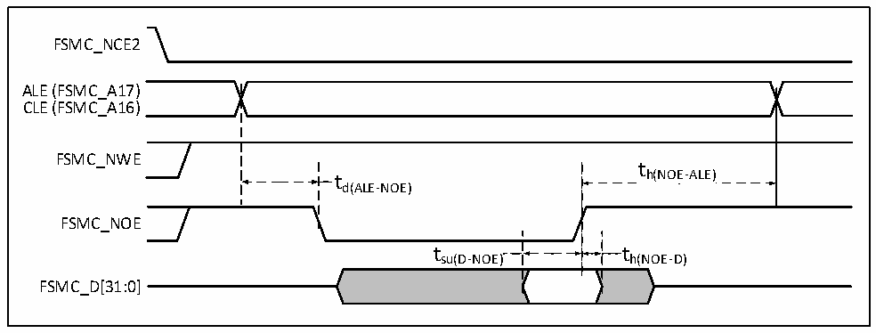
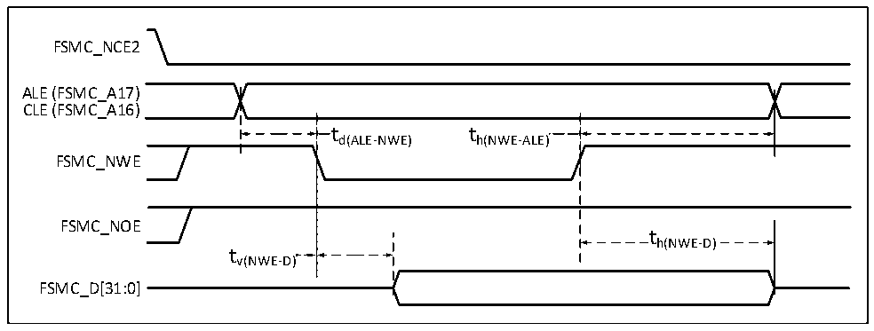

<!-- source-page: 127 -->

[← p.126](0126.md) · [index](../README.md) · [PDF p.127](https://ch32-riscv-ug.github.io/CH32H417/datasheet_en/CH32H417DS0.PDF#page=127) · [p.128 →](0128.md)

<!-- header: CH32H417/H416/H415 Datasheet https://wch-ic.com -->

> ⬆ **Table continued** — rendered in full at [page 126](0126.md). <!-- p127-table-001 -->

NAND Controller Waveforms and Timing  
Test conditions: NAND operation area, 16-bit data width selected, ECC calculation circuitry enabled, 512-byte  
page size, other timing configured to set registers FSMC_PCR2 = 0x0002005E, FSMC_PMEM2 = 0x01020301,  
FSMC_PATT2 = 0x01020301.  

Figure 3-20 NAND controller read operation waveform  
 <!-- rendered from the PDF; verify at https://ch32-riscv-ug.github.io/CH32H417/datasheet_en/CH32H417DS0.PDF#page=127 -->

🖼 Text parsed from the figure above

FSMC_NCE2  
ALE (FSMC_A17)  
CLE (FSMC_A16)  
FSMC_NWE  
t  
t h(NOE-ALE)  
d(ALE-NOE)  
FSMC_NOE  
t su(D-NOE)  )  t h(NOE-D)  )  
FSMC_D[31:0]  

Figure 3-21 NAND controller write operation waveform  
 <!-- rendered from the PDF; verify at https://ch32-riscv-ug.github.io/CH32H417/datasheet_en/CH32H417DS0.PDF#page=127 -->

🖼 Text parsed from the figure above

FSMC_NCE2  
ALE (FSMC_A17)  
CLE (FSMC_A16)  
t  t d(ALE-NWE)  
t h(NWE-ALE)  
FSMC_NWE  
FSMC_NOE  
th(NWE-D)  
tv(NWE-D)  
FSMC_D[31:0]  

<!-- image: p127-draw-image-00001 bbox=[515.88, 783.6, 535.32, 793.8] -->
<!-- footer: V1.8 123 -->
