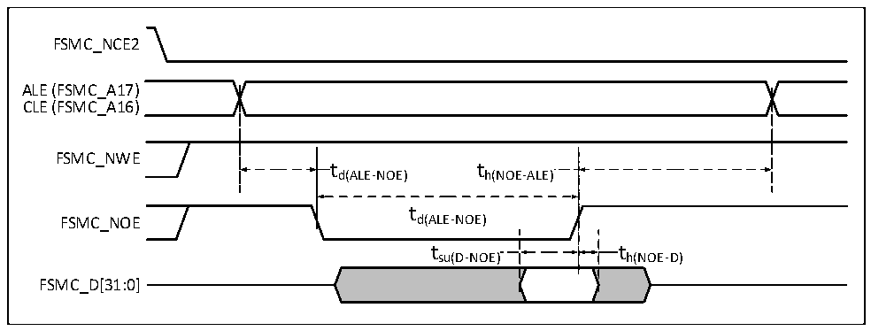
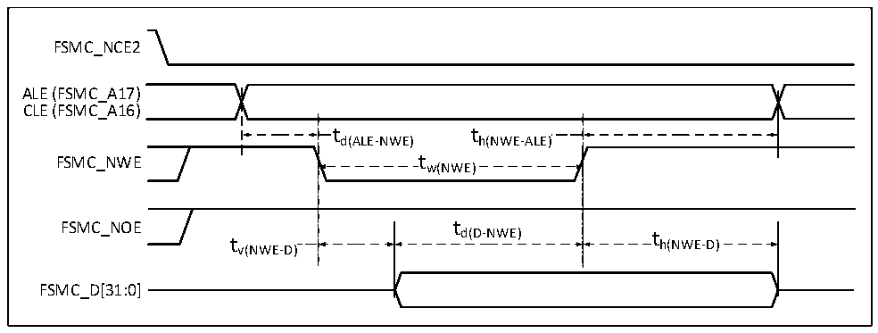

<!-- source-page: 128 -->

[← p.127](0127.md) · [index](../README.md) · [PDF p.128](https://ch32-riscv-ug.github.io/CH32H417/datasheet_en/CH32H417DS0.PDF#page=128) · [p.129 →](0129.md)

<!-- header: CH32H417/H416/H415 Datasheet https://wch-ic.com -->

Figure 3-22 Waveforms of NAND controller read operations in general-purpose memory space  
 <!-- rendered from the PDF; verify at https://ch32-riscv-ug.github.io/CH32H417/datasheet_en/CH32H417DS0.PDF#page=128 -->

🖼 Text parsed from the figure above

FSMC_NCE2  
ALE (FSMC_A17)  
CLE (FSMC_A16)  
FSMC_NWE  
td(ALE-NOE) th(NOE-ALE)  
t  
FSMC_NOE d(ALE-NOE)  
t su(D-NOE)  )  t h(NOE-D)  )  
FSMC_D[31:0]  

Figure 3-23 Waveforms of NAND controller write operations in general-purpose memory space  
 <!-- rendered from the PDF; verify at https://ch32-riscv-ug.github.io/CH32H417/datasheet_en/CH32H417DS0.PDF#page=128 -->

🖼 Text parsed from the figure above

FSMC_NCE2  
ALE (FSMC_A17)  
CLE (FSMC_A16)  
t t d(ALE-NWE) h(NWE-ALE) t w(NWE)  t )  h(NWE-ALE)  t w(NWE)  
FSMC_NWE tw(NWE)  
FSMC_NOE t  
d(D-NWE) t  
t h(NWE-D)  
v(NWE-D)  
FSMC_D[31:0]  

<!-- p128-table-003 (table-3-39@1) -->
<table><caption>Table 3-39 Timing characteristics of NAND flash read and write cycles</caption><tr><th>Symbol</th><th>Parameter</th><th>Min.</th><th>Max.</th><th>Unit</th></tr><tr><td style="text-align:left">t d(D-NEW)</td><td style="text-align:left">FSMC_NWE high before to FSMC_D[31:0] data valid</td><td style="text-align:left">4*t HCLK</td><td></td><td rowspan="11">ns</td></tr><tr><td style="text-align:left">t w(NOE)</td><td>FSMC_NOE low time</td><td style="text-align:left">4*t HCLK</td><td></td></tr><tr><td style="text-align:left">t su(D-NOE)</td><td style="text-align:left">FSMC_NOE high before to FSMC_D[31:0] data valid</td><td>20</td><td></td></tr><tr><td style="text-align:left">t h(NOE-D)</td><td style="text-align:left">FSMC_NOE high followed by to FSMC_D[31:0] data valid</td><td>15</td><td></td></tr><tr><td style="text-align:left">t w(NWE)</td><td>FSMC_NWE low time</td><td style="text-align:left">4*t HCLK</td><td></td></tr><tr><td style="text-align:left">t v(NWE-D)</td><td>FSMC_NWE low to FSMC_D[31:0] data valid</td><td>0</td><td></td></tr><tr><td style="text-align:left">t h(NWE-D)</td><td style="text-align:left">FSMC_NWE high to FSMC_D[31:0] data invalid</td><td style="text-align:left">2*t HCLK</td><td></td></tr><tr><td style="text-align:left">t d(ALE-NWE)</td><td>FSMC_NWE low before to FSMC_ALE valid</td><td style="text-align:left">2*t HCLK</td><td></td></tr><tr><td style="text-align:left">t h(NWE-ALE)</td><td>FSMC_NWE high to FSMC_ALE invalid</td><td style="text-align:left">2*t HCLK</td><td></td></tr><tr><td style="text-align:left">t d(ALE-NOE)</td><td>FSMC_NOE low before to FSMC_ALE valid</td><td style="text-align:left">2*t HCLK</td><td></td></tr><tr><td style="text-align:left">t h(NOE-ALE)</td><td>FSMC_NOE high to FSMC_ALE invalid</td><td style="text-align:left">4*t HCLK</td><td></td></tr></table>

<!-- image: p128-draw-image-00001 bbox=[515.88, 783.6, 535.32, 793.8] -->
<!-- footer: V1.8 124 -->
