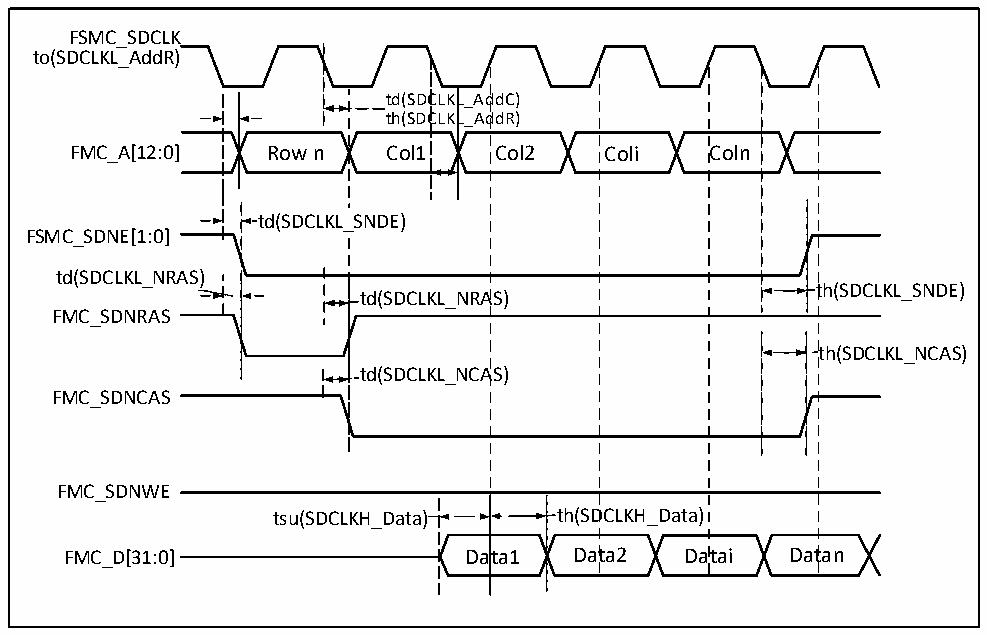

<!-- source-page: 129 -->

[← p.128](0128.md) · [index](../README.md) · [PDF p.129](https://ch32-riscv-ug.github.io/CH32H417/datasheet_en/CH32H417DS0.PDF#page=129) · [p.130 →](0130.md)

<!-- header: CH32H417/H416/H415 Datasheet https://wch-ic.com -->

### 3.3.26 SDRAM Characteristics

Figure 3-24 SDRAM read operation waveform (CL = 1)  
 <!-- rendered from the PDF; verify at https://ch32-riscv-ug.github.io/CH32H417/datasheet_en/CH32H417DS0.PDF#page=129 -->

🖼 Text parsed from the figure above

FSMC_SDCLK  
to(SDCLKL_AddR)  
td(SDC  CLKL  L_AddC) L_AddR)  ttdh((SSDDCC  CLKL  
FMC_A[12:0] Row n Col1 Col2 Coli Coln  
td(SDCLKL_SNDE)  
FSMC_SDNE[1:0]  
td(SDCLKL_NRAS)  
td(SDCLKL_NRAS)  )  
th(SDCLKL_SNDE)  
FMC_SDNRAS  
th(SDCLKL_NCAS)  
td(SDCLKL_NCAS)  
FMC_SDNCAS  
FMC_SDNWE  
tsu(SDCLKH_Data)  
ata1  
tsu(SDCLKH_Data) th(SDCLKH_Data)  
FMC_D[31:0] Data1 Data2 Datai Datan  

<!-- p129-table-005 (table-3-40@1) -->
<table><caption>Table 3-40 SDRAM read operation timing</caption><tr><th>Symbol</th><th>Parameter</th><th>Min.</th><th>Max.</th><th>Unit</th></tr><tr><td style="text-align:left">t W(SDCLK)</td><td>FMC_SDCLK period</td><td>9.5</td><td>10.5</td><td rowspan="10">ns</td></tr><tr><td style="text-align:left">t SU(SDCLKH_DATA)</td><td>Data input setup time</td><td>3.5</td><td></td></tr><tr><td style="text-align:left">t h(SDCLKH_DATA)</td><td>Data input holding time</td><td>1.5</td><td></td></tr><tr><td style="text-align:left">t d(SDCLKL_ADD)</td><td>Address valid time</td><td></td><td>4</td></tr><tr><td style="text-align:left">t d(SDCLKL_SDNE)</td><td>Chip selection valid time</td><td></td><td>1</td></tr><tr><td style="text-align:left">t h(SDCLKL_SDNE)</td><td>Chip selection holding time</td><td>0</td><td></td></tr><tr><td style="text-align:left">t d(SDCLKL_SDNRAS)</td><td>SDNRAS valid time</td><td></td><td>1</td></tr><tr><td style="text-align:left">t h(SDCLKL_SDNRAS)</td><td>SDNRAS holding time</td><td>0</td><td></td></tr><tr><td style="text-align:left">t d(SDCLKL_SDNCAS)</td><td>SDNCAS valid time</td><td></td><td>1</td></tr><tr><td style="text-align:left">t h(SDCLKL_SDNCAS)</td><td>SDNCAS holding time</td><td>0</td><td></td></tr></table>

<em>Note: When reading SDRAM, the maximum value for FMC_SDCLK is set to 100MHz.</em>  

<!-- p129-table-006 (table-3-41@1) pages 129-130 -->
<table><caption>Table 3-41 LPSDR SDRAM read operation timing</caption><tr><th>Symbol</th><th>Parameter</th><th>Min.</th><th>Max.</th><th>Unit</th></tr><tr><td style="text-align:left">t W(SDCLK)</td><td>FMC_SDCLK period</td><td>9.5</td><td>10.5</td><td rowspan="3">ns</td></tr><tr><td style="text-align:left">t SU(SDCLKH_DATA)</td><td>Data input setup time</td><td>3.0</td><td></td></tr><tr><td style="text-align:left">t h(SDCLKH_DATA)</td><td>Data input holding time</td><td>1.5</td><td></td></tr><tr><td style="text-align:left">t d(SDCLKL_ADD)</td><td>Address valid time</td><td></td><td>3.5</td><td rowspan="7"></td></tr><tr><td style="text-align:left">t d(SDCLKL_SDNE)</td><td>Chip selection valid time</td><td></td><td>1</td></tr><tr><td style="text-align:left">t h(SDCLKL_SDNE)</td><td>Chip selection holding time</td><td>0</td><td></td></tr><tr><td style="text-align:left">t d(SDCLKL_SDNRAS)</td><td>SDNRAS valid time</td><td></td><td>1</td></tr><tr><td style="text-align:left">t h(SDCLKL_SDNRAS)</td><td>SDNRAS holding time</td><td>0</td><td></td></tr><tr><td style="text-align:left">t d(SDCLKL_SDNCAS)</td><td>SDNCAS valid time</td><td></td><td>1</td></tr><tr><td style="text-align:left">t h(SDCLKL_SDNCAS)</td><td>SDNCAS holding time</td><td>0</td><td></td></tr></table>

<!-- image: p129-draw-image-00001 bbox=[515.88, 783.6, 535.32, 793.8] -->
<!-- footer: V1.8 125 -->
