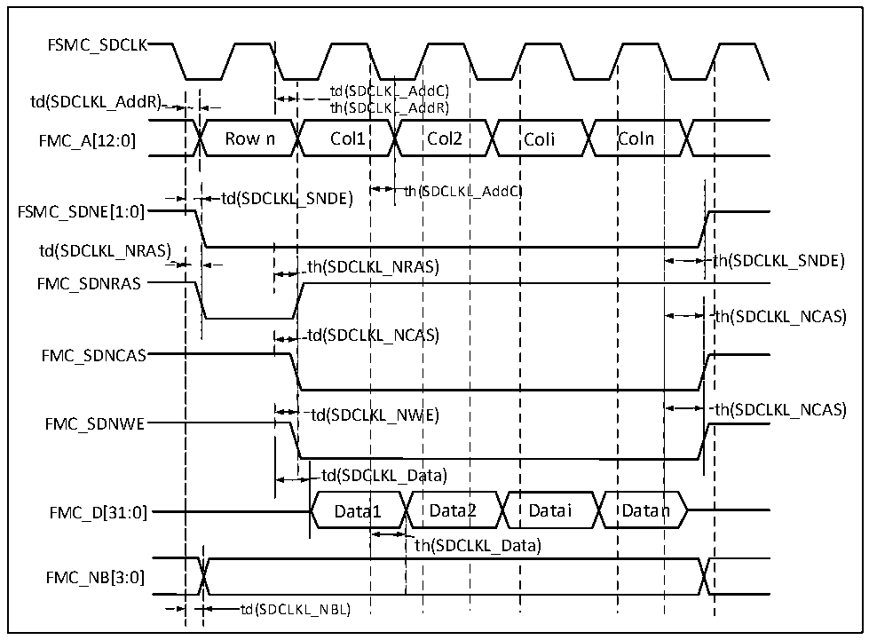

<!-- source-page: 130 -->

[← p.129](0129.md) · [index](../README.md) · [PDF p.130](https://ch32-riscv-ug.github.io/CH32H417/datasheet_en/CH32H417DS0.PDF#page=130) · [p.131 →](0131.md)

<!-- header: CH32H417/H416/H415 Datasheet https://wch-ic.com -->

> ⬆ **Table continued** — rendered in full at [page 129](0129.md). <!-- p130-table-001 -->

<em>Note: When reading SDRAM, the maximum value for FMC_SDCLK is set to 100MHz.</em>  

Figure 3-25 SDRAM write operation waveform  
 <!-- rendered from the PDF; verify at https://ch32-riscv-ug.github.io/CH32H417/datasheet_en/CH32H417DS0.PDF#page=130 -->

🖼 Text parsed from the figure above

FSMC_SDCLK  
td(SDC  CLKLCLKL  L_AddC) L_AddR)  ttdh((SSDDCC  CLK  L_AddR) Col2  
td(SDCLKL_AddR)  
th(SDCLKL_AddC)  th(  
td(SDCLKL_SNDE)  
FSMC_SDNE[1:0]  
td(SDCLKL_NRAS)  
th(SDCLKL_NRAS)  )  
th(SDCLKL_SNDE)  
FMC_SDNRAS  
th(SDCLKL_NCAS)  
td(SDCLKL_NCAS)  
FMC_SDNCAS  
th(SDCLKL_NCAS)  t  
td(SDCLKL_NWE)  
FMC_SDNWE  
td(SDCLKL_Data)  
a1  
FMC_D[31:0] Data1 Data2 Datai Datan  
FMC_NB[3:0]  
td(SDCLKL_NBL)  

<!-- p130-table-007 (table-3-42@1) pages 130-131 -->
<table><caption>Table 3-42 SDRAM write operation timing</caption><tr><th>Symbol</th><th>Parameter</th><th>Min.</th><th>Max.</th><th>Unit</th></tr><tr><td style="text-align:left">t W(SDCLK)</td><td>FMC_SDCLK period</td><td>9.5</td><td>10.5</td><td rowspan="8">ns</td></tr><tr><td style="text-align:left">t SU(SDCLKL_DATA)</td><td>Data output valid time</td><td></td><td>2</td></tr><tr><td style="text-align:left">t h(SDCLKL_DATA)</td><td>Data output holding time</td><td>0.5</td><td></td></tr><tr><td style="text-align:left">t d(SDCLKL_ADD)</td><td>Address valid time</td><td></td><td>4</td></tr><tr><td style="text-align:left">t d(SDCLKL_SDNWE)</td><td>SDNWE valid time</td><td></td><td>1</td></tr><tr><td style="text-align:left">t h(SDCLKL_SDNWE)</td><td>SDNWE holding time</td><td>0</td><td></td></tr><tr><td style="text-align:left">t d(SDCLKL_SDNE)</td><td>Chip selection valid time</td><td></td><td>1</td></tr><tr><td style="text-align:left">t h(SDCLKL_SDNE)</td><td>Chip selection holding time</td><td>0</td><td></td></tr><tr><td style="text-align:left">t d(SDCLKL_SDNRAS)</td><td>SDNRAS valid time</td><td></td><td>1</td><td rowspan="4"></td></tr><tr><td style="text-align:left">t h(SDCLKL_SDNRAS)</td><td>SDNRAS holding time</td><td>0</td><td></td></tr><tr><td style="text-align:left">t d(SDCLKL_SDNCAS)</td><td>SDNCAS valid time</td><td></td><td>1</td></tr><tr><td style="text-align:left">t h(SDCLKL_SDNCAS)</td><td>SDNCAS holding time</td><td>0</td><td></td></tr></table>

<!-- image: p130-draw-image-00001 bbox=[515.88, 783.6, 535.32, 793.8] -->
<!-- footer: V1.8 126 -->
