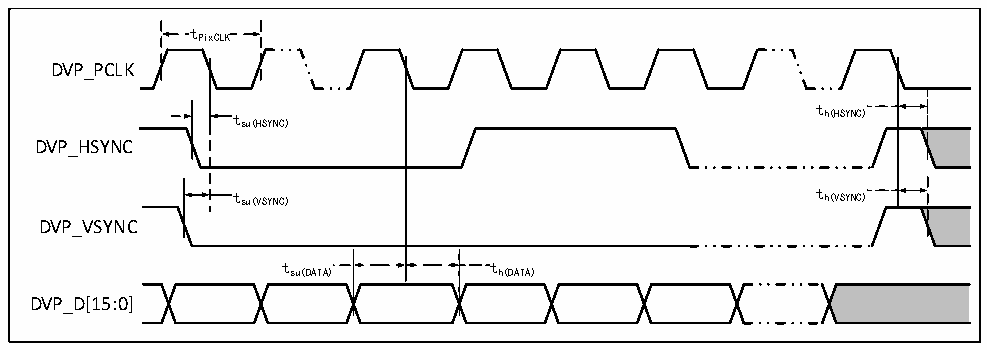

<!-- source-page: 131 -->

[← p.130](0130.md) · [index](../README.md) · [PDF p.131](https://ch32-riscv-ug.github.io/CH32H417/datasheet_en/CH32H417DS0.PDF#page=131) · [p.132 →](0132.md)

<!-- header: CH32H417/H416/H415 Datasheet https://wch-ic.com -->

> ⬆ **Table continued** — rendered in full at [page 130](0130.md). <!-- p131-table-001 -->

<em>Note: When reading SDRAM, the maximum value for FMC_SDCLK is set to 100MHz.</em>  

<!-- p131-table-002 (table-3-43@1) -->
<table><caption>Table 3-43 LPSDR SDRAM write operation timing</caption><tr><th>Symbol</th><th>Parameter</th><th>Min.</th><th>Max.</th><th>Unit</th></tr><tr><td style="text-align:left">t FW(SDCLK)</td><td>FMC_SDCLK period</td><td>9.5</td><td>10.5</td><td rowspan="12">ns</td></tr><tr><td style="text-align:left">t DSU(SDCLKL_DATA)</td><td>Data output valid time</td><td></td><td>4</td></tr><tr><td style="text-align:left">t D h(SDCLKL_DATA)</td><td>Data output holding time</td><td>0</td><td></td></tr><tr><td style="text-align:left">t A d(SDCLKL_ADD)</td><td>Address valid time</td><td></td><td>3.5</td></tr><tr><td style="text-align:left">t S d(SDCLKL_SDNWE)</td><td>SDNWE valid time</td><td></td><td>1</td></tr><tr><td style="text-align:left">t S h(SDCLKL_SDNWE)</td><td>SDNWE holding time</td><td>0</td><td></td></tr><tr><td style="text-align:left">t C d(SDCLKL_SDNE)</td><td>Chip selection valid time</td><td></td><td>1</td></tr><tr><td style="text-align:left">t C h(SDCLKL_SDNE)</td><td>Chip selection holding time</td><td>0</td><td></td></tr><tr><td style="text-align:left">t S d(SDCLKL_SDNRAS)</td><td>SDNRAS valid time</td><td></td><td>1</td></tr><tr><td style="text-align:left">t S h(SDCLKL_SDNRAS)</td><td>SDNRAS holding time</td><td>0</td><td></td></tr><tr><td style="text-align:left">t S d(SDCLKL_SDNCAS)</td><td>SDNCAS valid time</td><td></td><td>1</td></tr><tr><td style="text-align:left">t S h(SDCLKL_SDNCAS)</td><td>SDNCAS holding time</td><td>0</td><td></td></tr></table>

<em>Note: When reading SDRAM, the maximum value for FMC_SDCLK is set to 100MHz.</em>  

### 3.3.27 DVP Interface Characteristics

Figure 3-26 DVP timing waveform  
 <!-- rendered from the PDF; verify at https://ch32-riscv-ug.github.io/CH32H417/datasheet_en/CH32H417DS0.PDF#page=131 -->

🖼 Text parsed from the figure above

tPixCLK  
DVP_PCLK  
t  
t h(HSYNC)  
su(HSYNC)  
DVP_HSYNC  
t su(VSYNC) t h(VSYNC)  
DVP_VSYNC  
t su(DATA)  )  
t h(DATA)  
tsu(DATA) th(DATA)  
DVP_D[15:0]  

<!-- p131-table-005 (table-3-44@1) pages 131-132 -->
<table><caption>Table 3-44 DVP interface characteristics</caption><tr><th>Symbol</th><th>Parameter</th><th>Min.</th><th>Max.</th><th>Unit</th></tr><tr><td style="text-align:left">f /t PixCLK PixCLK</td><td>Pixel clock input frequency</td><td></td><td>150</td><td>MHz</td></tr><tr><td style="text-align:left">Duty (PixCLK)</td><td>Duty cycle of pixel clock</td><td>15</td><td></td><td>%</td></tr><tr><td style="text-align:left">t su(DATA)</td><td>Data setup time</td><td>2.5</td><td></td><td>ns</td></tr><tr><td style="text-align:left">t h(DATA)</td><td>Data holding time</td><td>1</td><td></td><td>ns</td></tr><tr><td style="text-align:left">t /t su(HSYNC) su(VSYNC)</td><td>HSYNC/VSYNC signal input setup time</td><td>2.5</td><td></td><td>ns</td></tr><tr><td style="text-align:left">t /t h(HSYNC) h(VSYNC)</td><td>HSYNC/VSYNC signal input holding time</td><td>1</td><td></td><td>ns</td></tr></table>

<!-- image: p131-draw-image-00001 bbox=[515.88, 783.6, 535.32, 793.8] -->
<!-- footer: V1.8 127 -->
