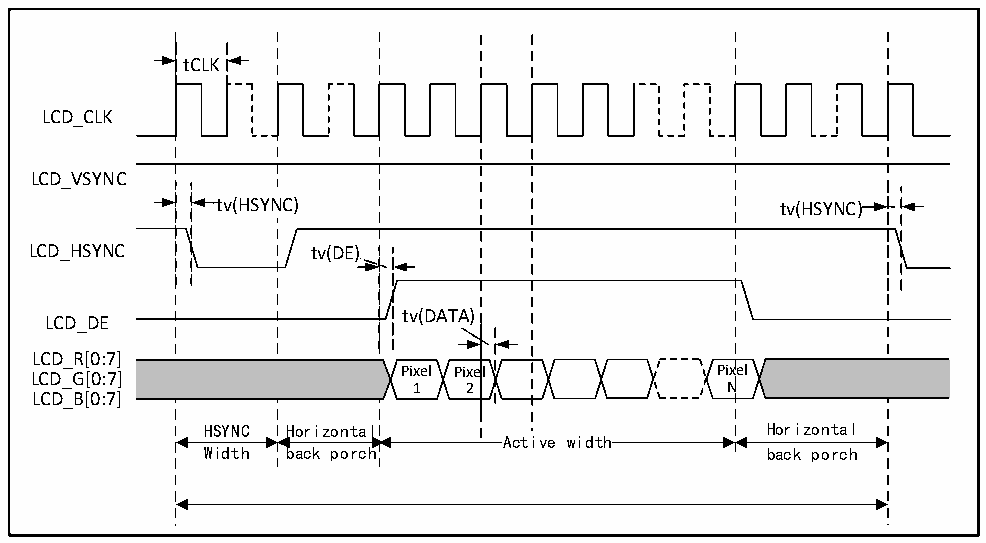
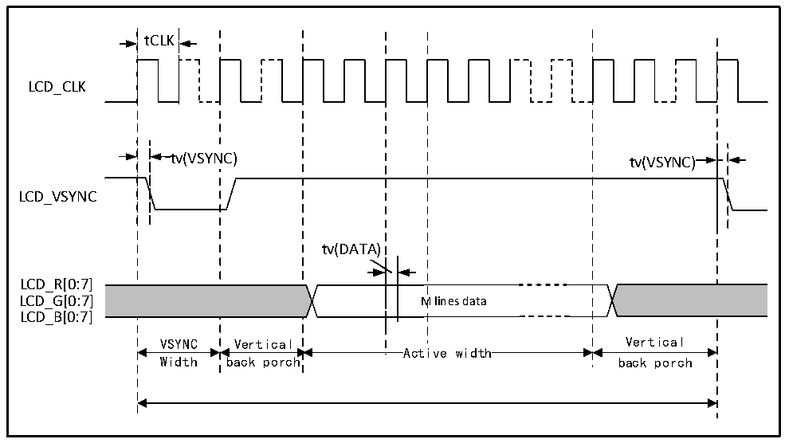

<!-- source-page: 132 -->

[← p.131](0131.md) · [index](../README.md) · [PDF p.132](https://ch32-riscv-ug.github.io/CH32H417/datasheet_en/CH32H417DS0.PDF#page=132) · [p.133 →](0133.md)

<!-- header: CH32H417/H416/H415 Datasheet https://wch-ic.com -->

> ⬆ **Table continued** — rendered in full at [page 131](0131.md). <!-- p132-table-001 -->

### 3.3.28 LTDC Interface Characteristics

Figure 3-27 LTDC horizontal sequence diagram  
 <!-- rendered from the PDF; verify at https://ch32-riscv-ug.github.io/CH32H417/datasheet_en/CH32H417DS0.PDF#page=132 -->

🖼 Text parsed from the figure above

tCLK  
LCD_CLK  
LCD_VSYNC  
tv(HSYNC) tv(HSYNC)  
LCD_HSYNC tv(DE)  
tv(DATA)  
LCD_DE  
LCD_R[0:7]  
LCD_G[0:7] Pixel Pixel Pixel  
1 2 N  
LCD_B[0:7]  
HSYNC Horizontal Horizontal  
Active width  
Width back porch back porch  

Figure 3-28 LTDC vertical sequence diagram  
 <!-- rendered from the PDF; verify at https://ch32-riscv-ug.github.io/CH32H417/datasheet_en/CH32H417DS0.PDF#page=132 -->

🖼 Text parsed from the figure above

tCLK  
LCD_CLK  
tv(VSYNC) tv(VSYNC)  
LCD_VSYNC  
tv(DATA)  
LCD_R[0:7]  
LCD_G[0:7] M lines data  
LCD_B[0:7]  
VSYNC Vertical Vertical  
Active width  
Width back porch back porch  

<!-- image: p132-draw-image-00001 bbox=[515.88, 783.6, 535.32, 793.8] -->
<!-- footer: V1.8 128 -->
