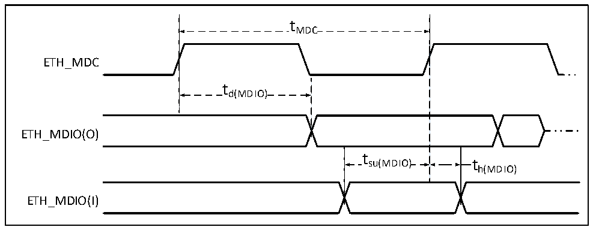

<!-- source-page: 133 -->

[← p.132](0132.md) · [index](../README.md) · [PDF p.133](https://ch32-riscv-ug.github.io/CH32H417/datasheet_en/CH32H417DS0.PDF#page=133) · [p.134 →](0134.md)

> ⚠ 3 subscript glyph(s) on this page appear as `*` because the PDF's text layer maps them to `*` (broken ToUnicode); the printed page shows the real subscripts -- read [the PDF, p.133](https://ch32-riscv-ug.github.io/CH32H417/datasheet_en/CH32H417DS0.PDF#page=133).

<!-- header: CH32H417/H416/H415 Datasheet https://wch-ic.com -->

<!-- p133-table-001 (table-3-45@1) -->
<table><caption>Table 3-45 LDTC interface characteristics</caption><tr><th>Symbol</th><th>Parameter</th><th>Condition</th><th>Min.</th><th>Typ.</th><th>Max.</th><th>Unit</th></tr><tr><td rowspan="3" style="text-align:left">FCLK</td><td rowspan="3">Clock output frequency</td><td style="text-align:left">CL=30pF, V (1) = 2.7-3.6V *</td><td></td><td></td><td>120</td><td>MHz</td></tr><tr><td style="text-align:left">CL=10pF, V (1) = 2.7-3.6V *</td><td></td><td></td><td>200</td><td>MHz</td></tr><tr><td style="text-align:left">CL=30pF, V (1) = 1.6-2.7V *</td><td></td><td></td><td>55</td><td>MHz</td></tr><tr><td style="text-align:left">Duty （CLK）</td><td>Clock duty cycle</td><td>CL=30pF</td><td>45</td><td></td><td>55</td><td>%</td></tr><tr><td style="text-align:left">t W（CKH）</td><td style="text-align:left">Clock high/low level duration</td><td>CL=30pF</td><td style="text-align:left">t /2-0.7CLK</td><td></td><td style="text-align:left">t /2+0.7CLK</td><td>ns</td></tr><tr><td style="text-align:left">t V</td><td style="text-align:left">Data and control signal output active duration</td><td>CL=30pF</td><td></td><td></td><td>0.7</td><td>ns</td></tr><tr><td style="text-align:left">t S</td><td style="text-align:left">Data and control signal output hold time</td><td>CL=30pF</td><td>0</td><td></td><td></td><td>ns</td></tr></table>

<em>Note: 1. In the table above, V* may be represented as VDDIO, VIO18, or VDD33 depending on the specific pin.</em>  

### 3.3.29 Gigabit Ethernet Interface Characteristics

Figure 3-29 ETH-SMI timing waveforms  
 <!-- rendered from the PDF; verify at https://ch32-riscv-ug.github.io/CH32H417/datasheet_en/CH32H417DS0.PDF#page=133 -->

🖼 Text parsed from the figure above

tMDC  
ETH_MDC  
td(MDIO)  
ETH_MDIO(O)  
t  
su(MDIO) t  
h(MDIO)  
ETH_MDIO(I)  

<!-- p133-table-002 (table-3-46@1) -->
<table><caption>Table 3-46 SMI signaling characteristics for Ethernet MACs</caption><tr><th>Symbol</th><th>Parameter &amp; Description</th><th>Min.</th><th>Typ.</th><th>Max.</th><th>Unit</th></tr><tr><td style="text-align:left">f /t MDC MDC</td><td>MDC clock frequency</td><td></td><td></td><td>2.5</td><td>MHz</td></tr><tr><td style="text-align:left">t d(MDIO)</td><td>Valid time for MDIO write data</td><td>0</td><td></td><td>300</td><td rowspan="3">ns</td></tr><tr><td style="text-align:left">t su(MDIO)</td><td>Read data setup time</td><td>10</td><td></td><td></td></tr><tr><td style="text-align:left">t h(MDIO)</td><td>Read data holding time</td><td>10</td><td></td><td></td></tr></table>

<!-- image: p133-draw-image-00001 bbox=[515.88, 783.6, 535.32, 793.8] -->
<!-- footer: V1.8 129 -->
