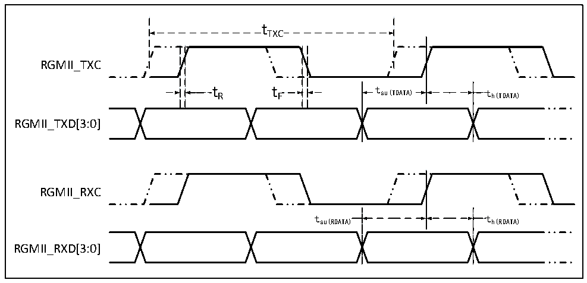

<!-- source-page: 134 -->

[← p.133](0133.md) · [index](../README.md) · [PDF p.134](https://ch32-riscv-ug.github.io/CH32H417/datasheet_en/CH32H417DS0.PDF#page=134) · [p.135 →](0135.md)

<!-- header: CH32H417/H416/H415 Datasheet https://wch-ic.com -->

Figure 3-30 ETH-RGMII signal timing waveforms  
 <!-- rendered from the PDF; verify at https://ch32-riscv-ug.github.io/CH32H417/datasheet_en/CH32H417DS0.PDF#page=134 -->

🖼 Text parsed from the figure above

tTXC  
RGMII_TXC  
t R t F t su(TDATA) t h(TDATA)  
RGMII_TXD[3:0]  
RGMII_RXC  
tsu(RDATA) th(RDATA)  
RGMII_RXD[3:0]  

<!-- p134-table-001 (table-3-47@1) -->
<table><caption>Table 3-47 RGMII signaling characteristics for Ethernet MACs</caption><tr><th>Symbol</th><th>Parameter &amp; Description</th><th>Min.</th><th>Typ.</th><th>Max.</th><th>Unit</th></tr><tr><td style="text-align:left">f /t TXC TXC</td><td>TXC/RXC clock frequency</td><td>7.2</td><td>8</td><td>8.8</td><td rowspan="7">ns</td></tr><tr><td style="text-align:left">t R</td><td>TXC/RXC rising time</td><td></td><td></td><td>2.0</td></tr><tr><td style="text-align:left">t F</td><td>TXC/RXC falling time</td><td></td><td></td><td>2.0</td></tr><tr><td style="text-align:left">t su(TDATA)</td><td>Send data setup time</td><td>1.2</td><td>2.0</td><td></td></tr><tr><td style="text-align:left">t h(TDATA)</td><td>Send data holding time</td><td>1.2</td><td>2.0</td><td></td></tr><tr><td style="text-align:left">t su(RDATA)</td><td>Input data setup time</td><td>1.2</td><td>2.0</td><td></td></tr><tr><td style="text-align:left">t h(RDATA)</td><td>Input data holding time</td><td>1.2</td><td>2.0</td><td></td></tr></table>

### 3.3.30 12-bit ADC Characteristics

<!-- p134-table-002 (table-3-48@1) pages 134-135 -->
<table><caption>Table 3-48 ADC characteristics</caption><tr><th>Symbol</th><th>Parameter</th><th>Condition</th><th>Min.</th><th>Typ.</th><th>Max.</th><th>Unit</th></tr><tr><td rowspan="2" style="text-align:left">VDD33A</td><td rowspan="2">Supply voltage</td><td style="text-align:left">f &lt; 2MHz S</td><td>2.7</td><td></td><td>3.6</td><td>V</td></tr><tr><td style="text-align:left">f ≥ 2MHz S</td><td>3</td><td></td><td>3.6</td><td>V</td></tr><tr><td style="text-align:left">V (2) REFP</td><td>Positive reference voltage</td><td style="text-align:left">V ≤ V REFP DD33A</td><td>2.4</td><td>3.3</td><td>3.6</td><td>V</td></tr><tr><td rowspan="2" style="text-align:left">IDD33A</td><td rowspan="2" style="text-align:left">ADC supply current (excluding buffer)</td><td>ADC_LP = 0</td><td></td><td>1.42</td><td></td><td>mA</td></tr><tr><td>ADC_LP = 1</td><td></td><td>0.37</td><td></td><td>mA</td></tr><tr><td rowspan="2" style="text-align:left">IBUF</td><td rowspan="2">ADC buffer own current</td><td>ADC_LP =</td><td></td><td>0.76</td><td></td><td>mA</td></tr><tr><td>ADC_LP = 1</td><td></td><td>0.19</td><td></td><td>mA</td></tr><tr><td style="text-align:left">f ADC</td><td>ADC clock frequency</td><td></td><td></td><td>14</td><td>80</td><td>MHz</td></tr><tr><td style="text-align:left">f S</td><td>Sampling rate</td><td></td><td>0.06</td><td></td><td>5</td><td>MHz</td></tr><tr><td rowspan="4" style="text-align:left">f TRIG</td><td rowspan="4">External trigger frequency</td><td style="text-align:left">f = 14MHz ADC</td><td></td><td></td><td>875</td><td>kHz</td></tr><tr><td></td><td></td><td></td><td>16</td><td style="text-align:left">1/f ADC</td></tr><tr><td style="text-align:left">f = 80MHz ADC</td><td></td><td></td><td>4.4</td><td>MHz</td></tr><tr><td></td><td></td><td></td><td>18</td><td style="text-align:left">1/f ADC</td></tr><tr><td rowspan="2" style="text-align:left">VAIN</td><td rowspan="2">Conversion voltage range</td><td style="text-align:left">V ≥ V REFP DDIO</td><td>0</td><td></td><td style="text-align:left">VDDIO</td><td>V</td></tr><tr><td style="text-align:left">V ＜ V REFP DDIO</td><td>0</td><td></td><td style="text-align:left">VREFP</td><td>V</td></tr><tr><td style="text-align:left">RAIN</td><td>External input impedance</td><td></td><td></td><td></td><td>50</td><td>kΩ</td></tr><tr><td style="text-align:left">RADC</td><td>Sampling switch resistance</td><td></td><td></td><td>0.6</td><td>1.5</td><td>kΩ</td></tr><tr><td style="text-align:left">CADC</td><td style="text-align:left">Internal sampling and holding capacitance</td><td></td><td></td><td>4.5</td><td></td><td>pF</td></tr><tr><td style="text-align:left">t CAL</td><td>Calibration time</td><td style="text-align:left">f = 14MHz ADC</td><td>2</td><td></td><td></td><td>us</td></tr><tr><td rowspan="3" style="text-align:left">t Iat</td><td rowspan="3">Injection-triggered conversion delay</td><td style="text-align:left">f = 14MHz ADC</td><td></td><td></td><td>0.143</td><td>us</td></tr><tr><td style="text-align:left">f = 80MHz ADC</td><td></td><td></td><td>0.025</td><td>us</td></tr><tr><td></td><td></td><td></td><td>2</td><td style="text-align:left">1/f ADC</td></tr><tr><td rowspan="3" style="text-align:left">t Iatr</td><td rowspan="3" style="text-align:left">Conventional trigger conversion delay</td><td style="text-align:left">f = 14MHz ADC</td><td></td><td></td><td>0.143</td><td>us</td></tr><tr><td style="text-align:left">f = 80MHz ADC</td><td></td><td></td><td>0.025</td><td>us</td></tr><tr><td></td><td></td><td></td><td>2</td><td style="text-align:left">1/f ADC</td></tr><tr><td rowspan="4" style="text-align:left">t s</td><td rowspan="4">Sampling time</td><td style="text-align:left">f = 14MHz ADC</td><td>0.107</td><td></td><td>17.11</td><td>us</td></tr><tr><td></td><td>1.5</td><td></td><td>239.5</td><td style="text-align:left">1/f ADC</td></tr><tr><td style="text-align:left">f = 80MHz ADC</td><td>0.037</td><td></td><td>2.49</td><td>us</td></tr><tr><td></td><td>3.5</td><td></td><td>239.5</td><td style="text-align:left">1/f ADC</td></tr><tr><td style="text-align:left">t STAB</td><td>Power-on time</td><td></td><td></td><td></td><td>1</td><td>us</td></tr><tr><td rowspan="4" style="text-align:left">t CONV</td><td rowspan="4" style="text-align:left">Total conversion time (including sampling time)</td><td style="text-align:left">f = 14MHz ADC</td><td>1</td><td></td><td>18</td><td>us</td></tr><tr><td></td><td>14</td><td></td><td>252</td><td style="text-align:left">1/f ADC</td></tr><tr><td style="text-align:left">f = 80MHz ADC</td><td>0.2</td><td></td><td>3.15</td><td>us</td></tr><tr><td></td><td>16</td><td></td><td>252</td><td style="text-align:left">1/f ADC</td></tr></table>

<!-- image: p134-draw-image-00001 bbox=[515.88, 783.6, 535.32, 793.8] -->
<!-- footer: V1.8 130 -->
