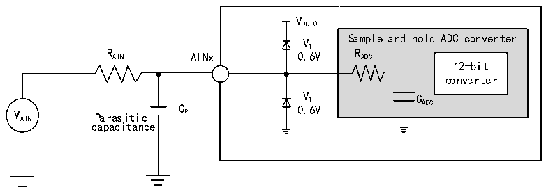
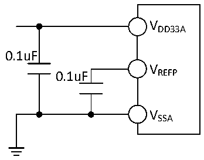

<!-- source-page: 136 -->

[← p.135](0135.md) · [index](../README.md) · [PDF p.136](https://ch32-riscv-ug.github.io/CH32H417/datasheet_en/CH32H417DS0.PDF#page=136) · [p.137 →](0137.md)

<!-- header: CH32H417/H416/H415 Datasheet https://wch-ic.com -->

<!-- p136-table-001 (table-3-50@1) -->
<table><caption>Table 3-50 ADC error (fADC= 14MHz, ADC_LP = 1)</caption><tr><th>Symbol</th><th>Parameter</th><th>Condition</th><th>Min.</th><th>Typ.</th><th>Max.</th><th>Unit</th></tr><tr><td>EO</td><td>Offset error</td><td rowspan="3" style="text-align:left">R &lt; 10kΩ, AIN V = 3.3VDD33A</td><td></td><td>±2</td><td>±5</td><td rowspan="3">LSB</td></tr><tr><td>ED</td><td>Differential nonlinear error</td><td></td><td>±1</td><td>±4</td></tr><tr><td>EL</td><td>Integral nonlinear error</td><td></td><td>±2</td><td>±4</td></tr></table>

<em>Note: The above are guaranteed design parameters.</em>  

<!-- p136-table-002 (table-3-51@1) -->
<table><caption>Table 3-51 ADC error (fADC= 80MHz, ADC_LP = 0)</caption><tr><th>Symbol</th><th>Parameter</th><th>Condition</th><th>Min.</th><th>Typ.</th><th>Max.</th><th>Unit</th></tr><tr><td>EO</td><td>Offset error</td><td rowspan="3" style="text-align:left">R &lt; 2kΩ, AIN V = 3.3VDD33A</td><td></td><td>±3</td><td>±7</td><td rowspan="3">LSB</td></tr><tr><td>ED</td><td>Differential nonlinear error</td><td></td><td>±2</td><td>±5</td></tr><tr><td>EL</td><td>Integral nonlinear error</td><td></td><td>±3</td><td>±5</td></tr></table>

<em>Note: The above are guaranteed design parameters.</em>  
Cp indicates the parasitic capacitance on the PCB and pads (About 5pF), which may be related to the quality of  
the pads and PCB layout. Larger values of Cp will reduce the conversion accuracy and the solution is to reduce  
the fADC  

Figure 3-31 ADC typical connection diagram  
 <!-- rendered from the PDF; verify at https://ch32-riscv-ug.github.io/CH32H417/datasheet_en/CH32H417DS0.PDF#page=136 -->

🖼 Text parsed from the figure above

VDDIO  
Sample and hold ADC converter  
VT  
R AIN AINx 0.6V R ADC  
12-bit  
converter  
V AIN Parasitic C P 0 V . T 6V C ADC  
capacitance  

Figure 3-32 Analog power supply and decoupling circuit reference  
 <!-- rendered from the PDF; verify at https://ch32-riscv-ug.github.io/CH32H417/datasheet_en/CH32H417DS0.PDF#page=136 -->

🖼 Text parsed from the figure above

VDD33A  
0.1uF  
V  
0.1uF REFP  
VSSA  

<!-- image: p136-draw-image-00001 bbox=[515.88, 783.6, 535.32, 793.8] -->
<!-- footer: V1.8 132 -->
