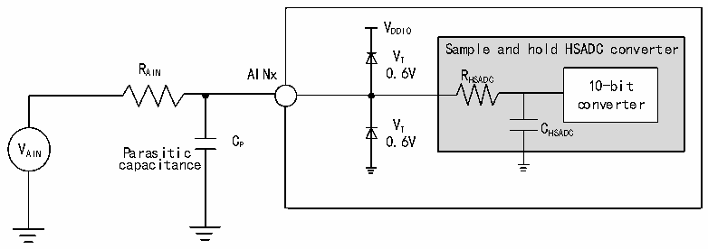
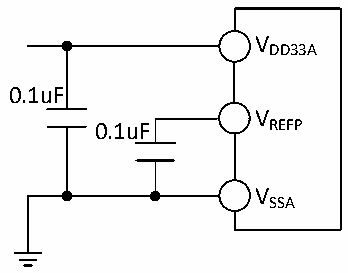

<!-- source-page: 138 -->

[← p.137](0137.md) · [index](../README.md) · [PDF p.138](https://ch32-riscv-ug.github.io/CH32H417/datasheet_en/CH32H417DS0.PDF#page=138) · [p.139 →](0139.md)

<!-- header: CH32H417/H416/H415 Datasheet https://wch-ic.com -->
Cp indicates the parasitic capacitance on the PCB and pads (About 5pF), which may be related to the quality of  
the pads and PCB layout. Larger values of Cp will reduce the conversion accuracy and the solution is to reduce  
the fADC.  

Figure 3-33 HSADC typical connection diagram  
 <!-- rendered from the PDF; verify at https://ch32-riscv-ug.github.io/CH32H417/datasheet_en/CH32H417DS0.PDF#page=138 -->

🖼 Text parsed from the figure above

VDDIO  
Sample and hold HSADC converter  
VT  
R AIN AINx 0.6V R  
HSADC 10-bit  
converter  
V AIN Parasitic C P 0 V . T 6V C HSADC  
capacitance  

Figure 3-34 Analog power supply and decoupling circuit reference  
 <!-- rendered from the PDF; verify at https://ch32-riscv-ug.github.io/CH32H417/datasheet_en/CH32H417DS0.PDF#page=138 -->

🖼 Text parsed from the figure above

VDD33A  
0.1uF  
V  
0.1uF REFP  
VSSA  

### 3.3.32 DAC Characteristics

<!-- p138-table-001 (table-3-54@1) pages 138-139 -->
<table><caption>Table 3-54 DAC characteristics</caption><tr><th>Symbol</th><th>Parameter</th><th>Condition</th><th>Min.</th><th>Typ.</th><th>Max.</th><th>Unit</th></tr><tr><td style="text-align:left">VDD33A</td><td>Supply voltage</td><td></td><td>2.4</td><td>3.3</td><td>3.6</td><td>V</td></tr><tr><td style="text-align:left">VREFP</td><td>Positive reference voltage</td><td style="text-align:left">V ≤ V REFP DD33A</td><td>2.4</td><td>3.3</td><td>3.6</td><td>V</td></tr><tr><td style="text-align:left">R (1) L</td><td>Load resistance when the buffer is open</td><td></td><td>5</td><td></td><td></td><td>kΩ</td></tr><tr><td style="text-align:left">C (1) L</td><td>Load capacitance when buffer is open</td><td></td><td></td><td></td><td>50</td><td>pF</td></tr><tr><td style="text-align:left">V (1) OUT_MIN</td><td rowspan="2">Buffer on, 12-bit DAC conversion</td><td></td><td>0</td><td></td><td>8</td><td>mV</td></tr><tr><td style="text-align:left">V (1) OUT_MAX</td><td style="text-align:left">V = 3.3VREFP</td><td>3.29</td><td></td><td>3.3</td><td>V</td></tr><tr><td style="text-align:left">V (1) OUT_MIN</td><td rowspan="2">Buffer off, 12-bit DAC conversion</td><td></td><td>0</td><td></td><td>3</td><td>mV</td></tr><tr><td style="text-align:left">V (1) OUT_MAX</td><td style="text-align:left">V = 3.3VREFP</td><td>3.295</td><td></td><td>3.3</td><td>V</td></tr><tr><td rowspan="3" style="text-align:left">IVREFP</td><td colspan="2">No load, input value 0x800</td><td></td><td>58</td><td></td><td rowspan="3">uA</td></tr><tr><td colspan="2" style="text-align:left">No load, when V = 3.6V, the input value is 0xF1C. REFP</td><td></td><td>194</td><td></td></tr><tr><td colspan="2" style="text-align:left">No load, when VREFP = 3.6V, the input value is 0x555 (worst)</td><td></td><td>331</td><td></td></tr><tr><td rowspan="2" style="text-align:left">IDDA</td><td colspan="2" style="text-align:left">Buffer opened without load, input value 0x800</td><td></td><td>170</td><td></td><td rowspan="2">uA</td></tr><tr><td colspan="2" style="text-align:left">Buffer open without load, V = 3.6V, input value 0xF1CREFP</td><td></td><td>150</td><td></td></tr><tr><td></td><td colspan="2" style="text-align:left">Buffer open without load, V = 3.6V, input value 0x555REFP (worst)</td><td></td><td>170</td><td></td><td></td></tr><tr><td>DNL</td><td>Differential nonlinear error</td><td></td><td></td><td>±2</td><td></td><td>LSB</td></tr><tr><td>INL</td><td>Integral nonlinear error</td><td style="text-align:left">After offset error and gain error correction</td><td></td><td>±4</td><td></td><td>LSB</td></tr><tr><td rowspan="2">Lose balance</td><td rowspan="2">Offset error</td><td></td><td></td><td>±3</td><td>±12</td><td>mV</td></tr><tr><td style="text-align:left">V = 3.6VREFP</td><td></td><td></td><td>±10</td><td>LSB</td></tr><tr><td>Gain error</td><td></td><td style="text-align:left">DAC configured as 12-bit</td><td></td><td>±0.4</td><td></td><td>%</td></tr><tr><td style="text-align:left">Amplifier gain(1)</td><td>Amplifier gain with open loop</td><td>5kΩ load (max.)</td><td>80</td><td>85</td><td></td><td>dB</td></tr><tr><td style="text-align:left">t SETTLING</td><td style="text-align:left">The maximum frequency of the correct DAC_OUT is obtained when the input code is a small change (from the value i to i+1 LSB)</td><td style="text-align:left">C ≤ 50pFLOAD R ≥ 5kΩLOAD</td><td></td><td>3</td><td>4</td><td>us</td></tr><tr><td>Update rate</td><td style="text-align:left">When the input code changes slightly (from the value I to i+1LSB), the maximum frequency of the correct DAC_OUT is obtained.</td><td style="text-align:left">C ≤ 50pFLOAD R ≥ 5kΩLOAD</td><td></td><td></td><td>1</td><td>MS/s</td></tr><tr><td>PSRR+(1)</td><td style="text-align:left">Power supply rejection ratio (relative to V ) (static DC measurement) DD33A</td><td style="text-align:left">Without R , LOAD C ≤ 50pFLOAD</td><td></td><td>-100</td><td>-75</td><td>dB</td></tr></table>

<!-- image: p138-draw-image-00001 bbox=[515.88, 783.6, 535.32, 793.8] -->
<!-- footer: V1.8 134 -->
