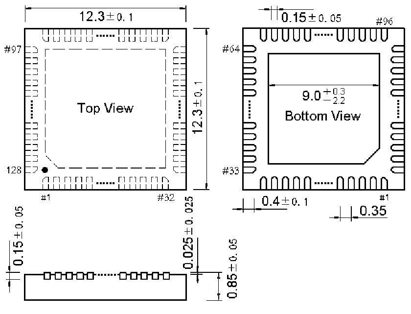

<!-- source-page: 144 -->

[← p.143](0143.md) · [index](../README.md) · [PDF p.144](https://ch32-riscv-ug.github.io/CH32H417/datasheet_en/CH32H417DS0.PDF#page=144) · [p.145 →](0145.md)

<!-- header: CH32H417/H416/H415 Datasheet https://wch-ic.com -->
<em>Note: All dimensions are in millimeters. The pin center spacing values are nominal values, with no error. Other</em>  
<em>than that, the dimensional error is not greater than the greater of ±0.2mm or 10%.</em>  

## 4.1 QFN128 package

 <!-- p144-draw-image-00002 rendered from the PDF -->

<!-- image: p144-draw-image-00001 bbox=[515.88, 783.6, 535.32, 793.8] -->
<!-- footer: V1.8 140 -->
