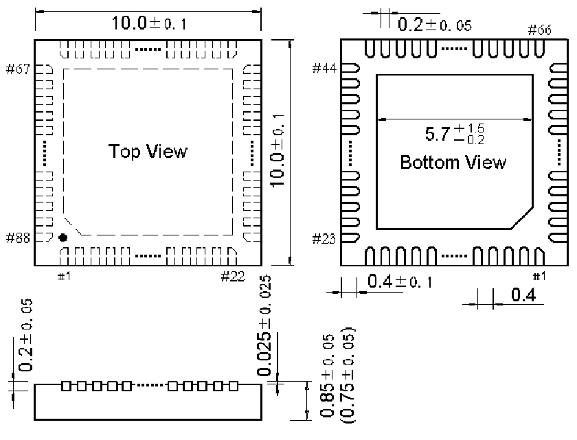
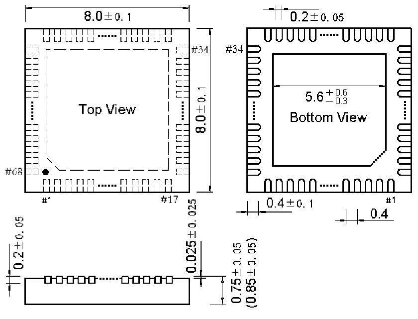

<!-- source-page: 145 -->

[← p.144](0144.md) · [index](../README.md) · [PDF p.145](https://ch32-riscv-ug.github.io/CH32H417/datasheet_en/CH32H417DS0.PDF#page=145) · [p.146 →](0146.md)

<!-- header: CH32H417/H416/H415 Datasheet https://wch-ic.com -->

## 4.2 QFN88 package

 <!-- p145-draw-image-00002 rendered from the PDF -->

## 4.3 QFN68 package

 <!-- p145-draw-image-00003 rendered from the PDF -->

<!-- image: p145-draw-image-00001 bbox=[515.88, 783.6, 535.32, 793.8] -->
<!-- footer: V1.8 141 -->
