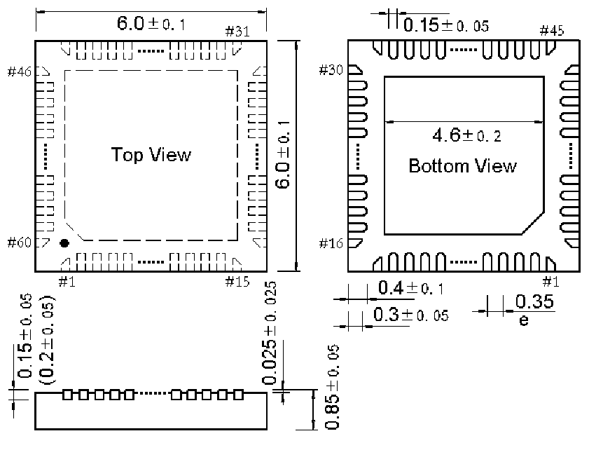

<!-- source-page: 146 -->

[← p.145](0145.md) · [index](../README.md) · [PDF p.146](https://ch32-riscv-ug.github.io/CH32H417/datasheet_en/CH32H417DS0.PDF#page=146) · [p.147 →](0147.md)

<!-- header: CH32H417/H416/H415 Datasheet https://wch-ic.com -->

## 4.4 QFN60X6 package

 <!-- p146-draw-image-00002 rendered from the PDF -->

<!-- image: p146-draw-image-00001 bbox=[515.88, 783.6, 535.32, 793.8] -->
<!-- footer: V1.8 142 -->
