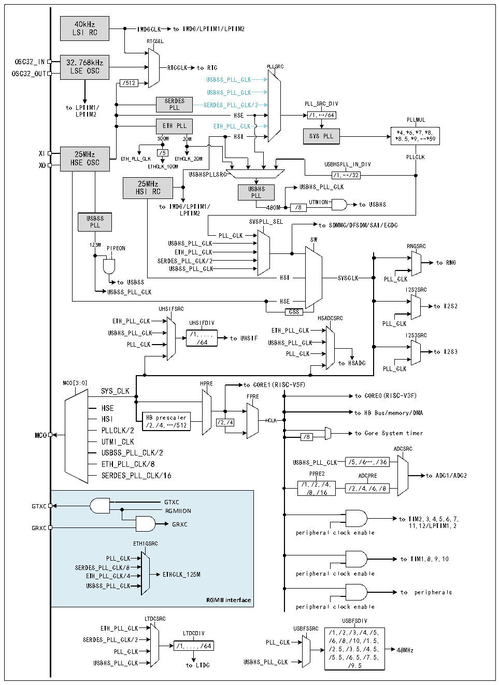

<!-- source-page: 9 -->

[← p.8](0008.md) · [index](../README.md) · [PDF p.9](https://ch32-riscv-ug.github.io/CH32H417/datasheet_zh/CH32H417DS0.PDF#page=9) · [p.10 →](0010.md)

<!-- header: CH32H417、H416、H415数据手册 https://wch.cn -->

## 1.3 时钟树

系统中引入4组时钟源：内部高频RC振荡器（HSI）、内部低频RC振荡器(LSI)、外接高频振荡器  
(HSE)和外接低频振荡器(LSE)。  

图1-3 时钟树框图  
 <!-- rendered from the PDF; verify at https://ch32-riscv-ug.github.io/CH32H417/datasheet_zh/CH32H417DS0.PDF#page=9 -->

🖼 Text parsed from the figure above

40kHz  
LSI RC IWDGCLK to IWDG/LPTIM1/LPTIM2  
RTCSEL  
OSC32_IN 32.768kHz  
OSC32_OUT LSE OSC RTCCLK to RTC PLLSRC  
USBSS_PLL_CLK  
/512  
USBHS_PLL_CLK  
to LPTIM1/ SE P R L D L ES SERDES_PLL_CLK/2 PLL_SRC_DIV  
LPTIM2 HSE /1,…/64  
PLLMUL  
ETH PLL ETH_PLL_CLK  
*4,*6,*7,*8,  
500M 20M HSI SYS PLL *8.5,*9,…*59  
XI 25MHz /5  
XO HSE OSC ETH_PLL_CL E K THCLK_100 E M THCLK_20M USBHSPLL_IN_DIV PLLCLK  
USBHSPLLSRC /1,…/32  
25MHz  
HSI RC USBHS USBHS_PLL_CLK  
PLL  
to IWDG/LPTIM1/ 480M /8 UTMION to USBHS  
LPTIM2  
USBSS  
SYSPLL_SEL  
PLL to SDMMC/DFSDM/SAI/ECDC  
PLL_CLK  PLL_CLK  
SW  
125M PIPEON USBHS_PLL_CLK RNGSRC  
ETH_PLL_CLK  
SERDES_PLL_CLK/2 to RNG  
USBSS_PLL_CLK  
to USBSS HSI SYSCLK PLL_CLK  
USBSS_PLL_CLK I2S2SRC  
HSE  
UHSIFSRC CSS to I2S2  
ETH_PLL_CLK UHSIFDIV HSADCSRC PLL_CLK  
USBHS_PLL_CLK /1,..., to UHSIF ETH_PLL_CLK I2S3SRC  
PLL_CLK /64 USBHS_PLL_CLK  
PLL_CLK to I2S3  
to HSADC  
PLL_CLK  
MCO[3:0] HPRE to CORE1(RISC-V5F)  
SYS_CLK  
FPRE to CORE0(RISC-V3F)  
HSE  
to HB Bus/memory/DMA  
HSI H /2 B ,/ p 4 re ,… sca /5 l 1 e 2 r /2,/4 HCLK  
PLLCLK/2  
MCO /8 to Core System timer  
UTMI_CLK  
USBSS_PLL_CLK/2 ADCSRC  
ETH_PLL_CLK/8 USBHS_PLL_CLK /5,/6…,/36  
SERDES_PLL_CLK/16 PPRE2 ADCPRE to ADC1/ADC2  
/1,/2,/4,  
/2,/4,/6,/8  
/8,/16  
GTXC  
GTXC  
RGMIION  
to TIM2,3,4,5,6,7,  
GRXC GRXC 11,12/LPTIM1,2  
peripheral clock enable  
ETH1GSRC  
PLL_CLK to TIM1,8,9,10  
SERDES_PLL_CLK/8  
ETH_PLL_CLK/4 ETHCLK_125M peripheral clock enable  
USBSS_PLL_CLK  
to peripherals  
<strong>RGMII interface</strong>  
peripheral clock enable  
LTDCSRC USBFSDIV  
ETH_PLL_CLK USBFSSRC  
LTDCDIV /1,/2,/3,/4,/5,  
SERDES_PLL_CLK/2 PLL_CLK /6,/8,/10,/1.5,  
PLL_CLK /1,...,/64 /2.5,/3.5,/4.5, 48MHz  
/5.5,/6.5,/7.5,  
USBHS_PLL_CLK to LTDC USBHS_PLL_CLK /9.5  

注：上图中标蓝的部分仅适用于批号第五位大于0的芯片。  
<!-- image: p9-draw-image-00001 bbox=[507.72, 779.28, 527.16, 789.6] -->
<!-- footer: V1.8 5 -->
