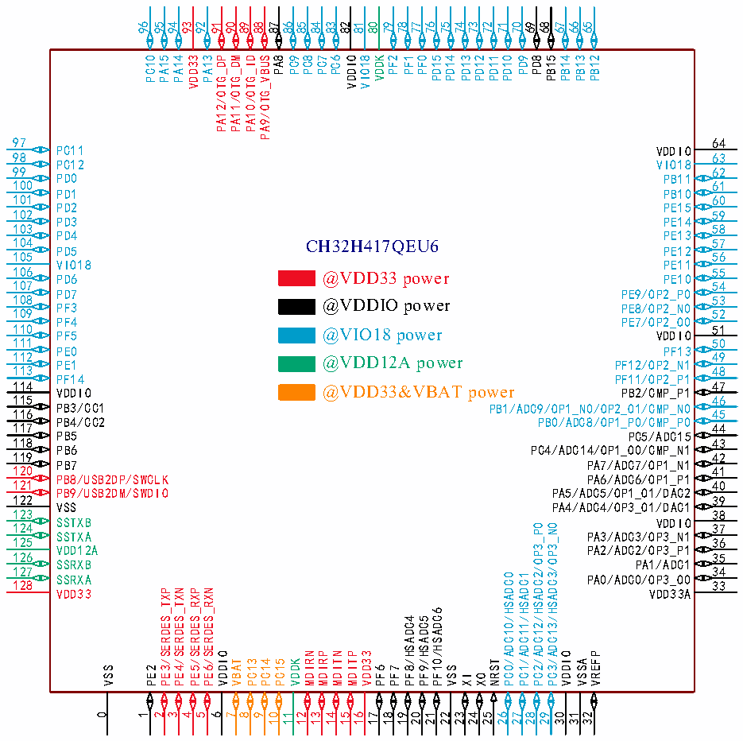

<!-- source-page: 24 -->

[← p.23](0023.md) · [index](../README.md) · [PDF p.24](https://ch32-riscv-ug.github.io/CH32H417/datasheet_zh/CH32H417DS0.PDF#page=24) · [p.25 →](0025.md)

<!-- header: CH32H417、H416、H415数据手册 https://wch.cn -->

# 第 2 章 引脚信息

## 2.1 引脚排列

### 2.1.1 CH32H417引脚排列

 <!-- p24-cluster-01 uncaptioned graphics, rendered from the PDF; verify at https://ch32-riscv-ug.github.io/CH32H417/datasheet_zh/CH32H417DS0.PDF#page=24 -->

🖼 Text parsed from the figure above

96 95 94 93 92 91 90 89 88 87 86 85 84 83 82 81 80 79 78 77 76 75 74 73 72 71 70 69 68 67 66 65  
PC10  
PA15  
PA14  
VDD33  
PA13  
PA12/OTG_DP  
PA11/OTG_DM  
PA10/OTG_ID  
PA9/OTG_VBUS  
PA8  
PC9  
PC8  
PC7  
PC6  
VDDIO  
VIO18  
VDDK  
PF2  
PF1  
PF0  
PD15  
PD14  
PD13  
PD12  
PD11  
PD10  
PD9  
PD8  
PB15  
PB14  
PB13  
PB12  
97  
64  
PC11 VDDIO  
98  
63  
PC12 VIO18  
99  
62  
PD0 PB11  
100  
61  
PD1 PB10  
101  
60  
PD2 PE15  
102  
59  
PD3 PE14  
103  
58  
PD4 PE13  
104 CH32H417QEU6  
57  
PD5 PE12  
105  
56  
VIO18 PE11  
106 PD6 @VDD33 power PE10  
55  
107  
54  
PD7 PE9/OP2_P0  
108 PF3 @VDDIO power PE8/OP2_N0  
53  
109  
52  
PF4 PE7/OP2_O0  
110 PF5 @VIO18 power VDDIO  
51  
111  
50  
PE0 PF13  
112 PE1 @VDD12A power PF12/OP2_N1  
49  
113  
48  
PF14 PF11/OP2_P1  
114 VDDIO @VDD33&amp;VBAT power PB2/CMP_P1  
47  
115  
46  
PB3/CC1 PB1/ADC9/OP1_N0/OP2_O1/CMP_N0  
116  
45  
PB4/CC2 PB0/ADC8/OP1_P0/CMP_P0  
117  
44  
PB5 PC5/ADC15  
118  
43  
PB6 PC4/ADC14/OP1_O0/CMP_N1  
119  
42  
PB7 PA7/ADC7/OP1_N1  
120  
41  
PB8/USB2DP/SWCLK PA6/ADC6/OP1_P1  
121  
40  
PB9/USB2DM/SWDIO PA5/ADC5/OP1_O1/DAC2  
122  
39  
VSS PA4/ADC4/OP3_O1/DAC1  
123  
38  
SSTXB VDDIO  
124  
37  
PC2/ADC12/HSADC2/OP3_P0  
PC3/ADC13/HSADC3/OP3_N0  
SSTXA PA3/ADC3/OP3_N1  
125  
36  
VDD12A PA2/ADC2/OP3_P1  
126  
35  
SSRXB PA1/ADC1  
127  
34  
PC0/ADC10/HSADC0  
PC1/ADC11/HSADC1  
SSRXA PA0/ADC0/OP3_O0  
128  
33  
VDD33 VDD33A  
PE3/SERDES_TXP  
PE4/SERDES_TXN  
PE5/SERDES_RXP  
PE6/SERDES_RXN  
PF10/HSADC6  
PF8/HSADC4  
PF9/HSADC5  
VDDIO  
MDIRN  
MDIRP  
MDITN  
MDITP  
VDD33  
VDDIO  
VREFP  
VBAT  
PC13  
PC14  
PC15  
VDDK  
NRST  
VSSA  
VSS  
PE2  
PF6  
PF7  
VSS  
XI  
XO  
0  
1  
2  
3 4  
5  
6  
7 8  
9  
10 11  
12  
13  
14 15  
16  
17  
18 19  
20  
21  
22 23  
24  
25  
26 27  
28  
29  
30 31  
32  

<!-- image: p24-draw-image-00001 bbox=[500.88, 779.28, 520.32, 789.6] -->
<!-- footer: V1.8 20 -->
