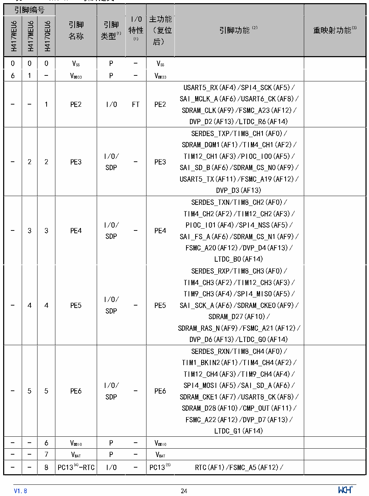

<!-- source-page: 28 -->

[← p.27](0027.md) · [index](../README.md) · [PDF p.28](https://ch32-riscv-ug.github.io/CH32H417/datasheet_zh/CH32H417DS0.PDF#page=28) · [p.29 →](0029.md)

<!-- header: CH32H417、H416、H415数据手册 https://wch.cn -->

## 2.2 引脚定义

注意，下表中的引脚功能描述针对的是所有功能，不涉及具体型号产品。不同型号之间外设资源有差  
异，查看前请先根据产品型号资源表确认是否有此功能。  

 <!-- p28-cluster-01 uncaptioned graphics, rendered from the PDF; verify at https://ch32-riscv-ug.github.io/CH32H417/datasheet_zh/CH32H417DS0.PDF#page=28 -->

🖼 Text parsed from the figure above

引脚编号  引脚  引脚类型(1)  I/O  主功能  引脚功能（2）  重映射功能(3)  H417WEU6  H417MEU6  H417QEU6  特性  （复位  名称  (1)  后）  0  0  0  VSS  P  -  VSS  6  1  -  VDD33  P  -  VDD33  -  -  1  PE2  I/O  FT  PE2  USART5_RX(AF4)/SPI4_SCK(AF5)/ SAI_MCLK_A(AF6)/USART6_CK(AF8)/ SDRAM_CLK(AF9)/FSMC_A23(AF12)/ DVP_D2(AF13)/LTDC_R6(AF14)  -  2  2  PE3  I/O/ SDP  -  PE3  SERDES_TXP/TIM8_CH1(AF0)/ SDRAM_DQM1(AF1)/TIM4_CH1(AF2)/ TIM12_CH1(AF3)/PIOC_IO0(AF5)/ SAI_SD_B(AF6)/SDRAM_CS_N0(AF9)/ USART5_TX(AF11)/FSMC_A19(AF12)/ DVP_D3(AF13)  -  3  3  PE4  I/O/ SDP  -  PE4  SERDES_TXN/TIM8_CH2(AF0)/ TIM4_CH2(AF2)/TIM12_CH2(AF3)/ PIOC_IO1(AF4)/SPI4_NSS(AF5)/ SAI_FS_A(AF6)/SDRAM_CS_N1(AF9)/ FSMC_A20(AF12)/DVP_D4(AF13)/ LTDC_B0(AF14)  -  4  4  PE5  I/O/ SDP  -  PE5  SERDES_RXP/TIM8_CH3(AF0)/ TIM4_CH3(AF2)/TIM12_CH3(AF3)/ TIM9_CH3(AF4)/SPI4_MISO(AF5)/ SAI_SCK_A(AF6)/SDRAM_CKE0(AF9)/ SDRAM_D27(AF10)/ SDRAM_RAS_N(AF9)/FSMC_A21(AF12)/ DVP_D6(AF13)/LTDC_G0(AF14)  -  5  5  PE6  I/O/ SDP  -  PE6  SERDES_RXN/TIM8_CH4(AF0)/ TIM1_BKIN2(AF1)/TIM4_CH4(AF2)/ TIM12_CH4(AF3)/TIM9_CH4(AF4)/ SPI4_MOSI(AF5)/SAI_SD_A(AF6)/ SDRAM_CKE1(AF7)/USART8_CK(AF8)/ SDRAM_D28(AF10)/CMP_OUT(AF11)/ FSMC_A22(AF12)/DVP_D7(AF13)/ LTDC_G1(AF14)  -  -  6  VDDIO  P  -  VDDIO  -  -  7  VBAT  P  -  VBAT  -  -  8  PC13(4)-RTC  I/O  -  PC13(5)  RTC(AF1)/FSMC_A5(AF12)/  引脚编号  引脚  引脚类型(1)  I/O特性 (1)  主功能  引脚功能（2）  重映射功能(3)  H417WEU6  H417MEU6  H417QEU6  （复位  名称  后）  SDRAM_A5(AF12)  -  -  9  PC14(4)- OSC32_IN  I/O/A  -  PC14(5)  OSC32_IN/SDRAM_CKE1(AF9)/ FSMC_D16(AF12)/SDRAM_D16(AF12)  -  -  10  PC15(4)- OSC32_OUT  I/O/A  -  PC15(5)  OSC32_OUT/SDRAM_RAS_N(AF9)/ FSMC_D17(AF12)/SDRAM_D17(AF12)  7  6  11  VDDK  P  -  VDDK  主VDDK  8  7  12  MDIRN(6)  ETH  -  MDIRN  9  8  13  MDIRP(6)  ETH  -  MDIRP  10  9  14  MDITN(6)  ETH  -  MDITN  11  10  15  MDITP(6)  ETH  -  MDITP  12  11  16  VDD33  P  -  VDD33  主VDD33  -  -  17  PF6  I/O  FT  PF6  CAN3_RX(AF2)/SPI1_NSS(AF3)/ QSPI2_SCK(AF4)/I3C_SCL(AF5)/ SAI_SD_B(AF6)/USART8_RX(AF7)/ TIM10_CH3(AF9)/QSPI1_SIO3(AF10)/ FSMC_D18(AF12)/SDRAM_D18(AF12)/ TIM11_CH1(AF13)  -  -  18  PF7  I/O  FT  PF7  CAN3_TX(AF2)/SPI1_SCK(AF3)/ QSPI2_SCSN(AF4)/I3C_SDA(AF5)/ SAI_MCLK_B(AF6)/USART8_TX(AF7)/ TIM10_CH4(AF9)/QSPI1_SIO2(AF10)/ FSMC_D19(AF12)/SDRAM_D19(AF12)/ TIM11_CH2(AF13)  -  -  19  PF8  I/O  -  PF8  HSADC_IN4/SPI1_MOSI(AF3)/ QSPI2_SIO0(AF4)/SAI_SCK_B(AF6)/ USART8_RTS(AF7)/QSPI2_SIO0(AF8)/ TIM10_CH1(AF9)/TIM11_CH3(AF13) QSPI1_SIO0(AF10)/FSMC_D20(AF12)/ SDRAM_D20(AF12)/  -  -  20  PF9  I/O/A  -  PF9  HSADC_IN5/SPI1_MISO(AF3)/ QSPI2_SIO1(AF4)/SAI_FS_B(AF6)/ USART8_CTS(AF7)/TIM10_CH2(AF9)/ USART8_RTS(AF11)/ QSPI1_SIO1(AF10)/FSMC_D21(AF12)/ SDRAM_D21(AF12)/TIM11_CH4(AF13)  -  -  21  PF10  I/O/A  -  PF10  HSADC_IN6/QSPI2_SIO2(AF4)/ USART8_CK(AF7)/TIM10_ETR(AF8)/ USART8_CTS(AF11)/FSMC_D22(AF12)/ SDRAM_D22(AF12)/DVP_D11(AF13)/ LTDC_DE(AF14)  引脚编号  引脚  引脚类型(1)  I/O特性 (1)  主功能  引脚功能（2）  重映射功能(3)  H417WEU6  H417MEU6  H417QEU6  （复位  名称  后）  -  -  22  VSS  P  -  VSS  13  12  23  XI  I/A  -  XI  14  13  24  XO  O/A  -  XO  -  14  25  NRST  I  -  NRST  15  15  26  PC0  I/O/A  -  PC0  ADC_IN10/HSADC_IN0/ TIM8_BKIN(AF0)/ETH_MDC(AF1)/ DFSDM_CKIN0(AF3)/FSMC_D4(AF4)/ PIOC_IO1(AF5)/SAI_MCLK_A(AF7)/ I2C2_SCL(AF9)/QSPI2_SIO3(AF10)/ LTDC_G2(AF11)/SDRAM_WE_N(AF12)/ LTDC_R5(AF14)/SDRAM_CAS_N(AF15)  UHSIF_CLK_1  16  16  27  PC1  I/O/A  -  PC1  ADC_IN11/HSADC_IN1/ TIM8_CH1N(AF0)/ETH_MDIO(AF1)/ TIM5_CH1(AF2)/DFSDM_DATIN0(AF3)/ FSMC_D5(AF4)/SPI2_MOSI(AF5)/ I2S2_SD(AF5)/SAI_SD_A(AF7)/ PIOC_IO0(AF7)/I2C2_SDA(AF9)/ QSPI2_SCSXN(AF10)/SDIO_CK(AF11)/ LTDC_G5(AF14)/SDRAM_WE_N(AF15)  UHSIF_PORT0_2/ UHSIF_PORT0_3/ UHSIF_PORT3_1  17  17  28  PC2  I/O/A  -  PC2  ADC_IN12/HSADC_IN2/OPA3_P0/ TIM8_CH2N(AF0)/ETH_PPS(AF1)/ TIM5_CH2(AF2)/DFSDM_CKIN1(AF3)/ FSMC_D6(AF4)/SPI2_MISO(AF5)/ DFSDM_CKOUT(AF6)/SAI_SCK_A(AF7)/ PIOC_IO1(AF8)/I2C2_SMBA(AF9)/ QSPI2_SIOX0(AF10)/ SDRAM_CS_NO(AF12)/ SDRAM_DQM0(AF15)  UHSIF_PORT1_2/ UHSIF_PORT1_3/ UHSIF_PORT4_1  18  18  29  PC3  I/O/A  -  PC3  ADC_IN13/HSADC_IN3/ OPA3_N0/TIM8_CH3N(AF0)/ TIM5_CH3(AF2)/DFSDM_DATIN1(AF3)/ FSMC_D7(AF4)/SPI2_MOSI(AF5)/ I2S2_SD(AF5)/SAI_FS_A(AF7)/ QSPI2_SIOX1(AF10)/ SDRAM_D16(AF11)/FSMC_D16(AF11)/ SDRAM_CKE0(AF12)/ SDRAM_DQM1(AF15)  UHSIF_PORT2_2/ UHSIF_PORT2_3/ UHSIF_PORT5_1  -  19  30  VDDIO  P  -  VDDIO  -  -  31  VSSA  P  -  VSSA  -  -  32  VREFP  P  -  VREFP  引脚编号  引脚  引脚类型(1)  I/O  主功能  引脚功能（2）  重映射功能(3)  H417WEU6  H417MEU6  H417QEU6  特性  （复位  名称  (1)  后）  19  20  33  VDD33A  P  -  VDD33A  -  21  34  PA0  I/O/A  -  PA0  ADC_IN0/OPA3_OUT0/ TIM2_CH1_ETR(AF1)/TIM5_CH1(AF2)/ TIM8_ETR(AF3)/QSPI2_SIOX2(AF4)/ PIOC_IO0(AF5)/TIM9_CH1(AF6)/ USART2_CTS(AF7)/USART6_TX(AF8)/ SDIO_CMD(AF9)/FSMC_D23(AF12)/ SDRAM_D23(AF12)/LTDC_R0(AF14)/ SDRAM_DQM2(AF15)  -  -  35  PA1  I/O/A  -  PA1  ADC_IN1/TIM2_CH2(AF1)/ TIM5_CH2(AF2)/QSPI2_SIOX3(AF4)/ TIM9_CH2(AF6)/USART2_RTS(AF7)/ USART6_RX(AF8)/QSPI1_SIO3(AF9)/ FSMC_D24(AF12)/SDRAM_D24(AF12)/ LTDC_R2(AF14)  -  -  36  PA2  I/O/A  -  PA2  ADC_IN2/OPA3_P1/TIM2_CH3(AF1)/ TIM5_CH3(AF2)/USART6_CK(AF3)/ TIM9_CH3(AF4)/USART2_TX(AF7)/ FSMC_D25(AF12)/SDRAM_D25(AF12)/ LTDC_R1(AF14)  -  -  37  PA3  I/O/A  -  PA3  ADC_IN3/OPA3_N1/TIM2_CH4(AF1)/ TIM5_CH4(AF2)/TIM9_CH4(AF4)/ USART2_RX(AF7)/TIM10_CH3(AF8)/ LTDC_B2(AF9)/FSMC_D26(AF12)/ SDRAM_D26(AF12)/LTDC_B5(AF14)  -  -  38  VDDIO  P  -  VDDIO  -  22  39  PA4  I/O/A  -  PA4  ADC_IN4/DAC1_OUT/OPA3_OUT1/ TIM5_ETR(AF2)/TIM9_ETR(AF4)/ SPI1_NSS(AF5)/SPI3_NSS(AF6)/ I2S3_WS(AF6)/USART2_CK(AF7)/ TIM10_CH4(AF9)/FSMC_D27(AF12) SDRAM_D27(AF12)/DVP_HSYNC(AF13)/ LTDC_VSYNC(AF14)  20  23  40  PA5  I/O/A  -  PA5  ADC_IN5/DAC2_OUT/OPA1_OUT1/ TIM2_CH1_ETR(AF1)/ TIM1_BKIN2(AF2)/TIM8_CH1N(AF3)/ SPI1_SCK(AF5)/TIM10_ETR(AF9)/ DVP_VSYNC(AF11)/FSMC_D28(AF12)/ SDRAM_D28(AF12)/LTDC_R4(AF14)  -  -  41  PA6  I/O/A  -  PA6  ADC_IN6/OPA1_P1/TIM1_BKIN(AF1)/  引脚编号  引脚  引脚类型(1)  I/O  主功能  引脚功能（2）  重映射功能(3)  H417WEU6  H417MEU6  H417QEU6  特性  （复位  名称  (1)  后）  TIM3_CH1(AF2)/TIM8_BKIN(AF3)/ SPI1_MISO(AF5)/SDRAM_DQM2(AF6)/ TIM10_CH1(AF9)/CMP_OUT(AF10)/ LTDC_HSYNC(AF11)/DVP_PCLK(AF13)/ LTDC_G2(AF14)  -  -  42  PA7  I/O/A  -  PA7  ADC_IN7/OPA1_N1/TIM1_CH1N(AF1)/ TIM3_CH2(AF2)/TIM8_CH1N(AF3)/ SPI1_MOSI(AF5)/TIM10_CH2(AF9)/ SDRAM_WE_N(AF12)/ LTDC_VSYNC(AF14)/  -  -  43  PC4  I/O/A  -  PC4  ADC_IN14/OPA1_OUT0/CMP_N1/ CAN3_RX(AF6)/I3C_SCL(AF7)/ SDRAM_CS_N0(AF12)/LTDC_R7(AF14)  -  -  44  PC5  I/O/A  -  PC5  ADC_IN15/CAN3_TX(AF6)/ I3C_SDA(AF7)/SDRAM_CKE0(AF12)/ CMP_OUT(AF13)/LTDC_DE(AF14)  21  24  45  PB0  I/O/A  -  PB0  ADC_IN8/OPA1_P0/CMP_P0/MCO(AF0)/ TIM1_CH2N(AF1)/TIM3_CH3(AF2)/ TIM8_CH2N(AF3)/TIM5_CH4(AF4)/ DFSDM_CKOUT(AF6)/SDRAM_DQM3(AF7) /USART6_CTS(AF8)/LTDC_R3(AF9)/ FSMC_D29(AF12)/SDRAM_D29(AF12)/ TIM12_ETR(AF13)/LTDC_G1(AF14)  UHSIF_PORT3_2/ UHSIF_PORT3_3/ UHSIF_PORT6_1  22  25  46  PB1  I/O/A  -  PB1  ADC_IN9/OPA1_N0/OPA2_OUT1/ CMP_N0/TIM1_CH3N(AF1)/ TIM3_CH4(AF2)/TIM8_CH3N(AF3)/ TIM12_CH1(AF5)/SDRAM_BA0(AF7)/ DFSDM_DATIN1(AF6)/LTDC_R6(AF9)/ FSMC_D30(AF12)/SDRAM_D30(AF12)/ LTDC_G0(AF14)  UHSIF_PORT4_2/ UHSIF_PORT4_3/ UHSIF_PORT7_1  -  -  47  PB2  I/O/A  FT  PB2  CMP_P1/DFSDM_CKIN1(AF4)/ TIM12_CH2(AF5)/SAI_SD_A(AF6)/ SPI3_MOSI(AF7)/I2S3_SD(AF7)/ QSPI1_SCK(AF9)/FSMC_D31(AF12) SDRAM_D31(AF12)/TIM11_ETR(AF13)  -  -  48  PF11  I/O/A  -  PF11  OPA2_P1/UHSIF_CLK/ I2C4_SMBA(AF2)/SDRAM_RAS_N(AF12)  -  -  49  PF12  I/O/A  -  PF12  OPA2_N1/UHSIF_PORT0/ I2C4_SCL(AF2)/PIOC_IO0(AF3)/ SDRAM_CAS_N(AF12)/  UHSIF_PORT0_1  引脚编号  引脚  引脚类型(1)  I/O特性 (1)  主功能  引脚功能（2）  重映射功能(3)  H417WEU6  H417MEU6  H417QEU6  （复位  名称  后）  TIM12_CH3(AF13)  -  -  50  PF13  I/O  -  PF13  UHSIF_PORT1/I2C4_SDA(AF2)/ PIOC_IO1(AF5)/DVP_PCLK(AF11)/ TIM12_CH4(AF13)  UHSIF_PORT1_1  -  -  51  VDDIO  P  -  VDDIO  -  -  52  PE7  I/O/A  -  PE7  OPA2_OUT0/UHSIF_PORT2/ TIM1_ETR(AF1)/USART8_RX(AF7)/ QSPI1_SIOX0(AF10)/FSMC_D4(AF12)/ SDRAM_D4(AF12)  UHSIF_PORT2_1  -  -  53  PE8  I/O/A  -  PE8  OPA2_N0/UHSIF_PORT3/ TIM1_CH1N(AF1)/USART8_TX(AF7)/ SDIO_D0(AF8)/QSPI1_SIOX1(AF10)/ FSMC_D5(AF12)/SDRAM_D5(AF12)  -  -  54  PE9  I/O/A  -  PE9  OPA2_P0/UHSIF_PORT4/ TIM1_CH1(AF1)/DFSDM_CKOUT(AF3)/ SDIO_D1(AF8)/QSPI1_SIOX2(AF10)/ FSMC_D6(AF12)/SDRAM_D6(AF12)  -  26  55  PE10  I/O  -  PE10  UHSIF_PORT5/TIM1_CH2N(AF1)/ SDRAM_D17(AF3)/SDIO_D2(AF8)/ QSPI2_SCK(AF7)/ QSPI1_SIOX3(AF10)/FSMC_D7(AF12)/ SDRAM_D7(AF12)/SDRAM_BA1(AF15)  UHSIF_PORT5_2/ UHSIF_PORT5_3  -  27  56  PE11  I/O  -  PE11  UHSIF_PORT6/TIM1_CH2(AF1)/ SDRAM_D18(AF3)/SPI4_NSS(AF5)/ QSPI2_SCSN(AF7)/SDIO_D3(AF8)/ FSMC_D8(AF12)/SDRAM_D8(AF12)/ LTDC_G3(AF14)/SDRAM_A0(AF15)  UHSIF_PORT6_2/ UHSIF_PORT6_3  -  28  57  PE12  I/O  -  PE12  UHSIF_PORT7/TIM1_CH3N(AF1)/ SDRAM_D19(AF3)/SPI4_SCK(AF5)/ QSPI2_SIO0(AF7)/SDIO_D4(AF8)/ FSMC_D9(AF12)/SDRAM_D9(AF12)/ CMP_OUT(AF13)/LTDC_B4(AF14)/ SDRAM_A1(AF15)  UHSIF_PORT7_2/ UHSIF_PORT7_3  23  29  58  PE13  I/O  -  PE13  UHSIF_PORT8/TIM1_CH3(AF1)/ TIM12_CH2(AF2)/SPI4_MISO(AF5)/ QSPI2_SIO1(AF7)/SDIO_D5(AF8)/ FSMC_D10(AF12)/SDRAM_D10(AF12)/ LTDC_DE(AF14)/SDRAM_A2(AF15)  24  30  59  PE14  I/O  -  PE14  UHSIF_PORT9/TIM1_CH4(AF1)/ TIM12_CH3(AF2)/I3C_SCL(AF3)/  引脚编号  引脚  引脚类型(1)  I/O  主功能  引脚功能（2）  重映射功能(3)  H417WEU6  H417MEU6  H417QEU6  特性  （复位  名称  (1)  后）  SPI4_MOSI(AF5)/QSPI2_SIO2(AF7)/ SDIO_D6(AF8)/FSMC_D11(AF12)/ SDRAM_D11(AF12)/LTDC_CLK(AF13)/ SDRAM_A3(AF14)  25  31  60  PE15  I/O  -  PE15  UHSIF_PORT10/TIM1_BKIN(AF1)/ TIM12_CH4(AF2)/I3C_SDA(AF3)/ QSPI2_SIO3(AF7)/SDIO_D7(AF8)/ USART5_CK(AF11)/FSMC_D12(AF12)/ SDRAM_D12(AF12)/CMP_OUT(AF13)/ LTDC_R7(AF14)/SDRAM_A4(AF15)  26  32  61  PB10  I/O  -  PB10  UHSIF_PORT11/SDRAM_A5(AF0)/ TIM2_CH3(AF1)/TIM9_CH2(AF2)/ LPTIM2_CH1(AF3)/I2C2_SCL(AF4)/ SPI2_SCK(AF5)/I2S2_CK(AF5)/ FSMC_A19(AF6)/USART3_TX(AF7)/ SDIO_CMD(AF8)/USART6_CK(AF9)/ QSPI2_SCSXN(AF11)/ FSMC_A10(AF12)/SDRAM_A10(AF12)/ LTDC_G4(AF14)  SDMMC_D2_1(8)  27  33  62  PB11  I/O  -  PB11  UHSIF_PORT12/SDRAM_A6(AF0)/ TIM2_CH4(AF1)/FSMC_A20(AF2)/ LPTIM2_ETR(AF3)/I2C2_SDA(AF4)/ USART3_RX(AF7)/SDIO_CK(AF8)/ TIM9_CH4(AF9)/QSPI2_SIOX0(AF11)/ FSMC_A11(AF12)/SDRAM_A11(AF12)/ LTDC_G5(AF14)  SDMMC_D3_1(8)  28  34  63  VIO18  P  -  VIO18  主VIO18  29  35  64  VDDIO  P  -  VDDIO  主VDDIO  30  36  65  PB12  I/O  -  PB12  UHSIF_PORT13/SDRAM_A7(AF0)/ TIM1_BKIN(AF1)/TIM8_BKIN(AF2)/ FSMC_A21(AF3)/I2C2_SMBA(AF4)/ SPI2_NSS(AF5)/I2S2_WS(AF5)/ DFSDM_DATIN1(AF6)/ USART3_CK(AF7)/TIM9_CH3(AF8)/ CAN2_RX(AF9)/LTDC_VSYNC(AF10)/ QSPI2_SIOX1(AF11)/ FSMC_A12(AF12)/SDRAM_A12(AF12)/ CMP_OUT(AF13)/USART7_RX(AF14)/ DVP_PCLK(AF15)  31  37  66  PB13  I/O  -  PB13  UHSIF_PORT14/SDRAM_A8(AF0)/  SDMMC_D0_1(8)  引脚编号  引脚  引脚类型(1)  I/O  主功能  引脚功能（2）  重映射功能(3)  H417WEU6  H417MEU6  H417QEU6  特性  （复位  名称  (1)  后）  TIM1_CH1N(AF1)/TIM8_BKIN2(AF2)/ LPTIM2_OC(AF3)/TIM9_ETR(AF4)/ SPI2_SCK(AF5)/I2S2_CK(AF5)/ DFSDM_CKIN1(AF6)/ USART3_CTS(AF7)/DVP_HSYNC(AF8)/ CAN2_TX(AF9)/ETH_PHY_LED3(AF10)/ QSPI2_SIOX0(AF11)/ FSMC_A13(AF12)/DVP_D2(AF13)/ USART7_TX(AF14)/FSMC_A22(AF15)  32  38  67  PB14  I/O  -  PB14  UHSIF_PORT15/FSMC_A23(AF0)/ TIM1_CH2N(AF1)/TIM9_CH1(AF2)/ TIM8_CH2N(AF3)/USART1_TX(AF4)/ SPI2_MISO(AF5)/LTDC_G0(AF6)/ USART3_RTS(AF7)/USART6_RTS(AF8)/ SDIO_D0(AF9)/ETH_PHY_LED4(AF10)/ QSPI2_SIOX1(AF11)/ FSMC_A14(AF12)/SDRAM_A9(AF0)/ SDRAM_BA0(AF12)/USART7_CK(AF13)/ LTDC_CLK(AF14)/DVP_VSYNC(AF15)  -  -  68  PB15  I/O  FT  PB15  TIM1_CH3N(AF1)/TIM9_CH2(AF2)/ TIM8_CH3N(AF3)/USART1_RX(AF4)/ SPI2_MOSI(AF5)/I2S2_SD(AF5)/ USART6_CTS(AF8)/SDIO_D1(AF9)/ FSMC_A15(AF12)/SDRAM_BA1(AF12)/ LTDC_G7(AF14)  -  -  69  PD8  I/O  FT  PD8  USART3_TX(AF7)/FSMC_D13(AF12)/ SDRAM_D13(AF12)/LTDC_B7(AF14)  -  -  70  PD9  I/O  -  PD9  SDRAM_A9(AF0)/I3C_SCL(AF5)/ USART3_RX(AF7)/FSMC_D14(AF12)/ SDRAM_D14(AF12)  UHSIF_CLK_3  33  39  71  PD10  I/O  -  PD10  UHSIF_PORT16/SDRAM_A10(AF0)/ DFSDM_CKOUT(AF3)/ LPTIM2_ETR(AF4)/I3C_SDA(AF5)/ USART3_CK(AF7)/RGMII_TXD3(AF10)/ FSMC_D15(AF12)/SDRAM_D15(AF12)/ LTDC_B3(AF14)  SDMMC_STR_1  34  40  72  PD11  I/O  -  PD11  UHSIF_PORT17/SDRAM_A11(AF0)/ LPTIM1_ETR(AF1)/LPTIM2_CH2(AF3)/ I2C4_SMBA(AF4)/TIM5_ETR(AF6)/ USART3_CTS(AF7)/QSPI1_SIO0(AF9)/  SDMMC_SDCK_1SDMMC_SLVCK_1  引脚编号  引脚  引脚类型(1)  I/O  主功能  引脚功能（2）  重映射功能(3)  H417WEU6  H417MEU6  H417QEU6  特性  （复位  名称  (1)  后）  RGMII_TXD2(AF10)/LTDC_R4(AF11)/ FSMC_A16(AF12)/USART1_CK(AF14)  35  41  73  PD12  I/O  -  PD12  UHSIF_PORT18/SDRAM_A12(AF0)/ LPTIM1_CH1(AF1)/TIM4_CH1(AF2)/ LPTIM2_CH1(AF3)/I2C4_SCL(AF4)/ CAN3_RX(AF5)/TIM5_CH1(AF6)/ USART3_RTS(AF7)/QSPI1_SIO1(AF9)/ RGMII_TXD1(AF10)/LTDC_R3(AF11)/ FSMC_A17(AF12)/DVP_D4(AF13)/ USART1_RX(AF14)  SDMMC_STS_1SDMMC_CMD_1  36  42  74  PD13  I/O  -  PD13  UHSIF_PORT19/SDRAM_D0(AF0)/ LPTIM1_OC(AF1)/TIM4_CH2(AF2)/ LTDC_R2(AF3)/I2C4_SDA(AF4)/ CAN3_TX(AF5)/TIM5_CH2(AF6)/ QSPI1_SIO3(AF9)/ RGMII_TXD0(AF10)/FSMC_A18(AF12)/ DVP_D5(AF13)/USART1_TX(AF14)  37  43  75  PD14  I/O  -  PD14  UHSIF_PORT20/SDRAM_D1(AF0)/ LPTIM1_CH2(AF1)/TIM4_CH3(AF2)/ TIM5_CH3(AF6)/LTDC_B1(AF8)/ QSPI1_SIO2(AF9)/ RGMII_TXEN(AF10)/ FSMC_D0(AF12)/SDRAM_D0(AF12)/ DVP_D6(AF13)/USART1_RTS(AF14)  38  44  76  PD15  I/O  -  PD15  UHSIF_PORT21/SDRAM_D2(AF0)/ TIM4_CH4(AF2)/TIM5_CH4(AF6)/ LTDC_G2(AF7)/RGMII_GTXC(AF10)/ FSMC_D1(AF12)/SDRAM_D1(AF12)/ DVP_D7(AF13)/USART1_CTS(AF14)  39  45  77  PF0  I/O  -  PF0  UHSIF_PORT22/SDRAM_D3(AF2)/ SDRAM_CS_N1(AF4)/QSPI2_SCK(AF5)/ USART4_CTS(AF7)/ ETH_PHY_LED0(AF10)/ LTDC_R1(AF11)/DVP_D11(AF12)/ LTDC_R7(AF14)  40  46  78  PF1  I/O  -  PF1  UHSIF_PORT23/SDRAM_D4(AF2)/ QSPI2_SCSN(AF5)/ SAI_MCLK_A(AF6)/USART4_CK(AF7)/ LTDC_B0(AF8)/ETH_PHY_LED1(AF10)/ FSMC_INT2(AF12)/LTDC_CLK(AF14)  引脚编号  引脚  引脚类型(1)  I/O  主功能  引脚功能（2）  重映射功能(3)  H417WEU6  H417MEU6  H417QEU6  特性  （复位  名称  (1)  后）  41  47  79  PF2  I/O  -  PF2  UHSIF_PORT24/SDRAM_D5(AF2)/ TIM8_ETR(AF3)/QSPI2_SIO0(AF5)/ USART4_RTS(AF7)/ ETH_PHY_LED2(AF10)/ SDRAM_CLK(AF12)/LTDC_G7(AF14)  -  48  80  VDDK  P  -  VDDK  -  49  81  VIO18  P  -  VIO18  -  -  82  VDDIO  P  -  VDDIO  42  50  83  PC6  I/O  -  PC6  SDMMC_D6(8)/UHSIF_PORT25/ SDRAM_D6(AF0)/TIM3_CH1(AF2)/ TIM8_CH1(AF3)/FSMC_D8(AF4)/ I2S2_MCK(AF5)/USART4_TX(AF7)/ SDIO_D6(AF9)/SWPMI_IO(AF11)/ RGMII_RXD3(AF12)/DVP_D0(AF13)/ LTDC_HSYNC(AF14)  SDMMC_D6_1(8)  43  51  84  PC7  I/O  -  PC7  SDMMC_D7(8)/UHSIF_PORT26/ SDRAM_D7(AF0)/TIM3_CH2(AF2)/ TIM8_CH2(AF3)/FSMC_D9(AF4)/ I2S3_MCK(AF6)/USART4_RX(AF7)/ SDIO_D7(AF9)/SWPMI_TX(AF11)/ RGMII_RXD2(AF12)/DVP_D1(AF13)/ LTDC_G6(AF14)  SDMMC_D7_1(8)  44  52  85  PC8  I/O  -  PC8  SDMMC_D0/UHSIF_PORT27/ SDRAM_D8(AF0)/TIM3_CH3(AF2)/ TIM8_CH3(AF3)/FSMC_D13(AF4)/ TIM9_ETR(AF6)/USART4_CK(AF7)/ USART7_RTS(AF8)/SWPMI_RX(AF11)/ RGMII_RXD1(AF12)/DVP_D2(AF13)/ LTDC_G4(AF14)  45  53  86  PC9  I/O  -  PC9  SDMMC_D1(8)/UHSIF_PORT28/ SDRAM_D9(AF0)/TIM3_CH4(AF2)/ TIM8_CH4(AF3)/I2C3_SDA(AF4)/ SPI3_MISO(AF5)/TIM9_CH1(AF6)/ FSMC_D14(AF7)/USART7_CTS(AF8)/ QSPI1_SIO0(AF9)/LTDC_G3(AF10)/ SWPMI_SUP(AF11)/ RGMII_RXD0(AF12)/DVP_D3(AF13)/ LTDC_B2(AF14)/SAI_MCLK_B(AF15)  SDMMC_D1_1(8)  -  -  87  PA8  I/O  FT  PA8  TIM1_CH1(AF1)/TIM8_BKIN2(AF3)/ I2C3_SCL(AF4)/SDRAM_DQM3(AF6)/  引脚编号  引脚  引脚类型(1)  I/O  主功能  引脚功能（2）  重映射功能(3)  H417WEU6  H417MEU6  H417QEU6  特性  （复位  名称  (1)  后）  USART1_CK(AF7)/USART8_RX(AF11)/ CMP_OUT(AF12)/LTDC_B3(AF13)/ LTDC_R6(AF14)  -  54  88  PA9  I/O/A  FT  PA9  OTG_VBUS/SDRAM_D10(AF0)/ TIM1_CH2(AF1)/I2C3_SMBA(AF4)/ SPI2_SCK(AF5)/I2S2_CK(AF5)/ USART1_TX(AF7)/SDRAM_D20(AF8)/ DVP_D0(AF13)/LTDC_R5(AF14)  -  55  89  PA10  I/O/A  FT  PA10  OTG_ID/SDRAM_D11(AF0)/ TIM1_CH3(AF1)/USART6_CK(AF6)/ USART1_RX(AF7)/SDRAM_D21(AF8)/ FSMC_A6(AF10)/SDRAM_A6(AF10)/ LTDC_B4(AF12)/DVP_D1(AF13)/ LTDC_B1(AF14)  -  56  90  PA11  I/O/A  FT  PA11  OTG_DM/SDRAM_D12(AF0)/ TIM1_CH4(AF1)/USART3_CK(AF4)/ SPI2_NSS(AF5)/I2S2_WS(AF5)/ USART6_RX(AF6)/USART1_CTS(AF7)/ SDRAM_D22(AF8)/CAN1_RX(AF9)/ FSMC_A7(AF10)/SDRAM_A7(AF10)/ LTDC_R4(AF14)  -  57  91  PA12  I/O/A  FT  PA12  OTG_DP/SDRAM_D13(AF0)/ TIM1_ETR(AF1)/USART3_RTS(AF4)/ SPI2_SCK(AF5)/I2S2_CK(AF5)/ USART6_TX(AF6)/USART1_RTS(AF7)/ SDRAM_D23(AF8)/CAN1_TX(AF9)/ FSMC_A8(AF10)/SDRAM_A8(AF10)/ TIM1_BKIN2(AF12)/LTDC_R5(AF14)/  46  58  92  PA13  I/O  -  PA13  UHSIF_PORT29/SDRAM_D14(AF0)/ SPI3_MOSI(AF1)/I2S3_SD(AF1)/ SDRAM_BA1(AF3)/USART3_TX(AF4)/ CAN_RX(AF5)/I2C3_SDA(AF7)/ LTDC_B2(AF8)/FSMC_A9(AF10)/ SDRAM_A9(AF10)/SAI_SD_B(AF13)/  -  59  93  VDD33  P  -  VDD33  47  60  94  PA14  I/O  -  PA14  SDMMC_D4(8)/UHSIF_PORT30/ SDRAM_D15(AF0)/SPI3_SCK(AF1)/ I2S3_CK(AF1)/SDRAM_A0(AF3)/ USART3_RX(AF4)/CAN_TX(AF5)/ I2C3_SCL(AF7)/USART8_CK(AF11)/  SDMMC_D4_1(8)  引脚编号  引脚  引脚类型(1)  I/O  主功能  引脚功能（2）  重映射功能(3)  H417WEU6  H417MEU6  H417QEU6  特性  （复位  名称  (1)  后）  RGMII_RXDV(AF12)/ SAI_SCK_B(AF13)/LTDC_B6(AF14)/ LTDC_R0(AF15)  48  61  95  PA15  I/O  -  PA15  SDMMC_D5(8)/UHSIF_PORT31/ FSMC_NBL3(AF0)/SDRAM_DQM3(AF0)/ TIM2_CH1_ETR(AF1)/ RGMII_RXC(AF3)/USART3_CTS(AF4)/ SPI1_NSS(AF5)/SPI3_NSS(AF6)/ I2S3_WS(AF6)/I2C3_SMBA(AF7)/ USART6_RTS(AF8)/LTDC_R3(AF9)/ LTDC_B4(AF10)/USART8_TX(AF11)/ SDRAM_A1(AF12)/SAI_FS_B(AF13)/ LTDC_B6(AF14)/LTDC_CLK(AF15)  SDMMC_D5_1(8)  49  62  96  PC10  I/O  -  PC10  SDMMC_D2(8)/UHSIF_PORT32/ FSMC_NBL2(AF0)/SDRAM_DQM2(AF0)/ SDRAM_RAS_N(AF1)/TIM9_CH2(AF2)/ SDRAM_D24(AF3)/SPI3_SCK(AF6)/ I2S3_CK(AF6)/USART3_TX(AF7)/ USART6_TX(AF8)/QSPI1_SIO1(AF9)/ LTDC_B1(AF10)/SWPMI_RX(AF11)/ DVP_D8(AF13)/LTDC_R2(AF14)/ LTDC_HSYNC（AF15）  SDMMC_STS_2/ SDMMC_STS_3/ SDMMC_CMD_2/ SDMMC_CMD_3/ UHSIF_PORT32_2/ UHSIF_PORT32_3  50  63  97  PC11  I/O  -  PC11  SDMMC_D3(8)/UHSIF_PORT33/ FSMC_NBL1(AF0)/SDRAM_DQM1(AF0)/ TIM9_CH4(AF2)/SDRAM_D25(AF3)/ SPI3_MISO(AF6)/USART3_RX(AF7)/ USART6_RX(AF8)/QSPI1_SCSXN(AF9)/ DVP_D4(AF13)/LTDC_B4(AF14)/ LTDC_VSYNC(AF15)  SDMMC_STR_2/ SDMMC_STR_3/ UHSIF_PORT33_2/ UHSIF_PORT33_3  51  64  98  PC12  I/O  -  PC12  SDMMC_SDCK/SDMMC_SLVCK/ UHSIF_PORT34/FSMC_NBL0(AF0)/ SDRAM_DQM0(AF0)/TIM9_CH3(AF2)/ SDRAM_D26(AF3)/SPI3_MOSI(AF6)/ I2S3_SD(AF6)/USART3_CK(AF7)/ USART7_TX(AF8)/DVP_D9(AF13)/ LTDC_R6(AF14)/LTDC_DE(AF15)  SDMMC_SDCK_2/ SDMMC_SDCK_3/ SDMMC_SLVCK_2/ SDMMC_SLVCK_3/ UHSIF_PORT34_2/ UHSIF_PORT34_3  52  65  99  PD0  I/O  -  PD0  UHSIF_PORT35/SDRAM_D10(AF1)/ USART6_RX(AF8)/CAN1_RX(AF9)/ FSMC_D2(AF12)/SDRAM_D2(AF12)/ LTDC_B1(AF14)/LTDC_R3(AF15)  SDMMC_D0_2/ SDMMC_D0_3/ UHSIF_PORT35_2/ UHSIF_PORT35_3  引脚编号  引脚  引脚类型(1)  I/O  主功能  引脚功能（2）  重映射功能(3)  H417WEU6  H417MEU6  H417QEU6  特性  （复位  名称  (1)  后）  53  66  100  PD1  I/O  -  PD1  UHSIF_PORT36/SDRAM_D11(AF1)/ USART6_TX(AF8)/CAN1_TX(AF9)/ FSMC_D3(AF12)/SDRAM_D3(AF12)/ LTDC_R4(AF15)  SDMMC_D1_2(8)/ SDMMC_D1_3(8)/ UHSIF_PORT36_2/ UHSIF_PORT36_3  54  67  101  PD2  I/O  -  PD2  SDMMC_STS/SDMMC_CMD/ UHSIF_PORT37/SDRAM_D12(AF1)/ TIM3_ETR(AF2)/USART7_RX(AF8)/ LTDC_B7(AF9)/FSMC_A25(AF11)/ DVP_D11(AF13)/LTDC_B2(AF14)/ LTDC_R5(AF15)  SDMMC_D2_2(8)/ SDMMC_D2_3(8)/ UHSIF_PORT37_2/ UHSIF_PORT37_3  55  68  102  PD3  I/O  -  PD3  SDMMC_STR/UHSIF_PORT38/ SDRAM_D13(AF1)/TIM11_CH1(AF2)/ DFSDM_CKOUT(AF3)/SPI2_SCK(AF5)/ I2S2_CK(AF5)/USART2_CTS(AF7)/ USART6_CK(AF8)/TIM3_CH1(AF9)/ FSMC_CLK(AF12)/DVP_D5(AF13)/ LTDC_G7(AF14)/LTDC_R6(AF15)  SDMMC_D3_2(8)/ SDMMC_D3_3(8)/ UHSIF_PORT38_2/ UHSIF_PORT38_3  56  69  103  PD4  I/O  -  PD4  UHSIF_PORT39/SDRAM_D14(AF1)/ TIM11_CH2(AF2)/ USART2_RTS(AF7)/USART7_CK(AF8)/ TIM3_CH2(AF9)/FSMC_NOE(AF12)/ LTDC_B4(AF14)/LTDC_R7(AF15)  SDMMC_D4_2(8)/ SDMMC_D4_3(8)/ UHSIF_PORT39_2/ UHSIF_PORT39_3  57  70  104  PD5  I/O  -  PD5  UHSIF_PORT40/SDRAM_D15(AF1)/ TIM11_CH3(AF2)/USART2_TX(AF7)/ TIM3_CH3(AF9)/FSMC_NWE(AF12)/ TIM11_ETR(AF13)/LTDC_B5(AF14)/ LTDC_G2(AF15)  SDMMC_D5_2(8)/ SDMMC_D5_3(8)/ UHSIF_PORT40_2/ UHSIF_PORT40_3  -  -  105  VIO18  P  -  VIO18  58  71  106  PD6  I/O  -  PD6  UHSIF_PORT41/TIM11_CH4(AF2)/ SDRAM_CS_N0(AF3)/ DFSDM_DATIN1(AF4)/ SPI3_MOSI(AF5)/ I2S3_SD(AF5)/SAI_SD_A(AF6)/ USART2_RX(AF7)/TIM3_CH4(AF9)/ USART5_CK(AF11)/ FSMC_NWAIT(AF12)/ DVP_D10(AF13)/LTDC_B2(AF14)/ LTDC_G3(AF15)  SDMMC_D6_2(8)/ SDMMC_D6_3(8)/ UHSIF_PORT41_2/ UHSIF_PORT41_3  59  72  107  PD7  I/O  -  PD7  UHSIF_PORT42/SDRAM_CS_N1(AF3)/ USART5_RTS(AF4)/SPI1_MOSI(AF5)/  SDMMC_D7_2(8)/ SDMMC_D7_3(8)/  引脚编号  引脚  引脚类型(1)  I/O  主功能  引脚功能（2）  重映射功能(3)  H417WEU6  H417MEU6  H417QEU6  特性  （复位  名称  (1)  后）  DFSDM_CKIN1(AF6)/USART2_CK(AF7)/ FSMC_NE1(AF12)/TIM11_CH3(AF13)/ LTDC_B3(AF14)/LTDC_G4(AF15)  UHSIF_PORT42_2/ UHSIF_PORT42_3  60  73  108  PF3  I/O  -  PF3  UHSIF_PORT43/CAN3_TX(AF2)/ SDRAM_CKE0(AF4)/ SDRAM_RAS_N(AF3)/SPI1_MISO(AF5)/ USART4_RX(AF7)/QSPI1_SIOX2(AF9)/ DVP_D9(AF11)/FSMC_NE2(AF12)/ FSMC_NCE2(AF12)/DVP_VSYNC(AF13)/ LTDC_B0(AF14)/LTDC_G5(AF15)  UHSIF_PORT43_2/ UHSIF_PORT43_3  61  74  109  PF4  I/O  -  PF4  UHSIF_PORT44/LPTIM1_ETR(AF1)/ CAN3_RX(AF2)/SDRAM_CKE1(AF4)/ SPI1_NSS(AF5)/USART4_TX(AF7)/ LTDC_G3(AF9)/DVP_D8(AF11)/ FSMC_NE3(AF12)/DVP_D2(AF13)/ LTDC_B2(AF14)/LTDC_G6(AF15)  UHSIF_PORT44_2/ UHSIF_PORT44_3  62  75  110  PF5  I/O  -  PF5  UHSIF_PORT45/LPTIM1_CH2(AF1)/ SDRAM_D29(AF3)/USART5_RX(AF4)/ SPI1_SCK(AF5)/QSPI1_SIOX3(AF9)/ FSMC_A0(AF12)/SDRAM_A0(AF12)/ DVP_D3(AF13)/LTDC_B3(AF14)/ LTDC_G7(AF15)  UHSIF_PORT45_2/ UHSIF_PORT45_3  63  76  111  PE0  I/O  -  PE0  UHSIF_PORT46/LPTIM1_CH1(AF1)/ SDRAM_A3(AF0)/SDRAM_D30(AF3)/ USART5_TX(AF4)/USART4_RTS(AF7)/ LTDC_B4(AF9)/DVP_D0(AF11)/ FSMC_NE4(AF12)/TIM11_CH1(AF13)/ LTDC_B1(AF14)/LTDC_B3(AF15)  UHSIF_PORT46_2/ UHSIF_PORT46_3  64  77  112  PE1  I/O  -  PE1  UHSIF_PORT47/LPTIM1_OC(AF1)/ SDRAM_A4(AF0)/SDRAM_D31(AF3)/ USART5_CTS(AF4)/USART4_CTS(AF7)/ DVP_D1(AF11)/FSMC_A24(AF12)/ TIM11_CH2(AF13)/LTDC_R0(AF14)/ LTDC_B4(AF15)  UHSIF_PORT47_2/ UHSIF_PORT47_3  65  78  113  PF14  I/O  -  PF14  SDRAM_CLK(AF1)/PIOC_IO1(AF5)/ DVP_D5(AF11)/FSMC_NADV(AF12)/ LTDC_B5(AF15)  UHSIF_CLK_2  66  79  -  VIO18  P  -  VIO18  -  -  114  VDDIO  P  -  VDDIO  -  80  115  PB3  I/O  -  PB3  TIM2_CH2(AF1)/CC1(AF4)/  引脚编号  引脚  引脚类型(1)  I/O  主功能  引脚功能（2）  重映射功能(3)  H417WEU6  H417MEU6  H417QEU6  特性  （复位  名称  (1)  后）  SPI1_SCK(AF5)/SPI3_SCK(AF6)/ I2S3_CK(AF6)/SDIO_D2(AF9)/ USART8_RX(AF11)/FSMC_A1(AF12)/ SDRAM_A1(AF12)/DVP_D5(AF13)/ TIM12_ETR(AF14)  -  81  116  PB4  I/O  -  PB4  TIM3_CH1(AF2)/CC2(AF4)/ SPI1_MISO(AF5)/SPI3_MISO(AF6)/ SPI2_NSS(AF7)/I2S2_WS(AF7)/ SDIO_D3(AF9)/TIM4_ETR(AF10)/ USART8_TX(AF11)/FSMC_A2(AF12)/ SDRAM_A2(AF12)/USART7_CK(AF14)  -  -  117  PB5  I/O  FT  PB5  TIM10_ETR(AF0)/TIM3_CH2(AF2)/ LTDC_B5(AF3)/I2C1_SMBA(AF4)/ SPI1_MOSI(AF5)/I2C4_SMBA(AF6)/ SPI3_MOSI(AF7)/I2S3_SD(AF7)/ I2S2_MCK(AF8)/CAN2_RX(AF9)/ FSMC_D17(AF11)/SDRAM_D17(AF11)/ SDRAM_CKE1(AF12)/DVP_D10(AF13)/ USART7_RX(AF14)  -  -  118  PB6  I/O  FT  PB6  TIM10_CH1(AF0)/FSMC_A5(AF1)/ TIM4_CH1(AF2)/CAN1_RX(AF3)/ I2C1_SCL(AF4)/I2S3_MCK(AF5)/ I2C4_SCL(AF6)/USART1_TX(AF7)/ CAN2_TX(AF9)/QSPI1_SCSN(AF10)/ SDRAM_A5(AF11)/ SDRAM_CS_N1(AF12)/DVP_D5(AF13)/ USART7_TX(AF14)  -  -  119  PB7  I/O  FT  PB7  TIM10_CH2(AF0)/TIM4_CH2(AF2)/ CAN1_TX(AF3)/I2C1_SDA(AF4)/ I2C4_SDA(AF6)/USART1_RX(AF7)/ USART8_CK(AF10)/FSMC_NADV(AF12)/ DVP_VSYNC(AF13)  67  82  120  PB8  I/O/A  -  PB8  SWCLK/USBHS_DP/TIM10_CH3(AF1)/ TIM4_CH3(AF2)/I2C1_SCL(AF4)/ PIOC_IO0(AF5)/I2C4_SCL(AF6)/ USART6_RX(AF8)/CAN1_RX(AF9)/ SDIO_D4(AF10)/FSMC_A3(AF12)/ SDRAM_A3(AF12)/DVP_D6(AF13)/ LTDC_B6(AF14)  68  83  121  PB9  I/O/A  -  PB9  SWIO/SWDIO/USBHS_DM/  引脚编号  引脚  引脚类型(1)  I/O  主功能  引脚功能（2）  重映射功能(3)  H417WEU6  H417MEU6  H417QEU6  特性  （复位  名称  (1)  后）  TIM10_CH4(AF1)/ TIM4_CH4(AF2)/SDRAM_DQM2(AF3)/ I2C1_SDA(AF4)/SPI2_NSS(AF5)/ I2S2_WS(AF5)/I2C4_SDA(AF6)/ PIOC_IO1(AF7)/USART6_TX(AF8)/ CAN1_TX(AF9)/SDIO_D5(AF10)/ I2C4_SMBA(AF11)/FSMC_A4(AF12)/ SDRAM_A4(AF12)/DVP_D7(AF13)/ LTDC_B7(AF14)  -  -  122  VSS  P  -  VSS  1  84  123  SSTXB(7)  USB3.0  -  SSTXB  2  85  124  SSTXA(7)  USB3.0  -  SSTXA  3  86  125  VDD12A  P  -  VDD12A  4  87  126  SSRXB(7)  USB3.0  -  SSRXB  5  88  127  SSRXA(7)  USB3.0  -  SSRXA  -  -  128  VDD33  P  -  VDD33  
0 0 0 VSS P - VSS  
6 1 - VDD33 P - VDD33  
- 6 VDDIO P - VDDIO  
- 7 VBAT P - VBAT  
<!-- image: p28-draw-image-00001 inside the figure -->
<!-- footer: V1.8 24 -->

