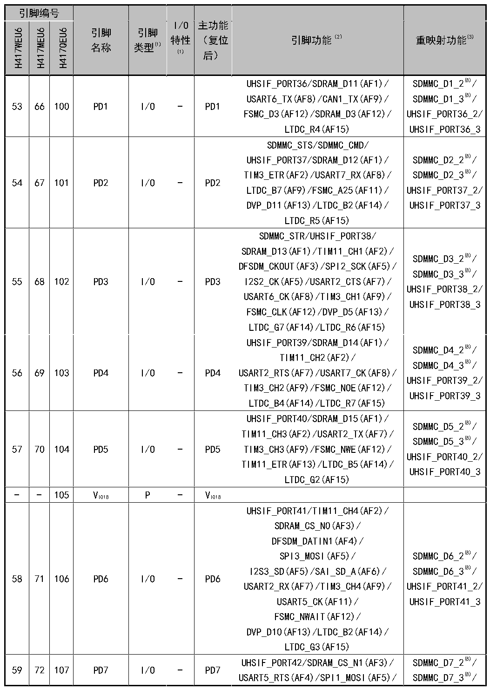

<!-- source-page: 40 -->

[← p.39](0039.md) · [index](../README.md) · [PDF p.40](https://ch32-riscv-ug.github.io/CH32H417/datasheet_zh/CH32H417DS0.PDF#page=40) · [p.41 →](0041.md)

<!-- header: CH32H417、H416、H415数据手册 https://wch.cn -->

 <!-- p40-cluster-01 uncaptioned graphics, rendered from the PDF; verify at https://ch32-riscv-ug.github.io/CH32H417/datasheet_zh/CH32H417DS0.PDF#page=40 -->

🖼 Text parsed from the figure above

> ⬆ **Table continued** — rendered in full at [page 28](0028.md). <!-- p40-table-001 -->

<!-- image: p40-draw-image-00001 bbox=[500.88, 779.28, 520.32, 789.6] -->
<!-- footer: V1.8 36 -->
