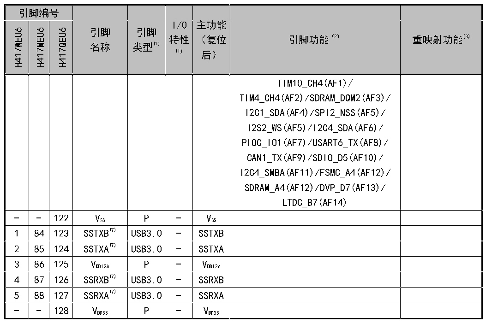

<!-- source-page: 43 -->

[← p.42](0042.md) · [index](../README.md) · [PDF p.43](https://ch32-riscv-ug.github.io/CH32H417/datasheet_zh/CH32H417DS0.PDF#page=43) · [p.44 →](0044.md)

<!-- header: CH32H417、H416、H415数据手册 https://wch.cn -->

 <!-- p43-cluster-01 uncaptioned graphics, rendered from the PDF; verify at https://ch32-riscv-ug.github.io/CH32H417/datasheet_zh/CH32H417DS0.PDF#page=43 -->

🖼 Text parsed from the figure above

> ⬆ **Table continued** — rendered in full at [page 28](0028.md). <!-- p43-table-001 -->

注1：表格缩写解释：  
I = TTL/CMOS电平斯密特输入；O = CMOS电平三态输出；A = 模拟信号输入或输出；P = 电源；  
FT = 耐受5V；USB3.0 = USB3.0信号；ETH = 以太网信号；SDP = SerDes PHY信号。  
注2：I/O引脚通过一个复用器连接到板载外设/模块，该复用器一次仅允许一个外设的复用功能(AF)连  
接到I/O引脚。该复用器采用多达16路复用功能输入（AF0到AF15），可通过GPIOx_AFLR和GPIOx_AFHR  
寄存器对这些输入进行配置：复位后，复用器选择为复用功能0，即(AF0)。更多详细信息请参考  
《CH32H417RM》手册的复用功能I/O章节和调试设置章节。  
注3：重映射功能下划线后的数值表示AFIO_PCFR1寄存器中相对应位的配置值。例如：UHSIF_CLK_1表示  
寄存器相应位配置为01b。  
注4：VDD33 和VBAT 均可连接内部模拟开关为备份区域以及PC13、PC14和PC15引脚供电，这个模拟开关只能  
够通过有限的电流(3mA)。当由VDD33 供电时：PC14和PC15可用于GPIO或LSE引脚、PC13可作为通用I/O  
口、RTC校准时钟、RTC闹钟或秒输出；PC13、PC14和PC15作为GPIO输出脚时只能工作在2MHz模式下，  
最大驱动负载为30pF，并且不能作为电流源(如驱动LED)。而当由VBAT 供电时：PC14和PC15只能用于  
LSE引脚、PC13可作为RTC闹钟或秒输出。  
注5：这些引脚在备份区域第一次上电时处于主功能状态下，之后即使复位，这些引脚的状态由后备域  
控制寄存器控制（这些寄存器不会被主复位系统所复位）。关于如何控制这些IO口的具体信息，请  
参考《CH32H417RM》手册的复位和时钟控制（RCC）章节。  
注6：支持以太网引脚RX/TX收发识别和成对交换，支持引脚MDIRP/MDIRN正负识别和交换，支持引脚  
MDITP/MDITN正负识别和交换。  
注7：USB3.0引脚信号支持正负识别和交换，PCB走线应该参考USB规范进行阻抗匹配，避免有过孔。  
SSRXA/SSRXB默认连接对方TXP/TXN，支持交叉连接TXN/TXP，SSTXA/SSTXB默认连接对方RXP/RXN，  
支持交叉连接RXN/RXP。  
注8：SDMMC在使用单线或者四线模式时，未使用的数据线对应的GPIO引脚不能做复用输出使用，可用于  
复用输入，也可用于通用GPIO输出。  
<!-- image: p43-draw-image-00001 bbox=[500.88, 779.28, 520.32, 789.6] -->
<!-- footer: V1.8 39 -->
