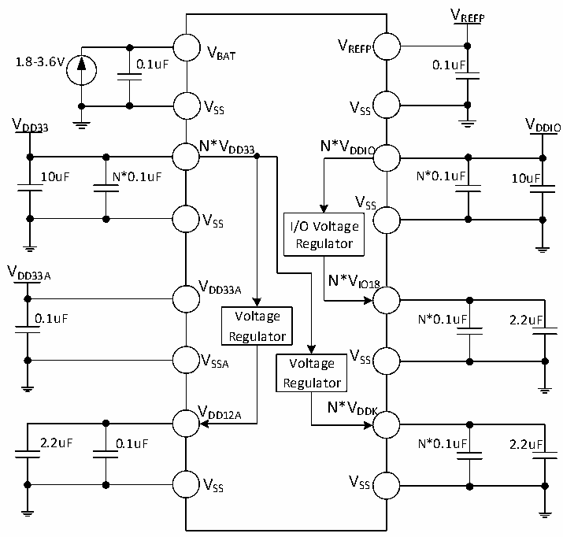

<!-- source-page: 76 -->

[← p.75](0075.md) · [index](../README.md) · [PDF p.76](https://ch32-riscv-ug.github.io/CH32H417/datasheet_zh/CH32H417DS0.PDF#page=76) · [p.77 →](0077.md)

<!-- header: CH32H417、H416、H415数据手册 https://wch.cn -->

# 第 3 章 电气特性

## 3.1 测试条件

除非特殊说明和标注，所有电压都以VSS 为基准。所有最小值和最大值将在最坏的环境温度、供电  
电压和时钟频率条件下得到保证。  
CH32H417典型数值基于以下几种环境之一用于设计指导：  
1、常温 25℃，供电 VDD33= 3.3V、VDD33A= 3.3V、VDDIO= 3.3V、VREFP= 3.3V，产生 VIO18=1.8V 或  
3.3V、VDD12A= 1.2V、VDDK= 1.2V。  
2、常温25℃，外部为DCDC芯片（CH2003V）提供额定5V，产生额定3.3V和1.2V供给CH32H417。  
供电VDD33= VDD33A= VDDIO= VREFP= 3.3V、VDD12A= VDDK= 1.2V，产生VIO18=1.8V或3.3V。  
3、常温25℃，外部为DCDC芯片（CH2003K）提供额定5V，产生额定3.3V和0.875V供给CH32H417。  
CH32H416典型数值基于以下几种环境之一用于设计指导：  
1、常温25℃，供电VDD33= 3.3V、VDD33A= 3.3V、VREFP= 3.3V，产生VDD12A= 1.2V、VDDK= 1.2V。  
2、常温25℃，外部为DCDC芯片（CH2003V）提供额定5V，产生额定3.3V和1.2V供给CH32H416。  
供电VDD33= VDD33A= VREFP= 3.3V、VDD12A= VDDK= 1.2V。  
CH32H415典型数值基于以下几种环境之一用于设计指导：  
1、常温25℃，供电VDD33= 3.3V、VDD33A= 3.3V，产生VDDK= 1.2V。  
2、常温25℃，外部为DCDC芯片（CH2003V）提供额定5V，产生额定3.3V和1.2V供给CH32H415。  
供电VDD33= VDD33A= 3.3V、VDDK= 1.2V。  
对于通过综合评估、设计模拟或工艺特性得到的数据，不会在生产线进行测试。在综合评估的基  
础上，最小和最大值是通过样本测试后统计得到。除非特殊说明为实测值，否则特性参数以综合评估  
或设计保证。供电方案：  

图3-1-1 CH32H417常规供电典型电路  
 <!-- rendered from the PDF; verify at https://ch32-riscv-ug.github.io/CH32H417/datasheet_zh/CH32H417DS0.PDF#page=76 -->

🖼 Text parsed from the figure above

VREFP  
V  
V REFP  
1.8-3.6V 0.1uF BAT 0.1uF  
VSS VSS  
VDD33 VDDIO  
N*VDD33 N*VDDIO  
10uF N*0.1uF N*0.1uF 10uF  
VSS  
V  
SS I/O Voltage  
Regulator  
V  
DD33A N*V  
V IO18  
DD33A  
0.1uF Voltage N*0.1uF 2.2uF  
Regulator  
V SSA Voltage V SS  
Regulator  
V DD12A N*V DDK  
2.2uF 0.1uF N*0.1uF 2.2uF  
V SS V SS  

<!-- image: p76-draw-image-00001 bbox=[500.52, 779.28, 519.96, 789.6] -->
<!-- footer: V1.8 72 -->
