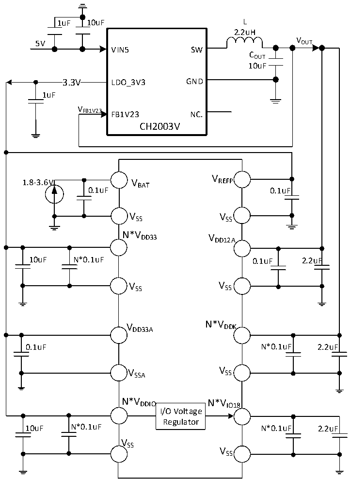

<!-- source-page: 77 -->

[← p.76](0076.md) · [index](../README.md) · [PDF p.77](https://ch32-riscv-ug.github.io/CH32H417/datasheet_zh/CH32H417DS0.PDF#page=77) · [p.78 →](0078.md)

<!-- header: CH32H417、H416、H415数据手册 https://wch.cn -->

图3-1-2 CH32H417 DCDC单一5V供电电路  
 <!-- rendered from the PDF; verify at https://ch32-riscv-ug.github.io/CH32H417/datasheet_zh/CH32H417DS0.PDF#page=77 -->

🖼 Text parsed from the figure above

1uF 10uF L  
2.2uH  
V  
5V OUT  
VIN5 SW  
COUT  
10uF  
3.3V  3.3V  
3.3V LDO_3V3 GND  
1uF  
V  
FB1V23 FB1V23 NC.  
CH2003V  
V  
1.8-3.6V V REFP  
BAT  
0.1uF 0.1uF  
VSS VSS  
N*V DD33 V DD12A  
10uF N*0.1uF 0.1uF 2.2uF  
VSS VSS  
V DD33A N*V DDK  
0.1uF N*0.1uF 2.2uF  
V SSA V SS  
N*V DDIO N*V IO18  
I/O Voltage  
Regulator  
10uF N*0.1uF N*0.1uF 2.2uF  
VSS  
VSS  

<!-- image: p77-draw-image-00001 bbox=[500.52, 779.28, 519.96, 789.6] -->
<!-- footer: V1.8 73 -->
