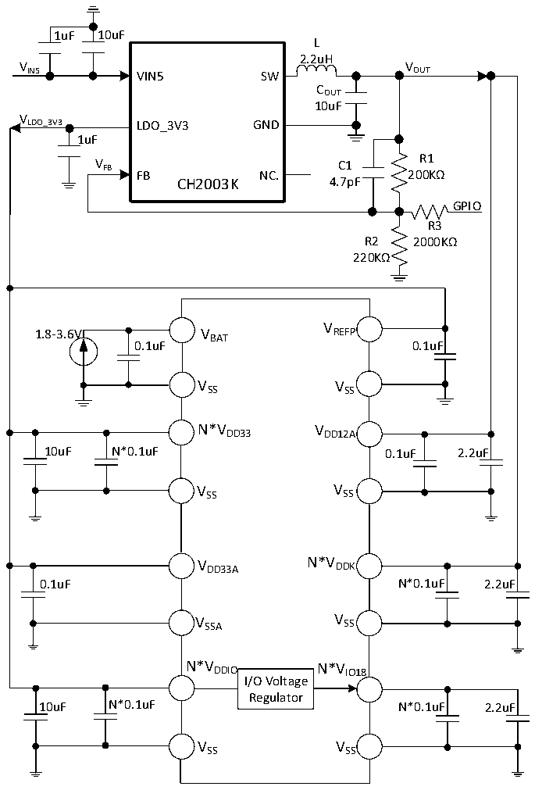

<!-- source-page: 78 -->

[← p.77](0077.md) · [index](../README.md) · [PDF p.78](https://ch32-riscv-ug.github.io/CH32H417/datasheet_zh/CH32H417DS0.PDF#page=78) · [p.79 →](0079.md)

<!-- header: CH32H417、H416、H415数据手册 https://wch.cn -->

图3-1-3 CH32H417调压器为低功耗模式的DCDC单一5V供电电路  
 <!-- rendered from the PDF; verify at https://ch32-riscv-ug.github.io/CH32H417/datasheet_zh/CH32H417DS0.PDF#page=78 -->

🖼 Text parsed from the figure above

1uF 10uF  
L  
2.2uH  
V V  
IN5 VIN5 SW OUT  
COUT  
10uF  
V  
LDO_3V3 LDO_3V3 GND  
1uF  
R1  
V FB C1  
FB NC. 200KΩ  
CH2003K 4.7pF  
GPIO  
R3  
R2 2000KΩ  
220KΩ  
V  
1.8-3.6V V REFP  
BAT  
0.1uF 0.1uF  
VSS VSS  
N*V DD33 V DD12A  
10uF N*0.1uF 0.1uF 2.2uF  
V SS V SS  
V DD33A N*V DDK  
0.1uF N*0.1uF 2.2uF  
V SSA V SS  
N*V DDIO N*V IO18  
I/O Voltage  
Regulator  
10uF N*0.1uF N*0.1uF 2.2uF  
VSS VSS  

注：1.对于CH32H417芯片，VDD33、VDDIO、VIO18 以及VDDK 在部分芯片封装中可能有多个引脚，同名电源引  
脚必须短接。  
主VDD33 引脚（与以太网信号引脚相邻）外接0.1uF并联至少10uF容量的退耦电容，剩余VDD33 引脚  
只需外接0.1uF容量的退耦电容即可。  
主VDDIO 引脚（与VIO18 相邻）外接0.1uF并联至少10uF容量的退耦电容，剩余VDDIO 引脚只需外接  
0.1uF容量的退耦电容即可。  
主VIO18 引脚（与VDDIO 相邻）外接0.1uF并联2.2uF容量的退耦电容，剩余VIO18 引脚只需外接0.1uF  
容量的退耦电容即可。  
主VDDK 引脚（与VDD33 相邻）外接0.1uF并联2.2uF容量的退耦电容，剩余VDDK 引脚只需外接0.1uF  
容量的退耦电容即可。  
2.对于图3-1-3，GPIO低电平对应调压器为正常模式；GPIO高电平对应调压器为低功耗模式。  
<!-- image: p78-draw-image-00001 bbox=[500.52, 779.28, 519.96, 789.6] -->
<!-- footer: V1.8 74 -->
