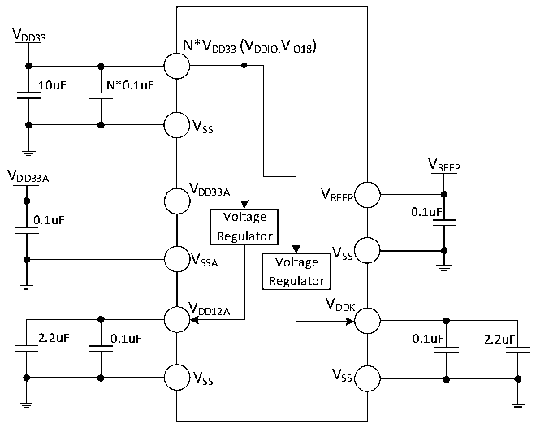
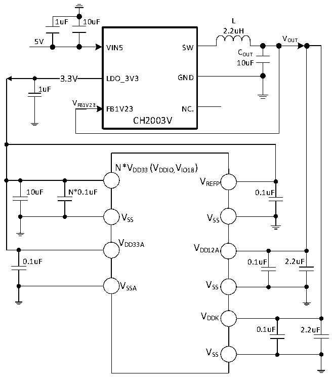

<!-- source-page: 79 -->

[← p.78](0078.md) · [index](../README.md) · [PDF p.79](https://ch32-riscv-ug.github.io/CH32H417/datasheet_zh/CH32H417DS0.PDF#page=79) · [p.80 →](0080.md)

<!-- header: CH32H417、H416、H415数据手册 https://wch.cn -->

图3-1-4 CH32H416常规供电典型电路  
 <!-- rendered from the PDF; verify at https://ch32-riscv-ug.github.io/CH32H417/datasheet_zh/CH32H417DS0.PDF#page=79 -->

🖼 Text parsed from the figure above

VDD33  
N*VDD33(VDDIO,IO18 V )  
10uF N*0.1uF  
VSS  
V  
V REFP  
DD33A  
V DD33A V  
REFP  
0.1uF Voltage 0.1uF  
Regulator  
V  
V SSA Voltage SS  
Regulator  
V DD12A V DDK  
2.2uF 0.1uF 0.1uF 2.2uF  
V SS V SS  

图3-1-5 CH32H416 DCDC单一5V供电电路  
 <!-- rendered from the PDF; verify at https://ch32-riscv-ug.github.io/CH32H417/datasheet_zh/CH32H417DS0.PDF#page=79 -->

🖼 Text parsed from the figure above

1uF 10uF L  
2.2uH  
VOUT  
5V  
VIN5 SW  
COUT  
10uF  
3.3V  3.3V  
3.3V LDO_3V3 GND  
1uF  
VFB1V23  
FB1V23 NC.  
CH2003V  
N*VDD33(VDDIO,IO18 V )  
VREFP  
10uF N*0.1uF 0.1uF  
VSS VSS  
V  
DD33A V  
DD12A  
0.1uF 0.1uF 2.2uF  
V SSA V SS  
VDDK  
0.1uF 2.2uF  
VSS  

注：1.对于CH32H416RDU6芯片，VDD33 有2个引脚，同名电源引脚必须短接。  
主VDD33 引脚（与VDDK 引脚相邻）外接0.1uF并联至少10uF容量的退耦电容，剩余VDD33 引脚只需外  
接0.1uF容量的退耦电容即可。  
<!-- image: p79-draw-image-00001 bbox=[500.52, 779.28, 519.96, 789.6] -->
<!-- footer: V1.8 75 -->
