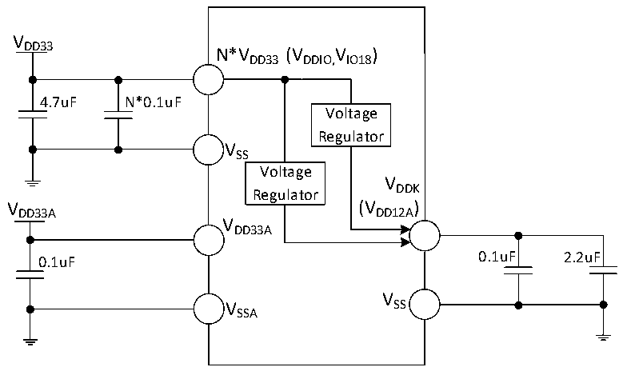
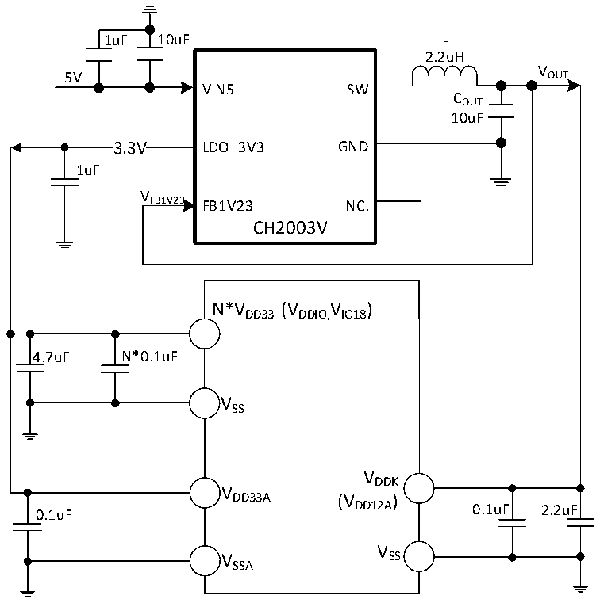

<!-- source-page: 80 -->

[← p.79](0079.md) · [index](../README.md) · [PDF p.80](https://ch32-riscv-ug.github.io/CH32H417/datasheet_zh/CH32H417DS0.PDF#page=80) · [p.81 →](0081.md)

<!-- header: CH32H417、H416、H415数据手册 https://wch.cn -->

图3-1-6 CH32H415常规供电典型电路  
 <!-- rendered from the PDF; verify at https://ch32-riscv-ug.github.io/CH32H417/datasheet_zh/CH32H417DS0.PDF#page=80 -->

🖼 Text parsed from the figure above

VDD33  
N*VDD33(VDDIO,IO18 V )  
4.7uF N*0.1uF  
Voltage  
Regulator  
VSS  
Voltage  
VDDK  
Regulator  
VDD33A(VDD12A)  
VDD33A  
0.1uF 0.1uF 2.2uF  
V  
V SS  
SSA  

图3-1-7 CH32H415 DCDC单一5V供电电路  
 <!-- rendered from the PDF; verify at https://ch32-riscv-ug.github.io/CH32H417/datasheet_zh/CH32H417DS0.PDF#page=80 -->

🖼 Text parsed from the figure above

1uF 10uF L  
2.2uH  
V  
5V OUT  
VIN5 SW  
COUT  
10uF  
3.3V  3.3V  
3.3V LDO_3V3 GND  
1uF  
V  
FB1V23 FB1V23 NC.  
CH2003V  
N*VDD33(VDDIO,IO18 V )  
4.7uF N*0.1uF  
VSS  
VDDK  
V  
DD33A (V )  
0.1uF DD12A 0.1uF 2.2uF  
V  
V SS  
SSA  

注：1.对于CH32H415REU6芯片，VDD33 有多个引脚，同名电源引脚必须短接。  
主VDD33 引脚（与VDDK 引脚相邻）外接0.1uF并联至少4.7uF容量的退耦电容，剩余VDD33 引脚只需  
外接0.1uF容量的退耦电容即可。  
<!-- image: p80-draw-image-00001 bbox=[500.52, 779.28, 519.96, 789.6] -->
<!-- footer: V1.8 76 -->
