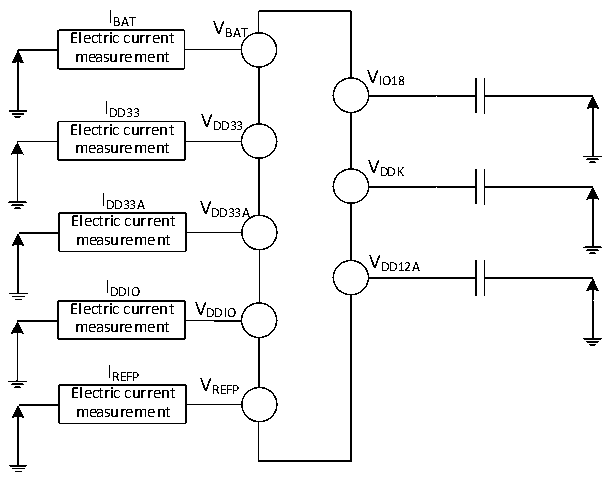

<!-- source-page: 83 -->

[← p.82](0082.md) · [index](../README.md) · [PDF p.83](https://ch32-riscv-ug.github.io/CH32H417/datasheet_zh/CH32H417DS0.PDF#page=83) · [p.84 →](0084.md)

<!-- header: CH32H417、H416、H415数据手册 https://wch.cn -->

> ⬆ **Table continued** — rendered in full at [page 82](0082.md). <!-- p83-table-001 -->

注：1.常温测试值。  

### 3.3.3 内置的参考电压

<!-- p83-table-002 (table-3-5@1) -->
<table><caption>表3-5 内置参考电压</caption><tr><th>符号</th><th>参数</th><th>条件</th><th>最小值</th><th>典型值</th><th>最大值</th><th>单位</th></tr><tr><td style="text-align:left">VREFINT</td><td>内置参考电压</td><td style="text-align:left">T = -40℃～85℃ A</td><td>1.17</td><td>1.21</td><td>1.24</td><td>V</td></tr></table>

### 3.3.4 供电电流特性

电流消耗是多种参数和因素的综合指标，这些参数和因素包括工作电压、环境温度、I/O 引脚的  
负载、产品的软件配置、工作频率、I/O 脚的翻转速率、程序在存储器中的位置以及执行的代码等。  
电流消耗测量方法如下图：  

图3-2-1 CH32H417电流消耗测量  
 <!-- rendered from the PDF; verify at https://ch32-riscv-ug.github.io/CH32H417/datasheet_zh/CH32H417DS0.PDF#page=83 -->

🖼 Text parsed from the figure above

I  
BAT V  
Electric current BAT  
measurement  
VIO18  
I  
DD33 V  
Electric current DD33  
measurement  
VDDK  
I  
DD33A V  
DD33A  
Electric current  
measurement  
VDD12A  
IDDIO  
Electric current V DDIO  
measurement  
I  
REFP V  
Electric current REFP  
measurement  

<!-- image: p83-draw-image-00001 bbox=[500.52, 779.28, 519.96, 789.6] -->
<!-- footer: V1.8 79 -->
