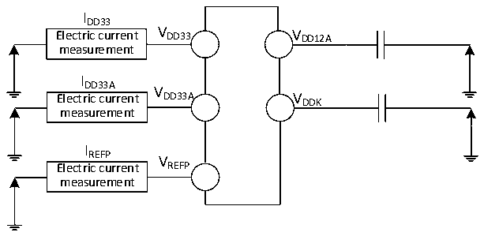
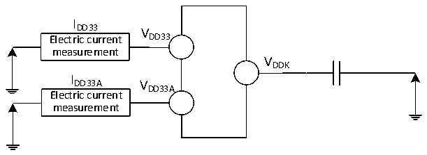

<!-- source-page: 84 -->

[← p.83](0083.md) · [index](../README.md) · [PDF p.84](https://ch32-riscv-ug.github.io/CH32H417/datasheet_zh/CH32H417DS0.PDF#page=84) · [p.85 →](0085.md)

<!-- header: CH32H417、H416、H415数据手册 https://wch.cn -->

图3-2-2 CH32H416电流消耗测量  
 <!-- rendered from the PDF; verify at https://ch32-riscv-ug.github.io/CH32H417/datasheet_zh/CH32H417DS0.PDF#page=84 -->

🖼 Text parsed from the figure above

IDD33  
Electric current V DD33 V DD12A  
measurement  
I  
DD33A V  
Electric current DD33A VDDK  
measurement  
IREFP  
V  
Electric current REFP  
measurement  

图3-2-3 CH32H415电流消耗测量  
 <!-- rendered from the PDF; verify at https://ch32-riscv-ug.github.io/CH32H417/datasheet_zh/CH32H417DS0.PDF#page=84 -->

🖼 Text parsed from the figure above

I  
DD33 V  
Electric current DD33  
measurement  
VDDK  
I  
DD33A V  
DD33A  
Electric current  
measurement  

CH32H417处于下列条件之一：  
1、常温供电VDD33= 3.3V、VDD33A= 3.3V、VDDIO= 3.3V、VREFP= 3.3V，产生VIO18= 1.8V、VDD12A= 1.2V、  
VDDK= 1.2V。  
2、常温，外部为DCDC芯片（CH2003V或CH2003K）提供额定5V，产生额定3.3V和1.2V供给CH32H417  
芯片。  
3、常温，外部为DCDC芯片（CH2003K）提供额定5V，产生额定3.3V和0.875V供给CH32H417芯  
片。  
同时测试时：所有I/O端口配置下拉输入，HSI = 25MHz（已校准），FHCLK= FV3F。使能或关闭所有  
外设时钟的功耗。  
CH32H416处于下列条件之一：  
1、常温供电VDD33= 3.3V、VDD33A= 3.3V、VREFP= 3.3V，产生VDD12A= 1.2V、VDDK= 1.2V。  
2、常温，外部为DCDC芯片（CH2003V）提供额定5V，产生额定3.3V和1.2V供给CH32H416芯片。  
同时测试时：所有I/O端口配置下拉输入，HSI = 25MHz（已校准），FHCLK= FV3F。使能或关闭所有  
外设时钟的功耗。  
CH32H415处于下列条件之一：  
1、常温供电VDD33= 3.3V、VDD33A= 3.3V，产生VDDK= 1.2V。  
2、常温，外部为DCDC芯片（CH2003V）提供额定5V，产生额定3.3V和1.2V供给CH32H415芯片。  
同时测试时：所有I/O端口配置下拉输入，HSI = 25MHz（已校准），FHCLK= FV3F。使能或关闭所有  
外设时钟的功耗。  
注：小封装型号未封装出的引脚或者已封装出来但未使用的引脚，建议配置为上拉输入或者下拉输入，  
否则可能影响电流指标，具体操作请参考EVT低功耗例程。  
<!-- image: p84-draw-image-00001 bbox=[500.52, 779.28, 519.96, 789.6] -->
<!-- footer: V1.8 80 -->
