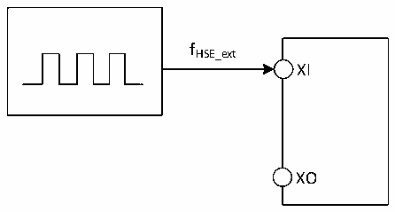

<!-- source-page: 87 -->

[← p.86](0086.md) · [index](../README.md) · [PDF p.87](https://ch32-riscv-ug.github.io/CH32H417/datasheet_zh/CH32H417DS0.PDF#page=87) · [p.88 →](0088.md)

<!-- header: CH32H417、H416、H415数据手册 https://wch.cn -->

> ⬆ **Table continued** — rendered in full at [page 86](0086.md). <!-- p87-table-001 -->

注：1.以上均为实测参数。  
2.供电电路基于图3-1-2、图3-1-5、图3-1-7。  
3.供电电路基于图3-1-3。  

### 3.3.5 外部时钟源特性

<!-- p87-table-002 (table-3-9@1) -->
<table><caption>表3-9 来自外部高速时钟</caption><tr><th>符号</th><th>参数</th><th>条件</th><th>最小值</th><th>典型值</th><th>最大值</th><th>单位</th></tr><tr><td style="text-align:left">FHSE_ext</td><td>外部时钟频率</td><td></td><td>5</td><td>25</td><td>32</td><td>MHz</td></tr><tr><td style="text-align:left">V (1) HSEH</td><td>XI输入引脚高电平电压</td><td></td><td style="text-align:left">0.8*VDDIO</td><td></td><td style="text-align:left">VDDIO</td><td>V</td></tr><tr><td style="text-align:left">V (1) HSEL</td><td>XI输入引脚低电平电压</td><td></td><td>0</td><td></td><td style="text-align:left">0.2*VDDIO</td><td>V</td></tr><tr><td style="text-align:left">C in(HSE)</td><td>XI输入电容</td><td></td><td></td><td>5</td><td></td><td>pF</td></tr><tr><td style="text-align:left">DuCy (HSE)</td><td>占空比(Duty cycle)</td><td></td><td></td><td>50</td><td></td><td>%</td></tr><tr><td style="text-align:left">IL</td><td>XI输入漏电流</td><td></td><td></td><td></td><td>±1</td><td>uA</td></tr></table>

注：1.不满足此条件可能会引起电平识别错误。  

图3-3 外部提供高频时钟源电路  
 <!-- rendered from the PDF; verify at https://ch32-riscv-ug.github.io/CH32H417/datasheet_zh/CH32H417DS0.PDF#page=87 -->

🖼 Text parsed from the figure above

fHSE_ext  
XI  
XO  

<!-- p87-table-003 (table-3-10@1) pages 87-88 -->
<table><caption>表3-10 来自外部低速时钟</caption><tr><th>符号</th><th>参数</th><th>条件</th><th>最小值</th><th>典型值</th><th>最大值</th><th>单位</th></tr><tr><td style="text-align:left">FLSE_ext</td><td>用户外部时钟频率</td><td></td><td></td><td>32.768</td><td></td><td>kHz</td></tr><tr><td style="text-align:left">VLSEH</td><td>OSC32_IN输入引脚高电平电压</td><td></td><td style="text-align:left">0.8*VDD33</td><td></td><td style="text-align:left">VDD33</td><td>V</td></tr><tr><td style="text-align:left">VLSEL</td><td>OSC32_IN输入引脚低电平电压</td><td></td><td>0</td><td></td><td style="text-align:left">0.2*VDD33</td><td>V</td></tr><tr><td style="text-align:left">C in（LSE）</td><td>OSC32_IN输入电容</td><td></td><td></td><td>5</td><td></td><td>pF</td></tr><tr><td style="text-align:left">DuCy LSE</td><td>占空比（Duty cycle）</td><td></td><td></td><td>50</td><td></td><td>%</td></tr><tr><td style="text-align:left">IL</td><td>OSC32_IN输入漏电流</td><td></td><td></td><td></td><td>±1</td><td>uA</td></tr></table>

<!-- image: p87-draw-image-00001 bbox=[500.52, 779.28, 519.96, 789.6] -->
<!-- footer: V1.8 83 -->
