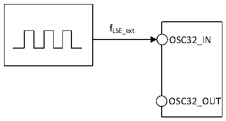
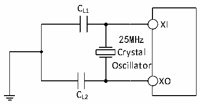

<!-- source-page: 88 -->

[← p.87](0087.md) · [index](../README.md) · [PDF p.88](https://ch32-riscv-ug.github.io/CH32H417/datasheet_zh/CH32H417DS0.PDF#page=88) · [p.89 →](0089.md)

<!-- header: CH32H417、H416、H415数据手册 https://wch.cn -->

> ⬆ **Table continued** — rendered in full at [page 87](0087.md). <!-- p88-table-001 -->

注：1.不满足此条件可能会引起电平识别错误。  

图3-4 外部提供低频时钟源电路  
 <!-- rendered from the PDF; verify at https://ch32-riscv-ug.github.io/CH32H417/datasheet_zh/CH32H417DS0.PDF#page=88 -->

🖼 Text parsed from the figure above

fLSE_ext  
OSC32_IN  
OSC32_OUT  

<!-- p88-table-002 (table-3-11@1) -->
<table><caption>表3-11 使用一个晶体/陶瓷谐振器产生的高速外部时钟</caption><tr><th>符号</th><th>参数</th><th>条件</th><th>最小值</th><th>典型值</th><th>最大值</th><th>单位</th></tr><tr><td style="text-align:left">FXI</td><td>谐振器频率</td><td></td><td>5</td><td>25</td><td>32</td><td>MHz</td></tr><tr><td style="text-align:left">RF</td><td>反馈电阻（无需外置）</td><td></td><td></td><td>250</td><td></td><td>kΩ</td></tr><tr><td style="text-align:left">CLOAD</td><td style="text-align:left">建议的负载电容与对应晶体串行阻抗RS</td><td style="text-align:left">R = 60Ω(1) S</td><td></td><td>20</td><td></td><td>pF</td></tr><tr><td style="text-align:left">IHSE</td><td>HSE驱动电流</td><td></td><td></td><td>0.8</td><td></td><td>mA</td></tr><tr><td style="text-align:left">g m</td><td>振荡器的跨导</td><td>启动</td><td></td><td>26</td><td></td><td>mA/V</td></tr><tr><td style="text-align:left">t SU(HSE)</td><td>启动时间</td><td style="text-align:left">V 稳定，25M晶体DD33</td><td></td><td>1.5（2）</td><td></td><td>ms</td></tr></table>

注：1.建议晶体ESR不超过80欧姆，优先选择ESR较小的晶体，负载电容参考晶体手册要求。  
2.启动时间指从HSEON开启到HSERDY被置位的时间差。  
3.以太网应用通常需要HSE，晶振建议用25M晶体，建议不超过30ppm。  
电路参考设计及要求：  
晶体的负载电容以晶体厂商建议为准，通常情况CL1= CL2。  

图3-5 外接25M晶体典型电路  
 <!-- rendered from the PDF; verify at https://ch32-riscv-ug.github.io/CH32H417/datasheet_zh/CH32H417DS0.PDF#page=88 -->

🖼 Text parsed from the figure above

CL1  
XI  
25MHz  
Crystal  
Oscillator  
XO  
CL2  

<!-- p88-table-003 (table-3-12@1) pages 88-89 -->
<table><caption>表3-12 使用一个晶体/陶瓷谐振器产生的低速外部时钟（fLSE= 32.768kHz）</caption><tr><th>符号</th><th>参数</th><th>条件</th><th>最小值</th><th>典型值</th><th>最大值</th><th>单位</th></tr><tr><td style="text-align:left">FLSE</td><td>谐振器频率</td><td></td><td></td><td>32.768</td><td></td><td>kHz</td></tr><tr><td style="text-align:left">RF</td><td>反馈电阻</td><td></td><td></td><td>5</td><td></td><td>MΩ</td></tr><tr><td>C</td><td style="text-align:left">建议的负载电容与对应晶体串行阻抗RS</td><td style="text-align:left">R &lt; 70kΩS</td><td></td><td></td><td>15</td><td>pF</td></tr><tr><td style="text-align:left">i 2</td><td>LSE驱动电流</td><td></td><td></td><td>0.35</td><td></td><td>uA</td></tr><tr><td style="text-align:left">g m</td><td>振荡器的跨导</td><td>启动</td><td></td><td>30</td><td></td><td>uA/V</td></tr><tr><td style="text-align:left">t SU（LSE）</td><td>启动时间</td><td style="text-align:left">V 是稳定的DD33</td><td></td><td>800</td><td></td><td>mS</td></tr></table>

<!-- image: p88-draw-image-00001 bbox=[500.52, 779.28, 519.96, 789.6] -->
<!-- footer: V1.8 84 -->
