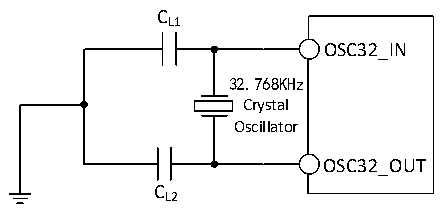

<!-- source-page: 89 -->

[← p.88](0088.md) · [index](../README.md) · [PDF p.89](https://ch32-riscv-ug.github.io/CH32H417/datasheet_zh/CH32H417DS0.PDF#page=89) · [p.90 →](0090.md)

<!-- header: CH32H417、H416、H415数据手册 https://wch.cn -->

> ⬆ **Table continued** — rendered in full at [page 88](0088.md). <!-- p89-table-001 -->

电路参考设计及要求：  
晶体的负载电容以晶体厂商建议为准，通常情况CL1= CL2，可选12pF左右。  

图3-6 外接32.768K晶体典型电路  
 <!-- rendered from the PDF; verify at https://ch32-riscv-ug.github.io/CH32H417/datasheet_zh/CH32H417DS0.PDF#page=89 -->

🖼 Text parsed from the figure above

CL1  
OSC32_IN  
32.768KHz  
Crystal  
Oscillator  
OSC32_OUT  
CL2  

注：负载电容CL由下式计算：CL= CL1 x CL2/ （CL1+ CL2） + Cstray，其中Cstray 是引脚的电容和PCB  
板或PCB相关的电容，它的典型值是介于2pF至7pF之间。  

### 3.3.6 内部时钟源特性

<!-- p89-table-002 (table-3-13@1) -->
<table><caption>表3-13 内部高速(HSI)RC振荡器特性</caption><tr><th>符号</th><th>参数</th><th>条件</th><th>最小值</th><th>典型值</th><th>最大值</th><th>单位</th></tr><tr><td style="text-align:left">FHSI</td><td>频率(校准后)</td><td></td><td></td><td>25</td><td></td><td>MHz</td></tr><tr><td style="text-align:left">DuCy HSI</td><td>占空比(Duty cycle)</td><td></td><td>45</td><td>50</td><td>55</td><td>%</td></tr><tr><td rowspan="2" style="text-align:left">ACCHSI</td><td rowspan="2">HSI振荡器的精度（校准后）</td><td style="text-align:left">T = 0℃～70℃ A</td><td>-1.6</td><td></td><td>1.6</td><td>%</td></tr><tr><td style="text-align:left">T = -40℃～85℃ A</td><td>-2.2</td><td></td><td>2.2</td><td>%</td></tr><tr><td style="text-align:left">t SU(HSI)</td><td>HSI振荡器启动稳定时间</td><td></td><td></td><td>10</td><td></td><td>us</td></tr></table>

<!-- p89-table-003 (table-3-14@1) -->
<table><caption>表3-14 内部低速(LSI)RC振荡器特性</caption><tr><th>符号</th><th>参数</th><th>条件</th><th>最小值</th><th>典型值</th><th>最大值</th><th>单位</th></tr><tr><td style="text-align:left">FLSI</td><td>频率</td><td></td><td>25</td><td>40</td><td>60</td><td>kHz</td></tr><tr><td style="text-align:left">DuCy LSI</td><td>占空比(Duty cycle)</td><td></td><td>45</td><td>50</td><td>55</td><td>%</td></tr><tr><td style="text-align:left">t (1) SU(LSI)</td><td>LSI振荡器启动稳定时间</td><td></td><td></td><td>230</td><td></td><td>us</td></tr><tr><td style="text-align:left">IDD(LSI)</td><td>LSI振荡器功耗</td><td></td><td></td><td>0.6</td><td></td><td>uA</td></tr></table>

注：1.寄存器RCC_CTLR LSION置1，等待LSIRDY置1。  

### 3.3.7 PLL特性

<!-- p89-table-004 (table-3-15@1) -->
<table><caption>表3-15 PLL特性</caption><tr><th>符号</th><th>参数</th><th>条件</th><th>最小值</th><th>典型值</th><th>最大值</th><th>单位</th></tr><tr><td rowspan="2" style="text-align:left">FPLL_IN</td><td>PLL输入时钟</td><td></td><td>5</td><td>25</td><td>32</td><td>MHz</td></tr><tr><td>PLL输入时钟占空比</td><td></td><td>40</td><td></td><td>60</td><td>%</td></tr><tr><td style="text-align:left">FPLL_OUT</td><td>PLL倍频输出时钟</td><td></td><td>100</td><td></td><td>600</td><td>MHz</td></tr><tr><td style="text-align:left">t LOCK</td><td>PLL锁定时间</td><td></td><td></td><td>40</td><td>90</td><td>us</td></tr></table>

<!-- image: p89-draw-image-00001 bbox=[500.52, 779.28, 519.96, 789.6] -->
<!-- footer: V1.8 85 -->
