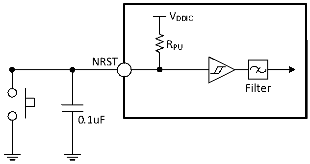

<!-- source-page: 97 -->

[← p.96](0096.md) · [index](../README.md) · [PDF p.97](https://ch32-riscv-ug.github.io/CH32H417/datasheet_zh/CH32H417DS0.PDF#page=97) · [p.98 →](0098.md)

> ⚠ 10 subscript glyph(s) on this page appear as `*` because the PDF's text layer maps them to `*` (broken ToUnicode); the printed page shows the real subscripts -- read [the PDF, p.97](https://ch32-riscv-ug.github.io/CH32H417/datasheet_zh/CH32H417DS0.PDF#page=97).

<!-- header: CH32H417、H416、H415数据手册 https://wch.cn -->

> ⬆ **Table continued** — rendered in full at [page 96](0096.md). <!-- p97-table-001 -->

注：1.以上均为设计参数保证。  
2.上表中，V*根据具体的引脚可表示为VDDIO、VIO18 或VDD33。  

### 3.3.11 NRST引脚特性

电路参考设计及要求：  

图3-7 外部复位引脚典型电路  
 <!-- rendered from the PDF; verify at https://ch32-riscv-ug.github.io/CH32H417/datasheet_zh/CH32H417DS0.PDF#page=97 -->

🖼 Text parsed from the figure above

VDDIO  
RPU  
NRST  
Filter  
0.1uF  

注：图中的电容是可选的，可以用于滤除按键抖动。  

<!-- p97-table-003 (table-3-22@1) -->
<table><caption>表3-22 外部复位引脚特性</caption><tr><th>符号</th><th>参数</th><th>条件</th><th>最小值</th><th>典型值</th><th>最大值</th><th>单位</th></tr><tr><td style="text-align:left">VIL（NRST）</td><td>NRST输入低电平电压</td><td></td><td>-0.3</td><td></td><td style="text-align:left">0.29*V -0.07DDIO</td><td>V</td></tr><tr><td style="text-align:left">VIH（NRST）</td><td>NRST输入高电平电压</td><td></td><td style="text-align:left">0.45*V +0.41DDIO</td><td></td><td style="text-align:left">V +0.3DDIO</td><td>V</td></tr><tr><td style="text-align:left">V hys（NRST）</td><td>NRST施密特触发器电压迟滞</td><td></td><td>150</td><td></td><td></td><td>mV</td></tr><tr><td style="text-align:left">R （1） PU</td><td>上拉等效电阻</td><td></td><td>30</td><td>40</td><td>55</td><td>kΩ</td></tr><tr><td style="text-align:left">VF（NRST）</td><td>NRST输入可被滤波脉宽</td><td></td><td></td><td></td><td>100</td><td>ns</td></tr><tr><td style="text-align:left">VNF（NRST）</td><td>NRST输入无法滤波脉宽</td><td></td><td>300</td><td></td><td></td><td>ns</td></tr></table>

注：上拉电阻是一个真正的电阻串联一个可开关的PMOS实现。这个PMOS开关的电阻很小（约占10%）。  

### 3.3.12 TIM定时器特性

<!-- p97-table-004 (table-3-23-1@1) pages 97-98 -->
<table><caption>表3-23-1 TIM1/8/2/3/4/5/6/7以及LPTIM1/2特性</caption><tr><th>符号</th><th>参数</th><th>条件</th><th>最小值</th><th>最大值</th><th>单位</th></tr><tr><td rowspan="2" style="text-align:left">t res(TIM)</td><td rowspan="2">定时器基准时钟</td><td></td><td>1</td><td></td><td style="text-align:left">t TIMxCLK</td></tr><tr><td style="text-align:left">f = 150MHz TIMxCLK</td><td>6.7</td><td></td><td>ns</td></tr><tr><td style="text-align:left">FEXT</td><td>CH1至CH4的定时器外部时钟频率</td><td></td><td>0</td><td style="text-align:left">f /2TIMxCLK</td><td>MHz</td></tr><tr><td></td><td></td><td style="text-align:left">f = 150MHz TIMxCLK</td><td>0</td><td>75</td><td>MHz</td></tr><tr><td style="text-align:left">R esTIM</td><td>定时器分辨率</td><td></td><td></td><td>16</td><td>位</td></tr><tr><td rowspan="2" style="text-align:left">t COUNTER</td><td rowspan="2" style="text-align:left">当选择了内部时钟时，16 位计数器时钟周期</td><td></td><td>1</td><td>65536</td><td style="text-align:left">t TIMxCLK</td></tr><tr><td style="text-align:left">f = 150MHz TIMxCLK</td><td>0.0067</td><td>437</td><td>us</td></tr><tr><td rowspan="2" style="text-align:left">t MAX_COUNT</td><td rowspan="2">最大可能的计数</td><td></td><td></td><td>65536</td><td style="text-align:left">t TIMxCLK</td></tr><tr><td style="text-align:left">f = 150MHz TIMxCLK</td><td></td><td>28.6</td><td>s</td></tr></table>

<!-- image: p97-draw-image-00001 bbox=[500.52, 779.28, 519.96, 789.6] -->
<!-- footer: V1.8 93 -->
