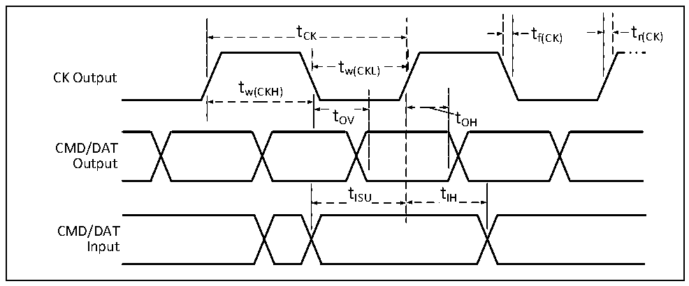
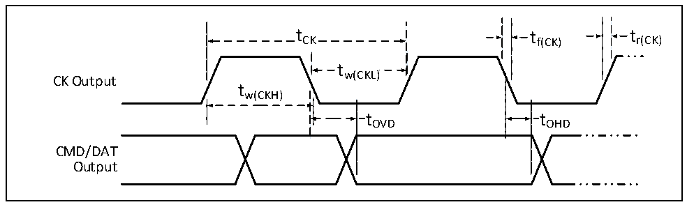

<!-- source-page: 105 -->

[← p.104](0104.md) · [index](../README.md) · [PDF p.105](https://ch32-riscv-ug.github.io/CH32H417/datasheet_zh/CH32H417DS0.PDF#page=105) · [p.106 →](0106.md)

<!-- header: CH32H417、H416、H415数据手册 https://wch.cn -->

> ⬆ **Table continued** — rendered in full at [page 104](0104.md). <!-- p105-table-001 -->

### 3.3.23 SDMMC接口特性

图3-14 SD高速模式时序图  
 <!-- rendered from the PDF; verify at https://ch32-riscv-ug.github.io/CH32H417/datasheet_zh/CH32H417DS0.PDF#page=105 -->

🖼 Text parsed from the figure above

t CK  tCK  
tCK tf(CK) tr(CK)  
tw(CKL)  
CK Output  
tw(CKH)  
tOV tOH  
CMD/DAT  
Output  
tISU tIH  
CMD/DAT  
Input  

图3-15 SD默认模式时序图  
 <!-- rendered from the PDF; verify at https://ch32-riscv-ug.github.io/CH32H417/datasheet_zh/CH32H417DS0.PDF#page=105 -->

🖼 Text parsed from the figure above

t CK  tCK  
tCK tf(CK) tr(CK)  
tw(CKL)  
CK Output  
tw(CKH)  
t t  
t OHD  
tOVD tOHD  
CMD/DAT  
Output  

<!-- p105-table-006 (table-3-33@1) pages 105-106 -->
<table><caption>表3-33 SDMMC接口特性</caption><tr><th>符号</th><th>参数</th><th colspan="2">条件</th><th>最小值</th><th>最大值</th><th>单位</th></tr><tr><td rowspan="5" style="text-align:left">f /t CK CK</td><td rowspan="5">数据传输模式下的时钟频率</td><td colspan="2">CL≤30pF</td><td></td><td>100</td><td>MHz</td></tr><tr><td colspan="2" style="text-align:left">CL≤10pF，V = 1.8V（单边沿） DD18</td><td></td><td>200</td><td>MHz</td></tr><tr><td colspan="2" style="text-align:left">CL≤10pF，V = 3.3V（单边沿） DD18</td><td></td><td>200</td><td>MHz</td></tr><tr><td colspan="2" style="text-align:left">CL≤10pF，V = 1.8V（双边沿） DD18</td><td></td><td>150（1）</td><td>MHz</td></tr><tr><td colspan="2" style="text-align:left">CL≤10pF，V = 3.3V（双边沿） DD18</td><td></td><td>180（1）</td><td>MHz</td></tr><tr><td style="text-align:left">t W（CKL）</td><td>时钟低电平时间</td><td colspan="2">CL≤10pF</td><td>2.2</td><td></td><td>ns</td></tr><tr><td style="text-align:left">t W（CKH）</td><td>时钟高电平时间</td><td colspan="2">CL≤10pF</td><td>2.2</td><td></td><td rowspan="3"></td></tr><tr><td style="text-align:left">t r（CK）</td><td>上升时间</td><td colspan="2">CL≤10pF</td><td></td><td>1.2</td></tr><tr><td style="text-align:left">t f（CK）</td><td>下降时间</td><td colspan="2">CL≤10pF</td><td></td><td>1.2</td></tr><tr><td colspan="7">CMD/DAT输入（参考CK）</td></tr><tr><td style="text-align:left">t ISU</td><td>输入建立时间</td><td colspan="2">CL≤10pF</td><td>0.5</td><td></td><td rowspan="2">ns</td></tr><tr><td style="text-align:left">t IH</td><td>输入保持时间</td><td colspan="2">CL≤10pF</td><td>0.5</td><td></td></tr><tr><td colspan="7">在高速模式下，CMD/DAT输出（参考CK）</td></tr><tr><td rowspan="2" style="text-align:left">t OV</td><td rowspan="2">输出有效时间</td><td rowspan="2">CL≤10pF</td><td>主模式</td><td></td><td>1.2</td><td rowspan="3">ns</td></tr><tr><td>从模式</td><td></td><td>6</td></tr><tr><td style="text-align:left">t OH</td><td>输出保持时间</td><td colspan="2">CL≤10pF</td><td>4.5</td><td></td></tr><tr><td colspan="7">在默认模式下，CMD/DAT输出（参考CK）</td></tr><tr><td rowspan="2" style="text-align:left">t OVD</td><td rowspan="2">输出有效默认时间</td><td rowspan="2">CL≤10pF</td><td>主模式</td><td></td><td>1.2</td><td rowspan="3">ns</td></tr><tr><td>从模式</td><td></td><td>6</td></tr><tr><td style="text-align:left">t OHD</td><td>输出保持默认时间</td><td colspan="2">CL≤10pF</td><td>4.5</td><td></td></tr></table>

<!-- image: p105-draw-image-00001 bbox=[502.8, 779.28, 522.24, 789.6] -->
<!-- footer: V1.8 101 -->
