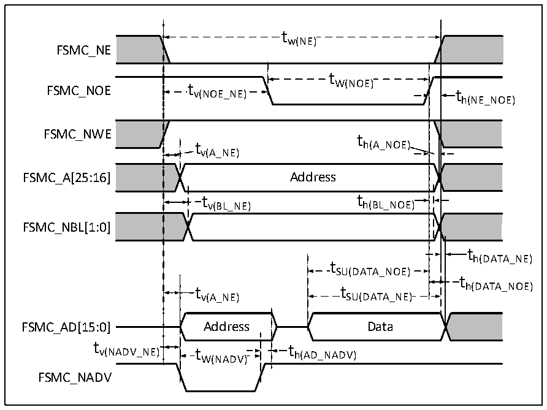
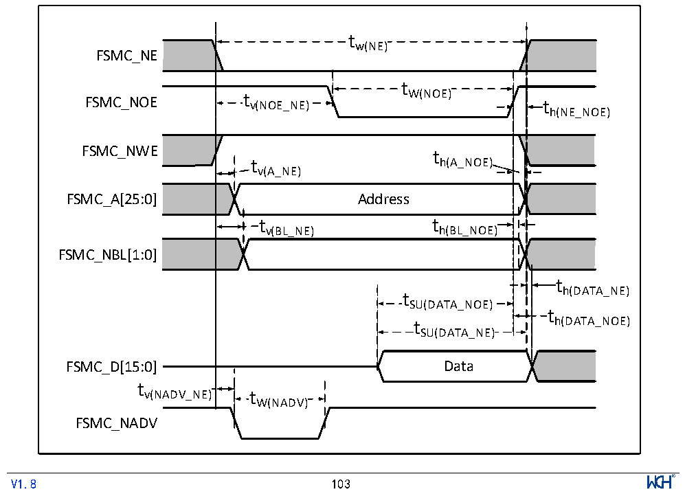

<!-- source-page: 107 -->

[← p.106](0106.md) · [index](../README.md) · [PDF p.107](https://ch32-riscv-ug.github.io/CH32H417/datasheet_zh/CH32H417DS0.PDF#page=107) · [p.108 →](0108.md)

<!-- header: CH32H417、H416、H415数据手册 https://wch.cn -->

### 3.3.25 FSMC特性

图3-16-1 异步总线复用PSRAM/NOR读操作波形  
 <!-- rendered from the PDF; verify at https://ch32-riscv-ug.github.io/CH32H417/datasheet_zh/CH32H417DS0.PDF#page=107 -->

🖼 Text parsed from the figure above

tw(NE)  
FSMC_NE  
t  
FSMC_NOE t v(NOE_NE) W(NOE) t  
h(NE_NOE)  
FSMC_NWE  
t  
t h(A_NOE)  
v(A_NE)  
FSMC_A[25:16] Address  
t v(BL_NE)  )  t h(BL_NOE)  )  
FSMC_NBL[1:0]  
th(DATA_NE)  
t SU(DATA_NOE)  t SU(DATA_NE)  
t  
v(A_NE) SU(DATA_NE)  
FSMC_AD[15:0] Address Data  
tv(NADV_NE)t th(AD_NADV)  
W(NADV)  
FSMC_NADV  

图3-16-2 异步总线非复用PSRAM/NOR读操作波形  
 <!-- rendered from the PDF; verify at https://ch32-riscv-ug.github.io/CH32H417/datasheet_zh/CH32H417DS0.PDF#page=107 -->

🖼 Text parsed from the figure above

tw(NE)  
FSMC_NE  
t  
FSMC_NOE t v(NOE_NE) W(NOE) t  
h(NE_NOE)  
FSMC_NWE  
t  
t h(A_NOE)  
v(A_NE)  
FSMC_A[25:0] Address  
t v(BL_NE)  )  t h(BL_NOE)  )  
FSMC_NBL[1:0]  
th(DATA_NE)  
t SU(DATA_NOE)  t SU(DATA_NE)  
t  
t h(DATA_NOE)  
FSMC_D[15:0] Data  
t  
v(NADV_NE) t  
W(NADV)  
FSMC_NADV  
<!-- image: p107-draw-image-00001 inside the figure -->
<!-- footer: V1.8 103 -->

