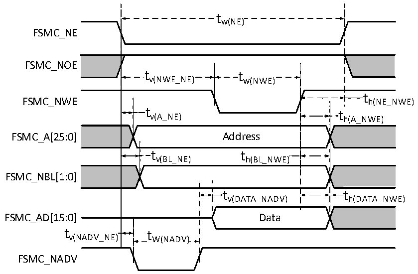

<!-- source-page: 109 -->

[← p.108](0108.md) · [index](../README.md) · [PDF p.109](https://ch32-riscv-ug.github.io/CH32H417/datasheet_zh/CH32H417DS0.PDF#page=109) · [p.110 →](0110.md)

<!-- header: CH32H417、H416、H415数据手册 https://wch.cn -->

图3-17-2 异步总线非复用PSRAM/NOR写操作波形  
 <!-- rendered from the PDF; verify at https://ch32-riscv-ug.github.io/CH32H417/datasheet_zh/CH32H417DS0.PDF#page=109 -->

🖼 Text parsed from the figure above

tw(NE)  
FSMC_NE  
FSMC_NOE  
tv(NWE_NE) tw(NWE)  
t h(NE_NWE)  th(NE h(A_NWE)  
FSMC_NWE h(NE_NWE)  
t v(A_NE)  Address  t v(BL_NE)  )  t h(BL_NWE)  )  t v(DATA_NADV)  
FSMC_NBL[1:0]  
t  t h(DATA_NWE)  
FSMC_AD[15:0] Data  
tv(NADV_NE) tW(NADV)  
FSMC_NADV  

<!-- p109-table-005 (table-3-36@1) -->
<table><caption>表3-36 异步总线复用PSRAM/NOR写操作时序</caption><tr><th>符号</th><th>参数</th><th>最小值</th><th>最大值</th><th>单位</th></tr><tr><td style="text-align:left">t W（NE）</td><td>FSMC_NE低电平时间</td><td style="text-align:left">5*t HCLK</td><td></td><td rowspan="13">ns</td></tr><tr><td style="text-align:left">t V（NEW_NE）</td><td>FSMC_NE低至FSMC_NWE低</td><td style="text-align:left">3*t HCLK</td><td></td></tr><tr><td style="text-align:left">t W（NWE）</td><td>FSMC_NWE低时间</td><td style="text-align:left">2*t HCLK</td><td></td></tr><tr><td style="text-align:left">t h（NE_NWE）</td><td>FSMC_NWE高至FSMC_NE高保持时间</td><td style="text-align:left">t HCLK</td><td></td></tr><tr><td style="text-align:left">t V（A_NE）</td><td>FSMC_NE低至FSMC_A有效</td><td>0</td><td>5</td></tr><tr><td style="text-align:left">t V（NADV_NE）</td><td>FSMC_NE低至FSMC_NADV低</td><td>0</td><td>5</td></tr><tr><td style="text-align:left">t W（NADV）</td><td>FSMC_NADV低时间</td><td style="text-align:left">t HCLK</td><td></td></tr><tr><td style="text-align:left">t h（AD_NADV）</td><td>FSMC_NADV高之后FSMC_AD（地址）有效保持时间</td><td style="text-align:left">2*t HCLK</td><td></td></tr><tr><td style="text-align:left">t h（A_NWE）</td><td>FSMC_NWE高之后的地址保持时间</td><td style="text-align:left">t HCLK</td><td></td></tr><tr><td style="text-align:left">t V（BL_NE）</td><td>FSMC_NE低至FSMC_BL有效</td><td>0</td><td>5</td></tr><tr><td style="text-align:left">t h（BL_NWE）</td><td>FSMC_NWE高之后的FSMC_BL保持时间</td><td style="text-align:left">t HCLK</td><td></td></tr><tr><td style="text-align:left">t V（DATA_NADV）</td><td>FSMC_NADV高至数据保持时间</td><td style="text-align:left">2*t HCLK</td><td></td></tr><tr><td style="text-align:left">t h（DATA_NWE）</td><td>FSMC_NWE高之后的数据保持时间</td><td style="text-align:left">t HCLK</td><td></td></tr></table>

<!-- image: p109-draw-image-00001 bbox=[502.8, 779.28, 522.24, 789.6] -->
<!-- footer: V1.8 105 -->
