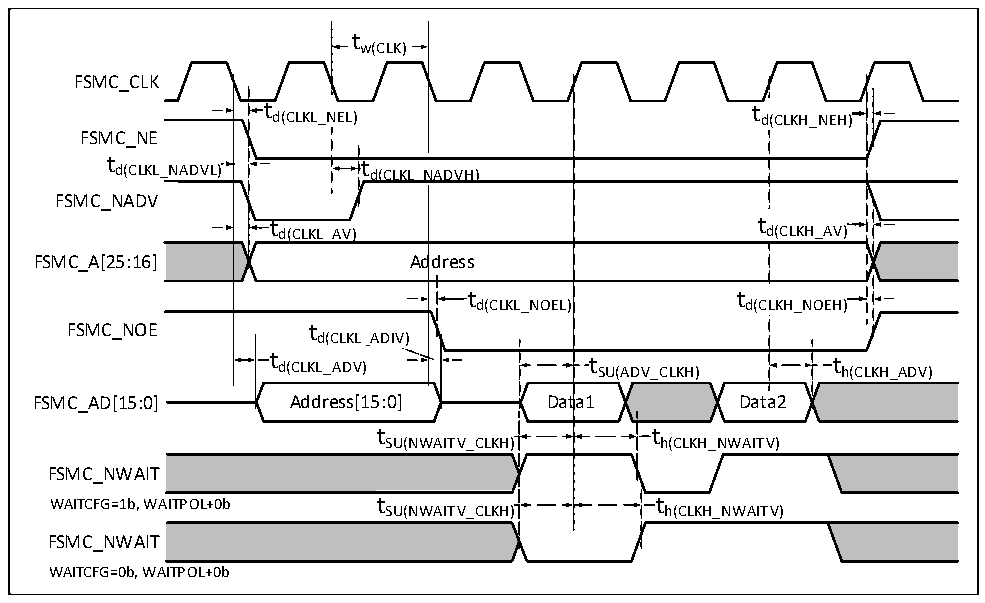

<!-- source-page: 110 -->

[← p.109](0109.md) · [index](../README.md) · [PDF p.110](https://ch32-riscv-ug.github.io/CH32H417/datasheet_zh/CH32H417DS0.PDF#page=110) · [p.111 →](0111.md)

<!-- header: CH32H417、H416、H415数据手册 https://wch.cn -->

图3-18 同步总线复用NOR/PSRAM读波形  
 <!-- rendered from the PDF; verify at https://ch32-riscv-ug.github.io/CH32H417/datasheet_zh/CH32H417DS0.PDF#page=110 -->

🖼 Text parsed from the figure above

tw(CLK)  
FSMC_CLK  
t  t d(CLKL_N  NEL)  td(CLKL_N  d(CLKH_NEH)  t d(CLKL_AV)  td(CLKL_N  ADVH)  )  td(CLKL_N  NADVH)  t d  d(CLKH_AV)  t d(CLKL_AV)  d(CLKH_AV)  td(CLKL_AV) Ad  dress  t d(CLKL_NOEL)  t d(C  t d(C  LKH_NOEH)  t SU(ADV_CLKH)  ta1  
FSMC_NE  
FSMC_NADV  
FSMC_A[25:16] Address  
FSMC_NOE t  
t  t h(CLKH_ADV  
t SU(NWAITV_CLKH)  t SU(NWAITV_CLKH)  
t  t h(CLKH_NWAITV)  
FSMC_NWAIT  
SU(NWAITV_CLKH) h(CLKH_NWAITV)  
FSMC_NWAIT  
WAITCFG=0b, WAITPOL+0b  

<!-- p110-table-005 (table-3-37@1) -->
<table><caption>表3-37 同步总线复用NOR/PSRAM读时序</caption><tr><th>符号</th><th>参数</th><th>最小值</th><th>最大值</th><th>单位</th></tr><tr><td style="text-align:left">t W（CLK）</td><td>FSMC_CLK周期</td><td style="text-align:left">2*t HCLK</td><td></td><td rowspan="15">ns</td></tr><tr><td style="text-align:left">t d（CLKL_NEL）</td><td>FSMC_CLK低至FSMC_NE低</td><td>0</td><td>5</td></tr><tr><td style="text-align:left">t d（CLKH_NEH）</td><td>FSMC_CLK高至FSMC_NE高</td><td style="text-align:left">0.5*t HCLK</td><td style="text-align:left">0.5*t HCLK</td></tr><tr><td style="text-align:left">t d（CLKL_NADVL）</td><td>FSMC_CLK低至FSMC_NADV低</td><td>0</td><td>5</td></tr><tr><td style="text-align:left">t d（CLKL_NADVH）</td><td>FSMC_CLK低至FSMC_NADV高</td><td>0</td><td>5</td></tr><tr><td style="text-align:left">t d（CLKL_AV）</td><td>FSMC_CLK低至FSMC_Ax有效（x = 16…25）</td><td>0</td><td>5</td></tr><tr><td style="text-align:left">t d（CLKH_AIV）</td><td>FSMC_CLK高至FSMC_Ax无效（x = 16…25）</td><td>0</td><td>5</td></tr><tr><td style="text-align:left">t d（CLKL_NOEL）</td><td>FSMC_CLK低至FSMC_NOE低</td><td style="text-align:left">2*t HCLK</td><td></td></tr><tr><td style="text-align:left">t d（CLKH_NOEH）</td><td>FSMC_CLK高至FSMC_NOE高</td><td style="text-align:left">t HCLK</td><td></td></tr><tr><td style="text-align:left">t d（CLKL_ADV）</td><td>FSMC_CLK低至FSMC_AD[15:0]有效</td><td>0</td><td>5</td></tr><tr><td style="text-align:left">t d（CLKL_ADIV）</td><td>FSMC_CLK低至FSMC_AD[15:0]无效</td><td>0</td><td>5</td></tr><tr><td style="text-align:left">t SU（ADV_CLKH）</td><td>FSMC_CLK高之前FSMC_AD[15:0]有效数据</td><td>8</td><td></td></tr><tr><td style="text-align:left">t h（CLKH_ADV）</td><td>FSMC_CLK高之后FSMC_AD[15:0]有效数据</td><td>8</td><td></td></tr><tr><td style="text-align:left">t SU（NWAITV_CLKH）</td><td>FSMC_CLK高之前FSMC_NWAIT有效</td><td>6</td><td></td></tr><tr><td style="text-align:left">t h（CLKH_NWAITV）</td><td>FSMC_CLK高之后FSMC_NWAIT有效</td><td>2</td><td></td></tr></table>

<!-- image: p110-draw-image-00001 bbox=[502.8, 779.28, 522.24, 789.6] -->
<!-- footer: V1.8 106 -->
