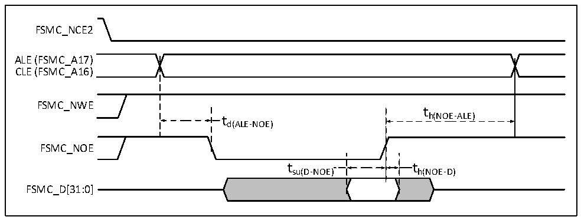
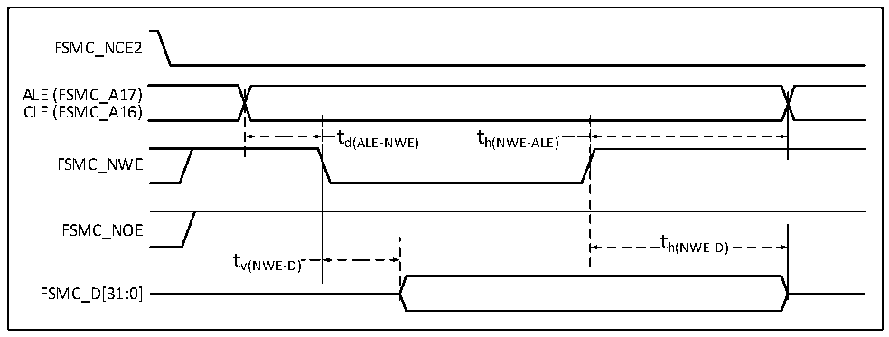
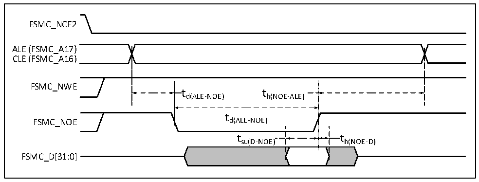

<!-- source-page: 112 -->

[← p.111](0111.md) · [index](../README.md) · [PDF p.112](https://ch32-riscv-ug.github.io/CH32H417/datasheet_zh/CH32H417DS0.PDF#page=112) · [p.113 →](0113.md)

<!-- header: CH32H417、H416、H415数据手册 https://wch.cn -->
NAND控制器波形和时序  
测试条件：NAND操作区域，选择16位数据宽度，使能ECC计算电路，512字节页面大小，其他时序配  
置为设置寄存器FSMC_PCR2 = 0x0002005E，FSMC_PMEM2 = 0x01020301，FSMC_PATT2 = 0x01020301。  

图3-20 NAND控制器读操作波形  
 <!-- rendered from the PDF; verify at https://ch32-riscv-ug.github.io/CH32H417/datasheet_zh/CH32H417DS0.PDF#page=112 -->

🖼 Text parsed from the figure above

FSMC_NCE2  
ALE (FSMC_A17)  
CLE (FSMC_A16)  
FSMC_NWE  
t  
t h(NOE-ALE)  
d(ALE-NOE)  
FSMC_NOE  
t su(D-NOE)  )  t h(NOE-D)  )  
FSMC_D[31:0]  

图3-21 NAND控制器写操作波形  
 <!-- rendered from the PDF; verify at https://ch32-riscv-ug.github.io/CH32H417/datasheet_zh/CH32H417DS0.PDF#page=112 -->

🖼 Text parsed from the figure above

FSMC_NCE2  
ALE (FSMC_A17)  
CLE (FSMC_A16)  
t t d(ALE-NWE) h(NWE-ALE)  t h(NWE-ALE)  
FSMC_NWE  
FSMC_NOE  
th(NWE-D)  
tv(NWE-D)  
FSMC_D[31:0]  

图3-22 NAND控制器在通用存储空间的读操作波形  
 <!-- rendered from the PDF; verify at https://ch32-riscv-ug.github.io/CH32H417/datasheet_zh/CH32H417DS0.PDF#page=112 -->

🖼 Text parsed from the figure above

FSMC_NCE2  
ALE (FSMC_A17)  
CLE (FSMC_A16)  
FSMC_NWE  
td(ALE-NOE) th(NOE-ALE)  
t  
FSMC_NOE d(ALE-NOE)  
t su(D-NOE)  )  t h(NOE-D)  )  
FSMC_D[31:0]  

<!-- image: p112-draw-image-00001 bbox=[502.8, 779.28, 522.24, 789.6] -->
<!-- footer: V1.8 108 -->
